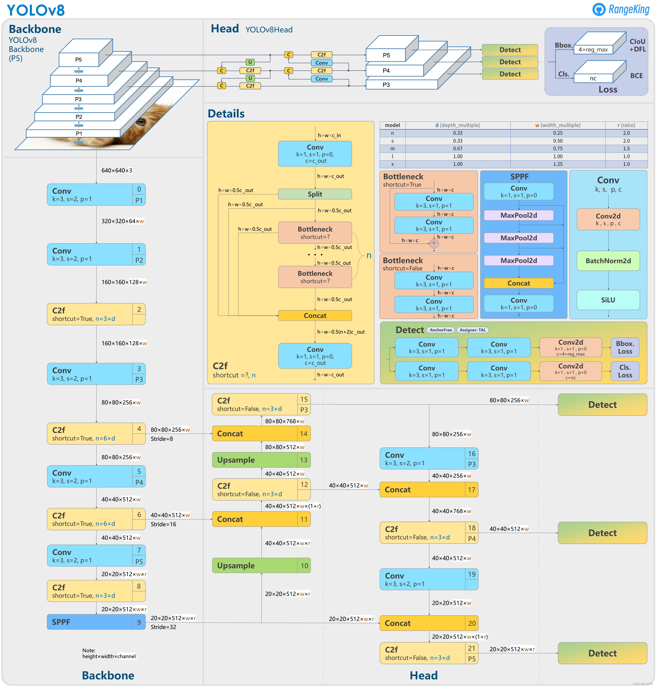
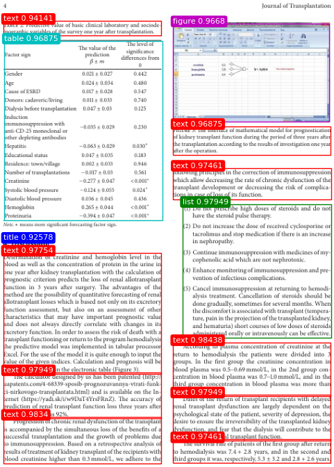

English | [中文](https://github.com/mindspore-lab/mindocr/blob/main/configs/layout/yolov8/README_CN.md)

# YOLOv8
<!--- Guideline: use url linked to abstract in ArXiv instead of PDF for fast loading.  -->

> [YOLOv8: You Only Look Once Version 8](https://github.com/ultralytics/ultralytics)

## Introduction
<!--- Guideline: Introduce the model and architectures. Cite if you use/adopt paper explanation from others. -->

YOLOv8 is the latest version of YOLO by Ultralytics. As a cutting-edge, state-of-the-art (SOTA) model, YOLOv8 builds on the success of previous versions, introducing new features and improvements for enhanced performance, flexibility, and efficiency. YOLOv8 supports a full range of vision AI tasks, including detection, segmentation, pose estimation, tracking, and classification. This versatility allows users to leverage YOLOv8's capabilities across diverse applications and domains.

In order to adapt to the layout analysis task, we have made some improvements to YOLOv8:
1. Increase input resolution to 800 * 800;
2. Use P3-P6 detection head;
3. Remove unnecessary data enhancements (such as Mosaic, Mixup, and HSV enhancement methods).



## Results
| mindspore |  ascend driver  |   firmware   | cann toolkit/kernel |
|:---------:|:---------------:|:------------:|:-------------------:|
|   2.3.1   |    24.1.RC2     | 7.3.0.1.231  |    8.0.RC2.beta1    |

### Accuracy

According to our experiment, the evaluation results on the public benchmark dataset (PublayNet) are as follows:

Experiments are tested on ascend 910* with mindspore 2.3.1 graph mode
<div align="center">

| **model name** | **cards** | **batch size** | **ms/step**   | **img/s** | **map** | **config**  | **weight**                                                                            |
|----------------|-----------|----------------|---------------|-----------|---------|-----------------------------------------------------|------------------------------------------------|
| YOLOv8         | 4         | 16             | 284.93| 56.15     | 94.4%   | [yaml](https://github.com/mindspore-lab/mindocr/blob/main/configs/layout/yolov8/yolov8n.yaml) | [ckpt](https://download.mindspore.cn/toolkits/mindocr/yolov8/yolov8n-4b9e8004.ckpt) \| [mindir](https://download.mindspore.cn/toolkits/mindocr/yolov8/yolov8n-2a1f68ab.mindir) |
</div>

**Notes:**
- To reproduce the result on other contexts, please ensure the global batch size is the same.
- The models are trained from scratch without any pre-training. For more dataset details of training and evaluation, please refer to [PubLayNet Dataset Preparation](#3.1.2 PubLayNet Dataset Preparation) section.
- The input Shapes of MindIR of YOLOv8 is (1, 3, 800, 800).


## Quick Start
### Preparation

#### Installation
Please refer to the [installation instruction](https://github.com/mindspore-lab/mindocr#installation) in MindOCR.

#### PubLayNet Dataset Preparation

PubLayNet is a dataset for document layout analysis. It contains images of research papers and articles and annotations for various elements in a page such as "text", "list", "figure" etc in these research paper images. The dataset was obtained by automatically matching the XML representations and the content of over 1 million PDF articles that are publicly available on PubMed Central.

#### Check YAML Config Files
Apart from the dataset setting, please also check the following important args: `system.distribute`, `system.val_while_train`, `common.batch_size`, `train.ckpt_save_dir`, `train.dataset.dataset_path`, `eval.ckpt_load_path`, `eval.dataset.dataset_path`, `eval.loader.batch_size`. Explanations of these important args:

```yaml
system:
  distribute: &distribute True  # `True` for distributed training, `False` for standalone training
  amp_level: 'O0'
  amp_level_infer: "O0"
  seed: 42
  val_while_train: False  # Validate while training
  drop_overflow_update: False
common:
  ...
  batch_size: 16  # Batch size for training
  annotations_path: publaynet/val.json
...
train:
  ckpt_save_dir: './tmp_layout'  # The training result (including checkpoints, per-epoch performance and curves) saving directory
  dataset_sink_mode: False
  dataset:
    type: PublayNetDataset
    dataset_path: publaynet/train.txt  # Path of training dataset
...
eval:
  ckpt_load_path: './tmp_layout/best.ckpt'  # checkpoint file path
  dataset_sink_mode: False
  dataset:
    type: PublayNetDataset
    dataset_path: publaynet/val.txt  # Path of validation dataset
  ...
  loader:
    shuffle: False
    batch_size: 16  # Batch size for validation
...
```

**Notes:**
- As the global batch size  (batch_size x num_devices) is important for reproducing the result, please adjust `batch_size` accordingly to keep the global batch size unchanged for a different number of NPUs, or adjust the learning rate linearly to a new global batch size.


### Model Training
<!--- Guideline: Avoid using shell script in the command line. Python script preferred. -->

* Distributed Training

It is easy to reproduce the reported results with the pre-defined training recipe. For distributed training on multiple Ascend 910 devices, please modify the configuration parameter `distribute` as True and run

```shell
# distributed training on multiple Ascend devices
mpirun --allow-run-as-root -n 4 python tools/train.py --config configs/layout/yolov8/yolov8n.yaml
```


* Standalone Training

If you want to train or finetune the model on a smaller dataset without distributed training, please modify the configuration parameter`distribute` as False and run:

```shell
# standalone training on a CPU/Ascend device
python tools/train.py --config configs/layout/yolov8/yolov8n.yaml
```

The training result (including checkpoints, per-epoch performance and curves) will be saved in the directory parsed by the arg `ckpt_save_dir`. The default directory is `./tmp_layout`.

### Model Evaluation

To evaluate the accuracy of the trained model, you can use `eval.py`. Please set the checkpoint path to the arg `ckpt_load_path` in the `eval` section of yaml config file, set `distribute` to be False, and then run:

```shell
python tools/eval.py --config configs/layout/yolov8/yolov8n.yaml
```

## MindSpore Lite Inference

To inference with MindSpot Lite on Ascend 310, please refer to the tutorial [MindOCR Inference](../../../docs/en/inference/inference_tutorial.md). In short, the whole process consists of the following steps:

**1. Model Export**

Please [download](#2-results) the exported MindIR file first, or refer to the [Model Export](../../../docs/en/inference/convert_tutorial.md#1-model-export) tutorial and use the following command to export the trained ckpt model to  MindIR file:

```shell
python tools/export.py --model_name_or_config configs/layout/yolov8/yolov8n.yaml --data_shape 800 800 --local_ckpt_path /path/to/local_ckpt.ckpt
```

The `data_shape` is the model input shape of height and width for MindIR file. The shape value of MindIR in the download link can be found in [Notes](#2-results) under results table. `distribute` in yaml shall be set to False.

**2. Environment Installation**

Please refer to [Environment Installation](../../../docs/en/inference/environment.md) tutorial to configure the MindSpore Lite inference environment.

**3. Model Conversion**

Please refer to [Model Conversion](../../../docs/en/inference/convert_tutorial.md#2-mindspore-lite-mindir-convert),
and use the `converter_lite` tool for offline conversion of the MindIR file.

**4. Inference**

Assuming that you obtain output.mindir after model conversion, go to the `deploy/py_infer` directory, and use the following command for inference:

```shell
python infer.py \
    --input_images_dir=/your_path_to/val \
    --layout_model_path=your_path_to/output.mindir \
    --layout_model_name_or_config=../../configs/layout/yolov8/yolov8n.yaml \
    --res_save_dir=results_dir
```

## Visualization

The inference results can be visualized using the following code:

```python
from matplotlib import pyplot as plt
import matplotlib.patches as patches
from PIL import Image


img_path = 'publaynet/val/PMC4958442_00003.jpg'
img = Image.open(img_path)
fig, ax = plt.subplots()
ax.imshow(img)

category_dict = {1: 'text', 2: 'title', 3: 'list', 4: 'table', 5: 'figure'}
color_dict = {1: 'r', 2: 'b', 3: 'g', 4: 'c', 5: 'm'}
results = [{"category_id": 1, "bbox": [308.25, 559.25, 240.5, 81.5], "score": 0.98438},
           {"category_id": 1, "bbox": [50.5, 672.75, 240.5, 70.5], "score": 0.9834},
           {"category_id": 3, "bbox": [322.875, 349.0, 226.25, 203.0], "score": 0.97949},
           {"category_id": 1, "bbox": [308.25, 638.75, 240.5, 70.5], "score": 0.97949},
           {"category_id": 1, "bbox": [50.688, 605.0, 240.125, 70.0], "score": 0.97949},
           {"category_id": 1, "bbox": [50.5, 423.125, 240.0, 183.75], "score": 0.97754},
           {"category_id": 1, "bbox": [308.25, 707.0, 240.5, 36.0], "score": 0.97461},
           {"category_id": 1, "bbox": [308.875, 294.0, 240.25, 47.5], "score": 0.97461},
           {"category_id": 1, "bbox": [308.625, 230.5, 239.75, 43.75], "score": 0.96875},
           {"category_id": 4, "bbox": [51.875, 100.5, 240.25, 273.5], "score": 0.96875},
           {"category_id": 5, "bbox": [308.625, 74.375, 237.75, 149.25], "score": 0.9668},
           {"category_id": 1, "bbox": [50.688, 70.625, 240.125, 22.0], "score": 0.94141},
           {"category_id": 2, "bbox": [50.562, 403.625, 67.375, 12.75], "score": 0.92578},
           {"category_id": 1, "bbox": [51.312, 374.625, 171.875, 10.75], "score": 0.7666},
           {"category_id": 4, "bbox": [53.625, 80.25, 493.75, 144.0], "score": 0.00247},
           {"category_id": 1, "bbox": [51.812, 144.625, 27.875, 12.25], "score": 0.00241},
           {"category_id": 1, "bbox": [52.625, 159.125, 14.0, 11.75], "score": 0.00184},
           {"category_id": 4, "bbox": [52.0, 207.5, 497.0, 164.5], "score": 0.00173},
           {"category_id": 3, "bbox": [326.25, 349.75, 222.5, 64.5], "score": 0.00133},
           {"category_id": 2, "bbox": [52.25, 144.938, 27.25, 12.125], "score": 0.00107}]

for item in results:
    category_id = item['category_id']
    bbox = item['bbox']
    score = item['score']
    if score < 0.8:
        continue
    left, bottom, w, h = bbox
    rect = patches.Rectangle((left, bottom), w, h, linewidth=1, edgecolor=color_dict[category_id], facecolor='none')
    ax.add_patch(rect)
    ax.text(left, bottom, '{} {}'.format(category_dict[category_id], score), fontsize=8, color='w',
            bbox=dict(facecolor=color_dict[category_id], edgecolor='none', boxstyle='round'))

plt.imshow(img)
plt.axis('off')
plt.show()
```

The visualization results are as follows:
<div align="center">



</div>
