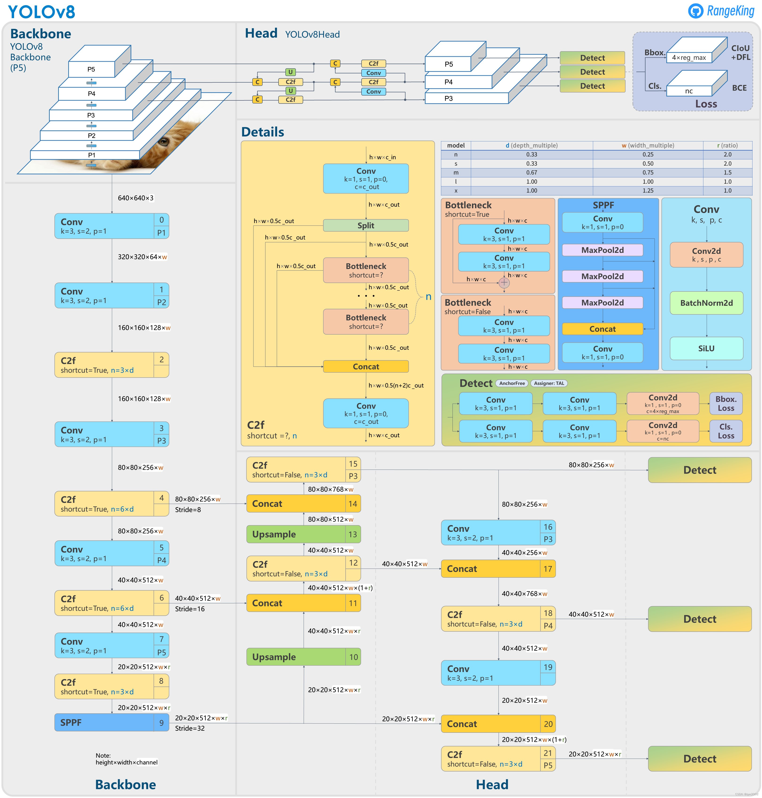

[English](https://github.com/mindspore-lab/mindocr/blob/main/configs/layout/yolov8/README.md) | 中文

# YOLOv8
<!--- Guideline: use url linked to abstract in ArXiv instead of PDF for fast loading.  -->

> [YOLOv8: You Only Look Once Version 8](https://github.com/ultralytics/ultralytics)

## 模型描述
<!--- Guideline: Introduce the model and architectures. Cite if you use/adopt paper explanation from others. -->

YOLOv8 是Ultralytics的YOLO的最新版本。作为一种前沿、最先进(SOTA)的模型，YOLOv8在之前版本的成功基础上引入了新功能和改进，以提高性能、灵活性和效率。YOLOv8支持多领域的视觉AI任务，包括检测、分割、姿态估计、跟踪和分类。这种多功能性使用户能够利用YOLOv8的功能应对多种应用和领域的需求。

为了适配版面分析任务，我们对YOLOv8做了部分改进：

1. 输入分辨率扩大为 800 * 800；
2. 使用P3-P6检测头；
3. 删除不必要的数据增强（如Mosaic、Mixup和HSV等增强方法）。

<!--- Guideline: If an architecture table/figure is available in the paper, put one here and cite for intuitive illustration. -->




## 评估结果


| mindspore |  ascend driver  |   firmware   | cann toolkit/kernel |
|:---------:|:---------------:|:------------:|:-------------------:|
|   2.3.1   |    24.1.RC2     | 7.3.0.1.231  |    8.0.RC2.beta1    |

根据我们的实验，在公开基准数据集（PublayNet）上的-评估结果如下：

在采用图模式的ascend 910*上实验结果，mindspore版本为2.3.1
<div align="center">

| **模型名称** | **卡数** | **单卡批量大小** | **ms/step**   | **img/s** | **map** | **配置**                                                                                        | **权重**                                                                                                                                                                         |
|----------|--------|------------|---------------|-----------|---------|-----------------------------------------------------------------------------------------------|--------------------------------------------------------------------------------------------------------------------------------------------------------------------------------|
| YOLOv8   | 4      | 16         | 284.93| 56.15     | 94.4%   | [yaml](https://github.com/mindspore-lab/mindocr/blob/main/configs/layout/yolov8/yolov8n.yaml) | [ckpt](https://download.mindspore.cn/toolkits/mindocr/yolov8/yolov8n-4b9e8004.ckpt) \| [mindir](https://download.mindspore.cn/toolkits/mindocr/yolov8/yolov8n-2a1f68ab.mindir) |
</div>

**注意:**
- 如需在其他环境配置重现训练结果，请确保全局批量大小与原配置文件保持一致。
- 模型都是从头开始训练的，无需任何预训练。关于训练和测试数据集的详细介绍，请参考[PubLayNet数据集准备](#3.1.2 PubLayNet数据集准备)章节。
- YOLOv8的MindIR导出时的输入Shape均为(1, 3, 800, 800)。

## 快速开始
### 环境及数据准备

#### 安装
环境安装教程请参考MindOCR的 [installation instruction](https://github.com/mindspore-lab/mindocr#installation).

#### PubLayNet数据集准备

PubLayNet是一个用于文档布局分析的数据集。它包含研究论文和文章的图像，以及页面中各种元素的注释，如这些研究论文图像中的“文本”、“列表”、“图形”等。该数据集是通过自动匹配PubMed Central上公开的100多万篇PDF文章的XML表示和内容而获得的。

PubLayNet的训练及验证数据集可以从 [这里](https://dax-cdn.cdn.appdomain.cloud/dax-publaynet/1.0.0/publaynet.tar.gz) 下载。

```bash
python tools/dataset_converters/convert.py \
    --dataset_name publaynet \
    --image_dir publaynet/ \
    --output_path publaynet/
```

下载完成后，可以使用上述MindOCR提供的脚本将数据转换为YOLOv8输入格式的数据类型。

#### 检查配置文件
除了数据集的设置，请同时重点关注以下变量的配置：`system.distribute`, `system.val_while_train`, `common.batch_size`, `train.ckpt_save_dir`, `train.dataset.dataset_path`, `eval.ckpt_load_path`, `eval.dataset.dataset_path`, `eval.loader.batch_size`。说明如下：

```yaml
system:
  distribute: &distribute True  # 分布式训练为True，单卡训练为False
  amp_level: 'O0'
  amp_level_infer: "O0"
  seed: 42
  val_while_train: False  # 边训练边验证
  drop_overflow_update: False
common:
  ...
  batch_size: 16  # 训练批大小
  annotations_path: publaynet/val.json
...
train:
  ckpt_save_dir: './tmp_layout'  # 训练结果（包括checkpoint、每个epoch的性能和曲线图）保存目录
  dataset_sink_mode: False
  dataset:
    type: PublayNetDataset
    dataset_path: publaynet/train.txt  # 训练数据集路径
...
eval:
  ckpt_load_path: './tmp_layout/best.ckpt'  # checkpoint文件路径
  dataset_sink_mode: False
  dataset:
    type: PublayNetDataset
    dataset_path: publaynet/val.txt  # 验证数据集路径
  ...
  loader:
    shuffle: False
    batch_size: 16  # 验证批大小
...
```

**注意:**
- 由于全局批大小 （batch_size x num_devices） 对结果复现很重要，因此当NPU卡数发生变化时，调整`batch_size`以保持全局批大小不变，或根据新的全局批大小线性调整学习率。


### 模型训练
<!--- Guideline: Avoid using shell script in the command line. Python script preferred. -->

* 分布式训练

使用预定义的训练配置可以轻松重现报告的结果。对于在多个昇腾910设备上的分布式训练，请将配置参数`distribute`修改为True，并运行：

```shell
# 在多个 Ascend 设备上进行分布式训练
mpirun --allow-run-as-root -n 4 python tools/train.py --config configs/layout/yolov8/yolov8n.yaml
```


* 单卡训练

如果要在没有分布式训练的情况下在较小的数据集上训练或微调模型，请将配置参数`distribute`修改为False 并运行：

```shell
# CPU/Ascend 设备上的单卡训练
python tools/train.py --config configs/layout/yolov8/yolov8n.yaml
```

训练结果（包括checkpoint、每个epoch的性能和曲线图）将被保存在yaml配置文件的`ckpt_save_dir`参数配置的目录下，默认为`./tmp_layout`。

### 模型评估

若要评估已训练模型的准确性，可以使用`eval.py`。请在yaml配置文件的`eval`部分将参数`ckpt_load_path`设置为模型checkpoint的文件路径，设置`distribute`为False，然后运行：

```shell
python tools/eval.py --config configs/layout/yolov8/yolov8n.yaml
```


## MindSpore Lite 推理

请参考[MindOCR 推理](../../../docs/zh/inference/inference_tutorial.md)教程，基于MindSpore Lite在Ascend 310上进行模型的推理，包括以下步骤：

**1. 模型导出**

请先[下载](#2-评估结果)已导出的MindIR文件，或者参考[模型导出](../../../docs/zh/inference/convert_tutorial.md#1-模型导出)教程，使用以下命令将训练完成的ckpt导出为MindIR文件:

```shell
python tools/export.py --model_name_or_config configs/layout/yolov8/yolov8n.yaml --data_shape 800 800 --local_ckpt_path /path/to/local_ckpt.ckpt
```

其中，`data_shape`是导出MindIR时的模型输入Shape的height和width，下载链接中MindIR对应的shape值见[注释](#2-评估结果)。yaml中的`distribute`需要被设置为False。

**2. 环境搭建**

请参考[环境安装](../../../docs/zh/inference/environment.md)教程，配置MindSpore Lite推理运行环境。

**3. 模型转换**

请参考[模型转换](../../../docs/zh/inference/convert_tutorial.md#2-mindspore-lite-mindir-转换)教程，使用`converter_lite`工具对MindIR模型进行离线转换。

**4. 执行推理**

假设在模型转换后得到output.mindir文件，在`deploy/py_infer`目录下使用以下命令进行推理：

```shell
python infer.py \
    --input_images_dir=/your_path_to/val \
    --layout_model_path=your_path_to/output.mindir \
    --layout_model_name_or_config=../../configs/layout/yolov8/yolov8n.yaml \
    --res_save_dir=results_dir
```

## 可视化

可以使用以下代码将推理结果进行可视化：

```python
from matplotlib import pyplot as plt
import matplotlib.patches as patches
from PIL import Image


img_path = 'publaynet/val/PMC4958442_00003.jpg'
img = Image.open(img_path)
fig, ax = plt.subplots()
ax.imshow(img)

category_dict = {1: 'text', 2: 'title', 3: 'list', 4: 'table', 5: 'figure'}
color_dict = {1: 'r', 2: 'b', 3: 'g', 4: 'c', 5: 'm'}
results = [{"category_id": 1, "bbox": [308.25, 559.25, 240.5, 81.5], "score": 0.98438},
           {"category_id": 1, "bbox": [50.5, 672.75, 240.5, 70.5], "score": 0.9834},
           {"category_id": 3, "bbox": [322.875, 349.0, 226.25, 203.0], "score": 0.97949},
           {"category_id": 1, "bbox": [308.25, 638.75, 240.5, 70.5], "score": 0.97949},
           {"category_id": 1, "bbox": [50.688, 605.0, 240.125, 70.0], "score": 0.97949},
           {"category_id": 1, "bbox": [50.5, 423.125, 240.0, 183.75], "score": 0.97754},
           {"category_id": 1, "bbox": [308.25, 707.0, 240.5, 36.0], "score": 0.97461},
           {"category_id": 1, "bbox": [308.875, 294.0, 240.25, 47.5], "score": 0.97461},
           {"category_id": 1, "bbox": [308.625, 230.5, 239.75, 43.75], "score": 0.96875},
           {"category_id": 4, "bbox": [51.875, 100.5, 240.25, 273.5], "score": 0.96875},
           {"category_id": 5, "bbox": [308.625, 74.375, 237.75, 149.25], "score": 0.9668},
           {"category_id": 1, "bbox": [50.688, 70.625, 240.125, 22.0], "score": 0.94141},
           {"category_id": 2, "bbox": [50.562, 403.625, 67.375, 12.75], "score": 0.92578},
           {"category_id": 1, "bbox": [51.312, 374.625, 171.875, 10.75], "score": 0.7666},
           {"category_id": 4, "bbox": [53.625, 80.25, 493.75, 144.0], "score": 0.00247},
           {"category_id": 1, "bbox": [51.812, 144.625, 27.875, 12.25], "score": 0.00241},
           {"category_id": 1, "bbox": [52.625, 159.125, 14.0, 11.75], "score": 0.00184},
           {"category_id": 4, "bbox": [52.0, 207.5, 497.0, 164.5], "score": 0.00173},
           {"category_id": 3, "bbox": [326.25, 349.75, 222.5, 64.5], "score": 0.00133},
           {"category_id": 2, "bbox": [52.25, 144.938, 27.25, 12.125], "score": 0.00107}]

for item in results:
    category_id = item['category_id']
    bbox = item['bbox']
    score = item['score']
    if score < 0.8:
        continue
    left, bottom, w, h = bbox
    rect = patches.Rectangle((left, bottom), w, h, linewidth=1, edgecolor=color_dict[category_id], facecolor='none')
    ax.add_patch(rect)
    ax.text(left, bottom, '{} {}'.format(category_dict[category_id], score), fontsize=8, color='w',
            bbox=dict(facecolor=color_dict[category_id], edgecolor='none', boxstyle='round'))

plt.imshow(img)
plt.axis('off')
plt.show()
```

可视化结果如下：
<div align="center">


</div>
