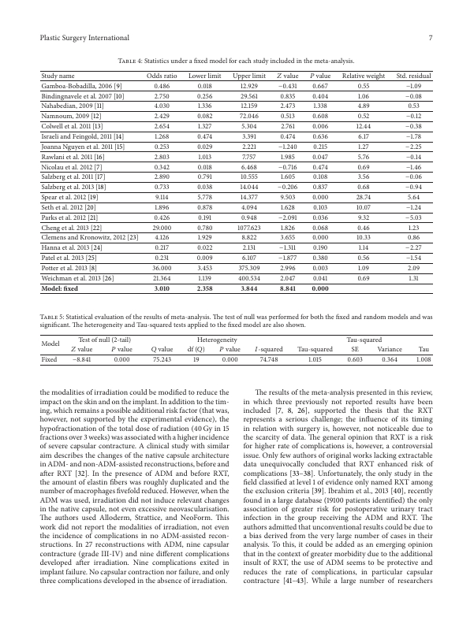

English | [中文](README_CN.md)

# Vary-toy

> [Vary: Scaling up the Vision Vocabulary for Large Vision-Language Models](https://arxiv.org/abs/2312.06109)
> [Small Language Model Meets with Reinforced Vision Vocabulary](https://arxiv.org/abs/2401.12503)

## 1. Model Description

Vary is an effective method to extend the visual vocabulary of the Large Visual Language Model (LVLM). Vary is divided into two parts: the generation and integration of new visual vocabulary. In the first stage, Vary designed a "vocabulary network" and a small decoder Transformer, which produced the required vocabulary through autoregression. Vary then scales up the common visual vocabulary by merging the new visual vocabulary with the original visual vocabulary (CLIP), enabling LVLM to quickly acquire new functionality. Vary-toy is a smaller version of Vary's official open source.

## 2. Assessment Result

According to our experiments, the inference performance of Vary-toy is as follows:

| **model** | **Environment Configuration** | **Total Time** | **Token generation speed** |                                   **Configuration File**                                   |
|:---------:|:-----------------------------:|:--------------:|:--------------------------:|:------------------------------------------------------------------------------------------:|
| Vary-toy  |        D910x1-MS2.2-G         |    23.38 s     |       30.75 tokens/s       | [yaml](https://github.com/mindspore-lab/mindocr/blob/main/configs/llm/vary/vary_toy.yaml) |

**Note:**

- Environment configuration: The training environment configuration is represented as \{processor\} x \{processor quantity\} - \{MS mode\}. The MindSpore mode can be G-graph mode or F-pynative mode. For example, D910x1-MS2.2-G uses graph mode to train on one 910 NPU depending on MindSpore 2.2.
- If you need to reproduce the training result in another environment, ensure that the global batch size is the same as that in the original configuration file.

## 3. Quick Start

### 3.1 Environment and Model Preparation

#### 3.1.1 Installation

Note: if you want to experience Vary-toy, you shall upgrade your python to 3.8 or above version.

For details about environment installation, see MindOCR [installation instruction](https://github.com/mindspore-lab/mindocr#installation).

In addition, you need to install the `tiktoken` using the following shell command:

``` shell
pip install tiktoken
```

#### 3.1.2 Configuration File

Pay special attention to the configuration of the following variables:`seq_length`,`checkpoint_name_or_path`,`repetition_penalty`,`max_decode_length`,`max_new_tokens`,`vocab_file`. Description:

```yaml
model:
  ...
  seq_length: 2048  # Sentence length
  checkpoint_name_or_path: "/path/to/vary_toy.ckpt"  # Weight path
  repetition_penalty: 1.5  # The penalty for generating duplicate values.
  max_decode_length: 2048  # Maximum generated sentence length.
  max_new_tokens: 1024  # Number of new tokens.
  ...
...
processor:
  ...
  tokenizer:
    vocab_file: "/path/to/qwen.tiktoken"  # Path of the tokenizer
  ...
...
```

#### 3.1.3 Model Preparation

Users can download tokenizer model from the following link:

- [qwen.tiktoken](https://huggingface.co/HaoranWei/Vary-toy/blob/main/qwen.tiktoken)

Users can download weights from the following link:

- [Vary-toy](https://download-mindspore.osinfra.cn/toolkits/mindocr/vary/vary_toy-e62a3564.ckpt)

Users can also download weights from the following huggingface link:

- [Vary-toy](https://huggingface.co/HaoranWei/Vary-toy/blob/main/pytorch_model.bin)

Then perform the weight conversion according to the following steps:

Note: Install `torch` before starting the conversion script:

```shell
pip install torch
```

After the download is complete, run the mindocr/models/llm/convert_weight.py conversion script to convert the huggingface weight to the MindSpore ckpt weight.

```shell
python mindocr/models/llm/convert_weight.py \
    --torch_ckpt_path="/path/to/pytorch_model.bin" \
    --mindspore_ckpt_path="/path/to/vary_toy.ckpt"

# Parameter description:
# torch_ckpt_path: weight path for downloading huggingface.
# mindspore_ckpt_path: path of the exported MindSpore weight.
```

### 3.2 Model Inference

```shell
python ./tools/infer/text/predict_llm.py \
    --image_dir=/path/to/image.jpg \
    --query="Provide the ocr results of this image." \
    --config_path="/path/to/vary_toy.yaml" \
    --chat_mode=False

# Parameter description:
# image_dir: image path.
# query: query statement
# config_path: indicates the configuration file path.
# chat_mode: indicates whether to use the dialog mode.
```

The execution result is printed on the screen.

For example, you can input the query statement "Describe this image in within 100 words" to generate analysis text of the following image:



```
The article discusses the analysis of traffic signals using deep learning models, specifically focusing on pedestrian crossing data. The authors propose a method to extract features from videos captured by cameras and use them to train a model for predicting pedestrian behavior. They compare their approach with other methods and show that their model outperforms others in terms of accuracy and robustness. The study also highlights the limitations of their approach, such as the need for accurate hand-crafted features and the lack of consideration for different types of vehicles. Overall, the findings suggest the potential of using machine learning models to improve traffic signal analysis and enhance safety.This article is about the use of deep learning models for predicting pedestrian behavior in traffic signals. It compares the performance of different models and highlights the limitations of these approaches.
```

### 3.3 Model Training

coming soon
