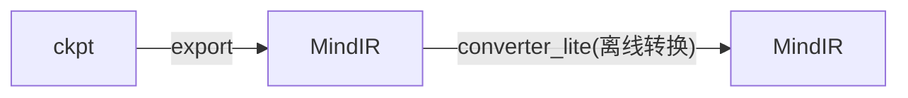
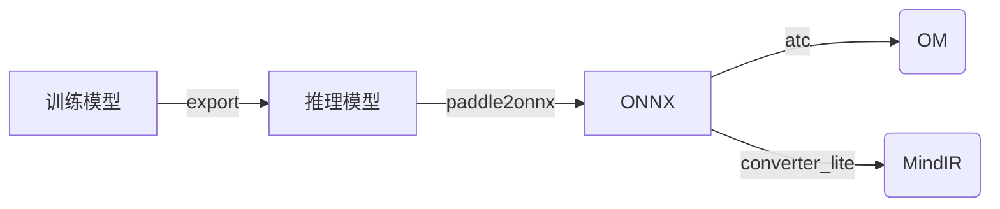

[English](../../en/inference/convert_tutorial_en.md) | 中文

## 推理 - 模型转换教程

### 1. MindOCR模型

MindOCR模型的推理使用[MindSpore Lite](https://www.mindspore.cn/lite)后端。



先准备模型文件，可以从训练端ckpt文件[导出](../../../configs/README.md)MindIR，或者直接从[模型列表](./models_list_cn.md)中下载已预先导出的MindIR，
然后再执行converter_lite模型转换命令，从而将ckpt训练模型转换为MindSpore Lite支持的MindIR模型。

converter_lite的详细教程见[推理模型离线转换](https://www.mindspore.cn/lite/docs/zh-CN/master/use/cloud_infer/converter_tool.html)，
模型列表中对应的转换参数见[模型转换参数](./convert_parameter_list_cn.md)。

#### 1.1 模型转换

假设输入模型为input.mindir，经过converter_lite工具转换后的输出模型为output.mindir，则模型转换命令如下：

```shell
converter_lite \
    --saveType=MINDIR \
    --NoFusion=false \
    --fmk=MINDIR \
    --device=Ascend \
    --modelFile=input.mindir \
    --outputFile=output \
    --configFile=config.txt
```

其中config.txt的内容如下：

```
 [ascend_context]
 input_format=NCHW
 input_shape=x:[1,3,736,1280]
```

config.txt中input_shape值需要替换为模型导出时的值，在推理时，输入图像会Resize到input_shape以满足输入要求。


#### 1.2 分档

在某些推理场景，如检测出目标后再执行目标识别网络，由于目标个数和大小不固定，如果每次推理都按照最大的BatchSize或最大ImageSize进行计算，会造成计算资源浪费。

因此，推理需要支持动态BatchSize和动态ImageSize的场景，Lite通过`configFile`配置`[ascend_context]`中`dynamic_dims`动态参数来实现。

详细信息可参考[动态shape配置](https://www.mindspore.cn/lite/docs/zh-CN/master/use/cloud_infer/converter_tool_ascend.html)，下文简称”分档“。

假设导出模型输入Shape为(-1, 3, -1, -1)，NHW这3个轴是动态的，所以可以在模型转换时设置一些可选值，以适应推理时各种Shape大小的输入图像。

所以，转换时有3种选择，通过设置不同的config.txt实现：

(1) 静态Shape

NHW都使用固定值，config.txt如下：

```
 [ascend_context]
 input_format=NCHW
 input_shape=x:[1,3,736,1280]
```

(2) 动态Image Size

N使用固定值，HW使用多个可选值，config.txt如下：

```shell
 [ascend_context]
 input_format=NCHW
 input_shape=x:[1,3,-1,-1]
 dynamic_dims=[736,1280],[768,1280],[896,1280],[1024,1280]
```

(3) 动态Batch Size

N使用多个可选值，HW使用固定值，config.txt如下：

```shell
 [ascend_context]
 input_format=NCHW
 input_shape=x:[-1,3,736,1280]
 dynamic_dims=[1],[4],[8],[16],[32]
```

在转换动态Batch Size/Image Size模型时，NHW值的选择可以由用户根据经验值设定，也可以从数据集中统计而来。

如果模型转换时需要同时支持动态Batch Size和动态Image Size，可以组合多个不同Batch Size的模型，每个模型使用相同的动态Image Size。

为了简化模型转换流程，我们开发了**自动分档工具**，可以从数据集中统计选择动态值和模型转换，详细教程请参考[模型Shape分档](./convert_dynamic_cn.md)。

### 2. PaddleOCR模型

PaddleOCR模型的推理可以使用[ACL](https://www.hiascend.com/document/detail/zh/canncommercial/63RC1/inferapplicationdev/aclcppdevg/aclcppdevg_000004.html)
和[MindSpore Lite](https://www.mindspore.cn/lite)两种后端，分别对应OM模型和MindIR模型。




模型列表中对应的转换参数见[模型转换参数](./convert_parameter_list_cn.md)。

#### 2.1 训练模型 -> 推理模型

在PaddleOCR模型的下载链接中，有训练模型和推理模型两种格式，如果提供的是训练模型，则需要将其转换为推理模型的格式。

在每个训练模型的原PaddleOCR介绍页面，一般会有转换脚本样例，只需要传入训练模型的配置文件、模型文件和保存路径即可。
[示例](https://github.com/PaddlePaddle/PaddleOCR/blob/release/2.6/doc/doc_ch/algorithm_det_db.md)如下：

```shell
# git clone https://github.com/PaddlePaddle/PaddleOCR.git
# cd PaddleOCR
python tools/export_model.py \
	-c configs/det/det_r50_vd_db.yml \
	-o Global.pretrained_model=./det_r50_vd_db_v2.0_train/best_accuracy  \
	Global.save_inference_dir=./det_db
```

#### 2.2 推理模型 -> ONNX

安装模型转换工具paddle2onnx：`pip install paddle2onnx==0.9.5`

详细使用教程请参考[Paddle2ONNX模型转化与预测](https://github.com/PaddlePaddle/PaddleOCR/blob/release/2.6/deploy/paddle2onnx/readme.md)。

执行转换命令，生成onnx模型：

```shell
paddle2onnx \
    --model_dir det_db \
    --model_filename inference.pdmodel \
    --params_filename inference.pdiparams \
    --save_file det_db.onnx \
    --opset_version 11 \
    --input_shape_dict="{'x':[-1,3,-1,-1]}" \
    --enable_onnx_checker True
```

参数中input_shape_dict的值，一般可以通过[Netron](https://github.com/lutzroeder/netron)工具打开推理模型查看，
或者在上述[tools/export_model.py](https://github.com/PaddlePaddle/PaddleOCR/blob/release/2.6/tools/export_model.py)的代码中找到。

#### 2.3 ONNX -> OM

使用ATC工具可以将ONNX模型转换为OM模型。

昇腾张量编译器（Ascend Tensor Compiler，简称ATC）是异构计算架构CANN体系下的模型转换工具，它可以将开源框架的网络模型转换为昇腾AI处理器支持的.om格式离线模型。
工具的详细教程见[ATC模型转换](https://www.hiascend.com/document/detail/zh/canncommercial/63RC1/inferapplicationdev/atctool/atctool_000001.html)。

示例中导出的ONNX模型输入Shape为(-1, 3,-1,-1)，NHW这3个轴是动态的。

ATC工具同样支持[分档](#12-分档)，所以可以在模型转换时设置一些可选值，以适应推理时各种Shape大小的输入图像。

所以，转换时有3种选择：

(1) 静态Shape

NHW都使用固定值，命令如下：

```shell
atc --model=det_db.onnx \
	--framework=5 \
	--input_shape="x:1,3,736,1280" \
	--input_format=ND \
	--soc_version=Ascend310P3 \
	--output=det_db_static \
	--log=error
```

(2) 动态Image Size

N使用固定值，HW使用多个可选值，命令如下：

```shell
atc --model=det_db.onnx \
	--framework=5 \
	--input_shape="x:1,3,-1,-1" \
	--input_format=ND \
	--dynamic_dims="736,1280;768,1280;896,1280;1024,1280" \
	--soc_version=Ascend310P3 \
	--output=det_db_dynamic_bs \
	--log=error
```

(3) 动态Batch Size

N使用多个可选值，HW使用固定值，命令如下：

```shell
atc --model=det_db.onnx \
	--framework=5 \
	--input_shape="x:-1,3,736,1280" \
	--input_format=ND \
	--dynamic_dims="1;4;8;16;32" \
	--soc_version=Ascend310P3 \
	--output=det_db_dynamic_bs \
	--log=error
```

在转换动态Batch Size/Image Size模型时，NHW值的选择可以由用户根据经验值设定，也可以从数据集中统计而来。

如果模型转换时需要同时支持动态Batch Size和动态Image Size，可以组合多个不同Batch Size的模型，每个模型使用相同的动态Image Size。

为了简化模型转换流程，我们开发了**自动分档工具**，可以一键式完成动态值选择和模型转换过程，详细教程请参考[模型Shape分档](./convert_dynamic_cn.md)。

#### 2.3 ONNX -> MindIR

使用converter_lite工具可以将ONNX模型转换为MindIR模型。工具的详细教程见[MindSpore Lite云侧推理离线模型转换](https://www.mindspore.cn/lite/docs/zh-CN/master/use/cloud_infer/converter_tool.html)。

转换命令如下：

```shell
converter_lite \
    --saveType=MINDIR \
    --NoFusion=false \
    --fmk=ONNX \
    --device=Ascend \
    --modelFile=det_db.onnx \
    --outputFile=det_db_output \
    --configFile=config.txt
```

转换流程和[MindOCR模型](#1-mindocr模型)完全相同，仅有区别是`--fmk`需指定输入是ONNX模型，这里不再赘述。
