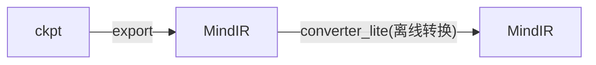
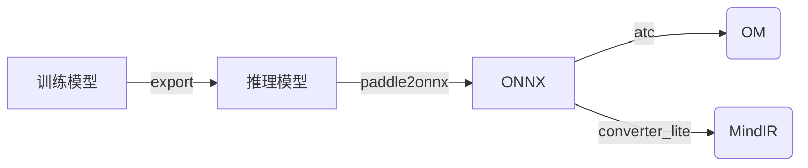
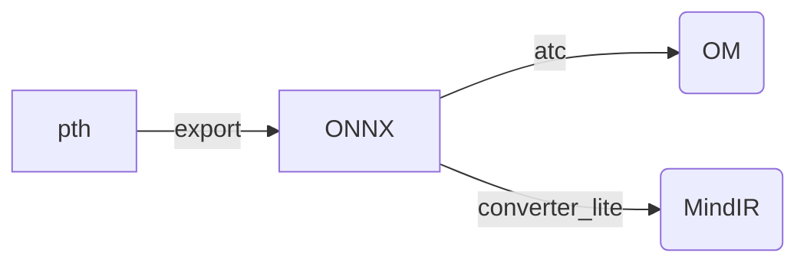

[English](../../en/inference/convert_tutorial_en.md) | 中文

## 推理 - 模型转换教程

### 1. MindOCR模型

MindOCR模型的推理使用[MindSpore Lite](https://www.mindspore.cn/lite)后端。



#### 1.1 模型导出

在推理之前，需要先把训练端的ckpt文件[导出](../../../configs/README.md)为MindIR文件，它保存了模型的结构和权重参数。

部分模型提供了MIndIR导出文件的下载链接，见[模型列表](./models_list_cn.md)，可跳转到对应模型的介绍页面进行下载。

#### 1.2 模型转换

需要使用`converter_lite`工具，将上述导出的MindIR文件进行离线转换，从而用于MindSpore Lite的推理。

`converter_lite`的详细教程见[推理模型离线转换](https://www.mindspore.cn/lite/docs/zh-CN/master/use/cloud_infer/converter_tool.html)。

假设输入模型为input.mindir，经过`converter_lite`工具转换后的输出模型为output.mindir，则模型转换命令如下：

```shell
converter_lite \
    --saveType=MINDIR \
    --NoFusion=false \
    --fmk=MINDIR \
    --device=Ascend \
    --modelFile=input.mindir \
    --outputFile=output \
    --configFile=config.txt
```

其中，`config.txt`可以设置转换模型的Shape和推理精度。

##### 1.2.1 模型Shape配置

- **静态Shape**

如果导出模型的输入名为`x`，输入Shape为`(1,3,736,1280)`，则config.txt如下：

```
[ascend_context]
input_format=NCHW
input_shape=x:[1,3,736,1280]
```

转换生成的output.mindir为静态shape版，推理时的输入图像需要Resize到该input_shape以满足输入要求。

在某些推理场景，如检测出目标后再执行目标识别网络，由于目标个数和大小不固定，如果每次推理都按照最大的BatchSize或最大ImageSize进行计算，会造成计算资源浪费。

假设导出模型输入Shape为(-1, 3, -1, -1)，NHW这3个轴是动态的，所以可以在模型转换时设置一些可选值，以适应推理时各种Shape大小的输入图像。

`converter_lite`通过`configFile`配置`[ascend_context]`中`dynamic_dims`参数来实现，详细信息可参考[动态shape配置](https://www.mindspore.cn/lite/docs/zh-CN/master/use/cloud_infer/converter_tool_ascend.html#动态shape配置)，下文简称”**分档**“。

所以，转换时有2种选择，通过设置不同的config.txt实现：

- **动态Image Size**

N使用固定值，HW使用多个可选值，config.txt如下：

```shell
[ascend_context]
input_format=NCHW
input_shape=x:[1,3,-1,-1]
dynamic_dims=[736,1280],[768,1280],[896,1280],[1024,1280]
```

- **动态Batch Size**

N使用多个可选值，HW使用固定值，config.txt如下：

```shell
[ascend_context]
input_format=NCHW
input_shape=x:[-1,3,736,1280]
dynamic_dims=[1],[4],[8],[16],[32]
```

在转换动态Batch Size/Image Size模型时，NHW值的选择可以由用户根据经验值设定，也可以从数据集中统计而来。

如果模型转换时需要同时支持动态Batch Size和动态Image Size，可以组合多个不同Batch Size的模型，每个模型使用相同的动态Image Size。

为了简化模型转换流程，我们开发了**自动分档工具**，可以从数据集中统计选择动态值和模型转换，详细教程请参考[模型Shape分档](./convert_dynamic_cn.md)。

**注意：**

如果导出的模型是静态Shape版的，则无法分档，需确保导出动态Shape版的模型。

##### 1.2.2 模型精度模式配置

对于模型推理的精度，需要在转换模型时通过`converter_lite`设置。

请参考[Ascend转换工具功能说明](https://www.mindspore.cn/lite/docs/zh-CN/master/use/cloud_infer/converter_tool_ascend.html#%E9%85%8D%E7%BD%AE%E6%96%87%E4%BB%B6)，在配置文件的表格中描述了`precision_mode`参数的使用方法，可选择`enforce_fp16`、`enforce_fp32`、`preferred_fp32`和`enforce_origin`等。

故而，可以在上述`config.txt`的`[ascend_context]`中增加`precision_mode`参数来设置精度：

```
[ascend_context]
input_format=NCHW
input_shape=x:[1,3,736,1280]
precision_mode=enforce_fp32
```

如不设置，默认为`enforce_fp16`。

### 2. PaddleOCR模型

PaddleOCR模型的推理可以使用[ACL](https://www.hiascend.com/document/detail/zh/canncommercial/63RC1/inferapplicationdev/aclcppdevg/aclcppdevg_000004.html)和[MindSpore Lite](https://www.mindspore.cn/lite)两种后端，分别对应OM模型和MindIR模型。




#### 2.1 训练模型 -> 推理模型

在PaddleOCR模型的下载链接中，有训练模型和推理模型两种格式，如果提供的是训练模型，则需要将其转换为推理模型的格式。

在每个训练模型的原PaddleOCR介绍页面，一般会有转换脚本样例，只需要传入训练模型的配置文件、模型文件和保存路径即可。
[示例](https://github.com/PaddlePaddle/PaddleOCR/blob/release/2.6/doc/doc_ch/algorithm_det_db.md)如下：

```shell
# git clone https://github.com/PaddlePaddle/PaddleOCR.git
# cd PaddleOCR
python tools/export_model.py \
	-c configs/det/det_r50_vd_db.yml \
	-o Global.pretrained_model=./det_r50_vd_db_v2.0_train/best_accuracy  \
	Global.save_inference_dir=./det_db
```

#### 2.2 推理模型 -> ONNX

安装模型转换工具paddle2onnx：`pip install paddle2onnx==0.9.5`

详细使用教程请参考[Paddle2ONNX模型转化与预测](https://github.com/PaddlePaddle/PaddleOCR/blob/release/2.6/deploy/paddle2onnx/readme.md)。

执行转换命令，生成onnx模型：

```shell
paddle2onnx \
    --model_dir det_db \
    --model_filename inference.pdmodel \
    --params_filename inference.pdiparams \
    --save_file det_db.onnx \
    --opset_version 11 \
    --input_shape_dict="{'x':[-1,3,-1,-1]}" \
    --enable_onnx_checker True
```

参数中input_shape_dict的值，一般可以通过[Netron](https://github.com/lutzroeder/netron)工具打开推理模型查看，或者在上述[tools/export_model.py](https://github.com/PaddlePaddle/PaddleOCR/blob/release/2.6/tools/export_model.py)的代码中找到。

#### 2.3 ONNX -> OM

使用ATC工具可以将ONNX模型转换为OM模型。

昇腾张量编译器（Ascend Tensor Compiler，简称ATC）是异构计算架构CANN体系下的模型转换工具，它可以将开源框架的网络模型转换为昇腾AI处理器支持的.om格式离线模型，详细教程见[ATC模型转换](https://www.hiascend.com/document/detail/zh/canncommercial/63RC1/inferapplicationdev/atctool/atctool_000001.html)。

##### 2.3.1 模型Shape配置

上述示例中导出的ONNX模型输入Shape为(-1, 3,-1,-1)。

- **静态Shape**

可以转换为静态Shape版的模型，NHW都使用固定值，命令如下：

```shell
atc --model=det_db.onnx \
	--framework=5 \
	--input_shape="x:1,3,736,1280" \
	--input_format=ND \
	--soc_version=Ascend310P3 \
	--output=det_db_static \
	--log=error
```

ATC工具通过设置参数 [dynamic_dims](https://www.hiascend.com/document/detail/zh/CANNCommunityEdition/63RC2alpha002/infacldevg/atctool/atlasatc_16_0056.html)来支持Shape的**分档**，可以在模型转换时设置一些可选值，以适应推理时各种Shape大小的输入图像，如下两种选择：

- **动态Image Size**

N使用固定值，HW使用多个可选值，命令如下：

```shell
atc --model=det_db.onnx \
	--framework=5 \
	--input_shape="x:1,3,-1,-1" \
	--input_format=ND \
	--dynamic_dims="736,1280;768,1280;896,1280;1024,1280" \
	--soc_version=Ascend310P3 \
	--output=det_db_dynamic_bs \
	--log=error
```

- **动态Batch Size**

N使用多个可选值，HW使用固定值，命令如下：

```shell
atc --model=det_db.onnx \
	--framework=5 \
	--input_shape="x:-1,3,736,1280" \
	--input_format=ND \
	--dynamic_dims="1;4;8;16;32" \
	--soc_version=Ascend310P3 \
	--output=det_db_dynamic_bs \
	--log=error
```

在转换动态Batch Size/Image Size模型时，NHW值的选择可以由用户根据经验值设定，也可以从数据集中统计而来。

如果模型转换时需要同时支持动态Batch Size和动态Image Size，可以组合多个不同Batch Size的模型，每个模型使用相同的动态Image Size。

为了简化模型转换流程，我们开发了**自动分档工具**，可以一键式完成动态值选择和模型转换过程，详细教程请参考[模型Shape分档](./convert_dynamic_cn.md)。

**注意：**

如果导出的模型是静态Shape版的，则无法分档，需确保导出动态Shape版的模型。

##### 2.3.2 模型精度模式配置

对于模型推理的精度，需要在转换模型时通过`ATC`设置。

请参考参数[precision_mode](https://www.hiascend.com/document/detail/zh/canncommercial/63RC1/inferapplicationdev/atctool/atctool_000092.html)的说明，可选择`force_fp16`、`force_fp32`、`allow_fp32_to_fp16`、`must_keep_origin_dtype`和`allow_mix_precision`等。

故而，可以在上述`atc`命令中增加`precision_mode`参数来设置精度：

```
atc --model=det_db.onnx \
	--framework=5 \
	--input_shape="x:1,3,736,1280" \
	--input_format=ND \
	--precision_mode=force_fp32 \
	--soc_version=Ascend310P3 \
	--output=det_db_static \
	--log=error
```

如不设置，默认为`force_fp16`。

#### 2.4 ONNX -> MindIR

使用converter_lite工具可以将ONNX模型转换为MindIR模型。工具的详细教程见[MindSpore Lite云侧推理离线模型转换](https://www.mindspore.cn/lite/docs/zh-CN/master/use/cloud_infer/converter_tool.html)。

转换命令如下：

```shell
converter_lite \
    --saveType=MINDIR \
    --NoFusion=false \
    --fmk=ONNX \
    --device=Ascend \
    --modelFile=det_db.onnx \
    --outputFile=det_db_output \
    --configFile=config.txt
```

转换流程和[MindOCR模型](#1-mindocr模型)完全相同，仅有区别是`--fmk`需指定输入是ONNX模型，这里不再赘述。

### 3. MMOCR模型

MMOCR使用Pytorch，其模型文件一般是pth格式。

需要先把它导出为ONNX格式，再转换为[ACL](https://www.hiascend.com/document/detail/zh/canncommercial/63RC1/inferapplicationdev/aclcppdevg/aclcppdevg_000004.html)/[MindSpore Lite](https://www.mindspore.cn/lite)支持的OM/MindIR格式。



#### 3.1 MMOCR模型 -> ONNX

[MMDeploy](https://github.com/open-mmlab/mmdeploy)提供了MMOCR模型导出ONNX的命令，详细教程见[如何转换模型](https://github.com/open-mmlab/mmdeploy/blob/main/docs/zh_cn/02-how-to-run/convert_model.md)。

对于参数`deploy_cfg`需选择目录[mmdeploy/configs/mmocr](https://github.com/open-mmlab/mmdeploy/tree/main/configs/mmocr)下的`*_onnxruntime_dynamic.py`文件，从而导出为动态Shape版ONNX模型。

#### 3.2 ONNX -> OM

请参考上文PaddleOCR小节的[ONNX -> OM](#23-onnx---om)。

#### 3.3 ONNX -> MindIR

请参考上文PaddleOCR小节的[ONNX -> MIndIR](#24-onnx---mindir)。
