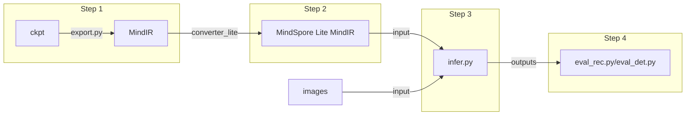

## 推理 - MindOCR模型
### 1. MindOCR模型支持列表
#### 1.1 文本检测

| 模型                                                                              | 骨干网络        | 语言      | 数据集    | F-score(%) | FPS   | data shape (NCHW) | 配置文件                                                                                                     | 下载                                                                                                                     |
|:--------------------------------------------------------------------------------|:------------|---------|:-------|:--------|:------|:------|:---------------------------------------------------------------------------------------------------------|:-----------------------------------------------------------------------------------------------------------------------|
| [DBNet](https://github.com/mindspore-lab/mindocr/tree/main/configs/det/dbnet)   | MobileNetV3 | en      | IC15   | 76.96  | 26.19 | (1,3,736,1280) |[yaml](https://github.com/mindspore-lab/mindocr/tree/main/configs/det/dbnet/db_mobilenetv3_icdar15.yaml) | [ckpt](https://download.mindspore.cn/toolkits/mindocr/dbnet/dbnet_mobilenetv3-62c44539.ckpt) \| [mindir](https://download.mindspore.cn/toolkits/mindocr/dbnet/dbnet_mobilenetv3-62c44539-f14c6a13.mindir)              |
|                                                                                 | ResNet-18   | en      | IC15   | 81.73  | 24.04 | (1,3,736,1280) | [yaml](https://github.com/mindspore-lab/mindocr/tree/main/configs/det/dbnet/db_r18_icdar15.yaml)         | [ckpt](https://download.mindspore.cn/toolkits/mindocr/dbnet/dbnet_resnet18-0c0c4cfa.ckpt) \| [mindir](https://download.mindspore.cn/toolkits/mindocr/dbnet/dbnet_resnet18-0c0c4cfa-cf46eb8b.mindir)                 |
|                                                                                 | ResNet-50   | en      | IC15   | 85.00  | 21.69 | (1,3,736,1280) | [yaml](https://github.com/mindspore-lab/mindocr/tree/main/configs/det/dbnet/db_r50_icdar15.yaml)         | [ckpt](https://download.mindspore.cn/toolkits/mindocr/dbnet/dbnet_resnet50-c3a4aa24.ckpt) \| [mindir](https://download.mindspore.cn/toolkits/mindocr/dbnet/dbnet_resnet50-c3a4aa24-fbf95c82.mindir)                 |
|                                                                                 | ResNet-50   | ch + en | 12个数据集 | 83.41  | 21.69 | (1,3,736,1280) | [yaml](https://github.com/mindspore-lab/mindocr/tree/main/configs/det/dbnet/db_r50_icdar15.yaml)         | [ckpt](https://download.mindspore.cn/toolkits/mindocr/dbnet/dbnet_resnet50_ch_en_general-a5dbb141.ckpt) \| [mindir](https://download.mindspore.cn/toolkits/mindocr/dbnet/dbnet_resnet50_ch_en_general-a5dbb141-912f0a90.mindir)   |
| [DBNet++](https://github.com/mindspore-lab/mindocr/tree/main/configs/det/dbnet) | ResNet-50   | en      | IC15   | 86.79  | 8.46  | (1,3,1152,2048) | [yaml](https://github.com/mindspore-lab/mindocr/tree/main/configs/det/dbnet/db++_r50_icdar15.yaml)       | [ckpt](https://download.mindspore.cn/toolkits/mindocr/dbnet/dbnetpp_resnet50-068166c2.ckpt) \| [mindir](https://download.mindspore.cn/toolkits/mindocr/dbnet/dbnetpp_resnet50-068166c2-9934aff0.mindir)               |
|                                                                                 | ResNet-50   | ch + en | 12个数据集 | 84.30  | 8.46  | (1,3,1152,2048) | [yaml](https://github.com/mindspore-lab/mindocr/tree/main/configs/det/dbnet/db++_r50_icdar15.yaml)       | [ckpt](https://download.mindspore.cn/toolkits/mindocr/dbnet/dbnetpp_resnet50_ch_en_general-884ba5b9.ckpt) \| [mindir](https://download.mindspore.cn/toolkits/mindocr/dbnet/dbnetpp_resnet50_ch_en_general-884ba5b9-b3f52398.mindir) |
| [EAST](https://github.com/mindspore-lab/mindocr/tree/main/configs/det/east)     | ResNet-50   | en      | IC15   | 86.86  | 6.72  | (1,3,720,1280) | [yaml](https://github.com/mindspore-lab/mindocr/tree/main/configs/det/east/east_r50_icdar15.yaml)        | [ckpt](https://download.mindspore.cn/toolkits/mindocr/east/east_resnet50_ic15-7262e359.ckpt) \| [mindir](https://download.mindspore.cn/toolkits/mindocr/east/east_resnet50_ic15-7262e359-5f05cd42.mindir)              |
|                                                                                 | MobileNetV3   | en      | IC15   | 75.32  | 26.77  | (1,3,720,1280) | [yaml](https://github.com/mindspore-lab/mindocr/blob/main/configs/det/east/east_mobilenetv3_icdar15.yaml)        | [ckpt](https://download.mindspore.cn/toolkits/mindocr/east/east_mobilenetv3_ic15-4288dba1.ckpt) \| [mindir](https://download.mindspore.cn/toolkits/mindocr/east/east_mobilenetv3_ic15-4288dba1-5bf242c5.mindir)              |
| [PSENet](https://github.com/mindspore-lab/mindocr/tree/main/configs/det/psenet) | ResNet-152  | en      | IC15   | 82.50  | 2.52  | (1,3,1472,2624) | [yaml](https://github.com/mindspore-lab/mindocr/tree/main/configs/det/psenet/pse_r152_icdar15.yaml)      | [ckpt](https://download.mindspore.cn/toolkits/mindocr/psenet/psenet_resnet152_ic15-6058a798.ckpt) \| [mindir](https://download.mindspore.cn/toolkits/mindocr/psenet/psenet_resnet152_ic15-6058a798-0d755205.mindir)         |
|                                                                                 | ResNet-50  | en      | IC15   | 81.37  | 10.16  | (1,3,736,1312) | [yaml](https://github.com/mindspore-lab/mindocr/tree/main/configs/det/psenet/pse_r50_icdar15.yaml)      | [ckpt](https://download.mindspore.cn/toolkits/mindocr/psenet/psenet_resnet50_ic15-7e36cab9.ckpt) \| [mindir](https://download.mindspore.cn/toolkits/mindocr/psenet/psenet_resnet50_ic15-7e36cab9-cfd2ee6c.mindir)         |
|                                                                                 | MobileNetV3  | en      | IC15   | 70.56  | 10.38  | (1,3,736,1312) | [yaml](https://github.com/mindspore-lab/mindocr/tree/main/configs/det/psenet/pse_mv3_icdar15.yaml)      | [ckpt](https://download.mindspore.cn/toolkits/mindocr/psenet/psenet_mobilenetv3_ic15-bf2c1907.ckpt) \| [mindir](https://download.mindspore.cn/toolkits/mindocr/psenet/psenet_mobilenetv3_ic15-bf2c1907-da7cfe09.mindir)         |
| [FCENet](https://github.com/mindspore-lab/mindocr/tree/main/configs/det/fcenet) | ResNet50 | en | IC15 | 78.94 | 14.59 | (1,3,736,1280) | [yaml](https://github.com/mindspore-lab/mindocr/blob/main/configs/det/fcenet/fce_icdar15.yaml) | [ckpt](https://download.mindspore.cn/toolkits/mindocr/fcenet/fcenet_resnet50-43857f7f.ckpt) \| [mindir](https://download.mindspore.cn/toolkits/mindocr/fcenet/fcenet_resnet50-43857f7f-dad7dfcc.mindir) |

#### 1.2 文本识别

| 模型                                                                         | 骨干网络     | 字典文件                                                                                           | 数据集 | Acc(%)    | FPS    | data shape (NCHW) | 配置文件                                                                                           | 下载                                                                                                            |
|:----------------------------------------------------------------------------|:------------|:-------------------------------------------------------------------------------------------------|:------|:------|:-------|:-------|:--------------------------------------------------------------------------------------------------|:---------------------------------------------------------------------------------------------------------------|
| [CRNN](https://github.com/mindspore-lab/mindocr/tree/main/configs/rec/crnn) | VGG7        | Default                                                                                          | IC15  | 66.01 | 465.64 | (1,3,32,100) | [yaml](https://github.com/mindspore-lab/mindocr/tree/main/configs/rec/crnn/crnn_vgg7.yaml)        | [ckpt](https://download.mindspore.cn/toolkits/mindocr/crnn/crnn_vgg7-ea7e996c.ckpt) \| [mindir](https://download.mindspore.cn/toolkits/mindocr/crnn/crnn_vgg7-ea7e996c-573dbd61.mindir)               |
|                                                                             | ResNet34_vd | Default                                                                                          | IC15  | 69.67 | 397.29 | (1,3,32,100) |[yaml](https://github.com/mindspore-lab/mindocr/tree/main/configs/rec/crnn/crnn_resnet34.yaml)    | [ckpt](https://download.mindspore.cn/toolkits/mindocr/crnn/crnn_resnet34-83f37f07.ckpt) \| [mindir](https://download.mindspore.cn/toolkits/mindocr/crnn/crnn_resnet34-83f37f07-eb10a0c9.mindir)           |
|                                                                             | ResNet34_vd | [ch_dict.txt](https://github.com/mindspore-lab/mindocr/tree/main/mindocr/utils/dict/ch_dict.txt) | /     | /      | /      | (1,3,32,320) | [yaml](https://github.com/mindspore-lab/mindocr/tree/main/configs/rec/crnn/crnn_resnet34_ch.yaml) | [ckpt](https://download.mindspore.cn/toolkits/mindocr/crnn/crnn_resnet34_ch-7a342e3c.ckpt) \| [mindir](https://download.mindspore.cn/toolkits/mindocr/crnn/crnn_resnet34_ch-7a342e3c-105bccb2.mindir)        |
| [SVTR](https://github.com/mindspore-lab/mindocr/tree/main/configs/rec/svtr) | Tiny        | Default                                                                                          | IC15  | 79.92 | 338.04 | (1,3,64,256)  | [yaml](https://github.com/mindspore-lab/mindocr/blob/main/configs/rec/svtr/svtr_tiny.yaml)    | [ckpt](https://download.mindspore.cn/toolkits/mindocr/svtr/svtr_tiny-950be1c3.ckpt) \| [mindir](https://download.mindspore.cn/toolkits/mindocr/svtr/svtr_tiny-950be1c3-86ece8c8.mindir)    |
| [Rare](https://github.com/mindspore-lab/mindocr/tree/main/configs/rec/rare) | ResNet34_vd | Default                                                                                          | IC15  | 69.47 | 273.23 | (1,3,32,100) | [yaml](https://github.com/mindspore-lab/mindocr/blob/main/configs/rec/rare/rare_resnet34.yaml)    | [ckpt](https://download.mindspore.cn/toolkits/mindocr/rare/rare_resnet34-309dc63e.ckpt) \| [mindir](https://download.mindspore.cn/toolkits/mindocr/rare/rare_resnet34_ascend-309dc63e-b96c2a4b.mindir)    |
|                                                                             | ResNet34_vd | [ch_dict.txt](https://github.com/mindspore-lab/mindocr/tree/main/mindocr/utils/dict/ch_dict.txt) | /     | /      | /      | (1,3,32,320) | [yaml](https://github.com/mindspore-lab/mindocr/blob/main/configs/rec/rare/rare_resnet34_ch.yaml) | [ckpt](https://download.mindspore.cn/toolkits/mindocr/rare/rare_resnet34_ch-5f3023e2.ckpt) \| [mindir](https://download.mindspore.cn/toolkits/mindocr/rare/rare_resnet34_ch_ascend-5f3023e2-11f0d554.mindir) |
| [RobustScanner](https://github.com/mindspore-lab/mindocr/tree/main/configs/rec/robustscanner) | ResNet-31 | [en_dict90.txt](https://github.com/mindspore-lab/mindocr/blob/main/mindocr/utils/dict/en_dict90.txt) | IC15 | 73.71 | 22.30 | (1,3,48,160) | [yaml](https://github.com/mindspore-lab/mindocr/blob/main/configs/rec/robustscanner/robustscanner_resnet31.yaml) | [ckpt](https://download.mindspore.cn/toolkits/mindocr/robustscanner/robustscanner_resnet31-f27eab37.ckpt) \| [mindir](https://download.mindspore.cn/toolkits/mindocr/robustscanner/robustscanner_resnet31-f27eab37-158bde10.mindir) |
| [VisionLAN](https://github.com/mindspore-lab/mindocr/tree/main/configs/rec/visionlan) | ResNet-45 | Default |  IC15 |  80.07  |  321.37 | (1,3,64,256) | [yaml(LA)](https://github.com/mindspore-lab/mindocr/blob/main/configs/rec/visionlan/visionlan_resnet45_LA.yaml) | [ckpt(LA)](https://download.mindspore.cn/toolkits/mindocr/visionlan/visionlan_resnet45_LA-e9720d9e.ckpt) \| [mindir(LA)](https://download.mindspore.cn/toolkits/mindocr/visionlan/visionlan_resnet45_LA-e9720d9e-71b38d2d.mindir) |

<br></br>
### 2. MindOCR推理流程

如上图所示，推理流程分为以下几步：

1. 将MindOCR训练完成后的ckpt模型，使用```tools/export.py```导出成MindIR模型；
2. 下载并配置[模型转换工具](https://www.mindspore.cn/lite/docs/zh-CN/master/use/cloud_infer/converter_tool.html)（即**converter_lite**），使用converter_lite工具将MindIR模型导出成MindSpore Lite MindIR模型；
3. 准备好MindSpore Lite MindIR模型和输入图片后，使用```deploy/py_infer/infer.py```进行推理；
4. 根据模型种类不同，使用```deploy/eval_utils/eval_det.py```对文本检测类模型的推理结果进行评估，或者使用```deploy/eval_utils/eval_rec.py```对文本识别类模型的推理结果进行评估。

**注意：Step 1在Ascend910、GPU或CPU上执行。Step 2,3,4在Ascend310或310P上执行。**
<br></br>
### 3. MindOCR推理方法
#### 3.1 文本检测
下面以[模型表格](#11-文本检测)中的`DBNet ResNet-50 en`为例介绍推理方法：
- 下载模型表格中的[ckpt文件](https://download.mindspore.cn/toolkits/mindocr/dbnet/dbnet_resnet50-c3a4aa24.ckpt)并使用以下命令导出为MindIR
，或者直接从模型表格下载已经导出完成的[MindIR文件](https://download.mindspore.cn/toolkits/mindocr/dbnet/dbnet_resnet50-c3a4aa24-fbf95c82.mindir):
``` shell
# 使用本地ckpt文件，导出`DBNet ResNet-50 en` 模型的MindIR
# 更多参数使用详情，请执行 `python tools/export.py -h`
python tools/export.py --model_name_or_config dbnet_resnet50 --data_shape 736 1280 --local_ckpt_path /path/to/dbnet.ckpt
```
上述命令中```--model_name_or_config```为MindOCR中的模型名称或传入yaml目录(例如```--model_name_or_config configs/rec/crnn/crnn_resnet34.yaml```)；

```--data_shape 736 1280```参数表明模型输入图片的大小为[736, 1280]，每个MindOCR模型都对应着一个固定导出data shape，详细请见模型支持列表中的**data shape**列；

```--local_ckpt_path /path/to/dbnet.ckpt```参数表明需要导出的模型文件为```/path/to/dbnet.ckpt```

- 在Ascend310或310P上使用converter_lite工具将MindIR转换为MindSpore Lite MindIR：

执行以下命令：
```shell
converter_lite \
    --saveType=MINDIR \
    --fmk=MINDIR \
    --optimize=ascend_oriented \
    --modelFile=dbnet_resnet50-c3a4aa24-fbf95c82.mindir \
    --outputFile=dbnet_resnet50
```
上述命令中：

```--fmk=MINDIR```表明输入模型的原始格式为MindIR，同时```—fmk```参数还支持ONNX等；

```--saveType=MINDIR```表明输出模型格式为MindIR格式；

```--optimize=ascend_oriented```表明针对Ascend设备做优化；

```--modelFile=dbnet_resnet50-c3a4aa24-fbf95c82.mindir```表明当前需要转换的模型路径为```dbnet_resnet50-c3a4aa24-fbf95c82.mindir```；

```--outputFile=dbnet_resnet50```表明输出模型的路径为```dbnet_resnet50```，不需要加.mindir后缀，可自动生成；

上述命令执行完成后会生成`dbnet_resnet50.mindir`模型文件;


> 了解更多[converter_lite](https://www.mindspore.cn/lite/docs/zh-CN/master/use/cloud_infer/converter_tool.html)

> 了解更多[模型转换教程](convert_tutorial.md)

- 使用`/deploy/py_infer/infer.py`脚本和`dbnet_resnet50.mindir`文件执行推理：

```shell
python infer.py \
    --input_images_dir=/path/to/ic15/ch4_test_images \
    --det_model_path=/path/to/mindir/dbnet_resnet50.mindir \
    --det_model_name_or_config=en_ms_det_dbnet_resnet50 \
    --res_save_dir=/path/to/dbnet_resnet50_results
```
执行完成后，在参数`--res_save_dir`所指目录下生成预测文件`det_results.txt`；

在进行推理时，可使用`--vis_det_save_dir`参数进行结果可视化：
<p align="center">

</p>
<p align="center">
<em>文本检测结果可视化</em>
</p>

> 了解更多[infer.py](inference_tutorial.md#42-详细推理参数解释)推理参数

- 使用以下命令评估结果：

```shell
python deploy/eval_utils/eval_det.py \
		--gt_path=/path/to/ic15/test_det_gt.txt \
		--pred_path=/path/to/dbnet_resnet50_results/det_results.txt
```
结果为: `{'recall': 0.8348579682233991, 'precision': 0.8657014478282576, 'f-score': 0.85}`
<br></br>

#### 3.2 文本识别
下面以[模型表格](#12-文本识别)中的`CRNN ResNet34_vd en`为例介绍推理方法：

- 下载模型表格中的[MindIR文件](https://download.mindspore.cn/toolkits/mindocr/crnn/crnn_resnet34-83f37f07-eb10a0c9.mindir)；

- 在Ascend310或310P上使用converter_lite工具将MindIR转换为MindSpore Lite MindIR：

执行以下命令：
```shell
converter_lite \
    --saveType=MINDIR \
    --fmk=MINDIR \
    --optimize=ascend_oriented \
    --modelFile=crnn_resnet34-83f37f07-eb10a0c9.mindir \
    --outputFile=crnn_resnet34vd
```
上述命令执行完成后会生成`crnn_resnet34vd.mindir`模型文件；

converter_lite参数简要说明请见上述文本检测样例。
> 了解更多[converter_lite](https://www.mindspore.cn/lite/docs/zh-CN/master/use/cloud_infer/converter_tool.html)

> 了解更多[模型转换教程](convert_tutorial.md)

- 使用`/deploy/py_infer/infer.py`脚本和`crnn_resnet34vd.mindir`文件执行推理：

```shell
python infer.py \
    --input_images_dir=/path/to/ic15/ch4_test_word_images \
    --rec_model_path=/path/to/mindir/crnn_resnet34vd.mindir \
    --rec_model_name_or_config=../../configs/rec/crnn/crnn_resnet34.yaml \
    --res_save_dir=/path/to/rec_infer_results
```
执行完成后，在参数`--res_save_dir`所指目录下生成预测文件`rec_results.txt`。
> 了解更多[infer.py](inference_tutorial.md#42-详细推理参数解释)推理参数

- 使用以下命令评估结果：

```shell
python deploy/eval_utils/eval_rec.py \
		--gt_path=/path/to/ic15/rec_gt.txt \
		--pred_path=/path/to/rec_infer_results/rec_results.txt
```
结果为: `{'acc': 0.6966779232025146, 'norm_edit_distance': 0.8627135157585144}`
