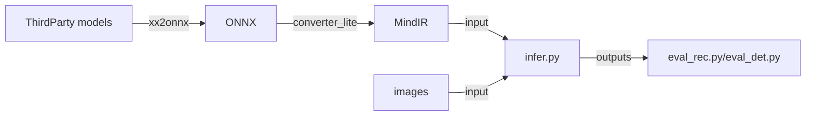

## 第三方模型离线推理 - 快速开始
### 1. 第三方模型支持列表
MindOCR可以支持第三方模型（如PaddleOCR、MMOCR等）的推理，本文档展示了已适配的模型列表。 性能测试基于Ascend310P，部分模型暂无测试数据集。
#### 1.1 文本检测
|             名称             |  模型   |   骨干网络    | 数据集 | F-score(%) |  FPS  |    来源    |                                                                   配置文件                                                                   |                                                                                   下载                                                                                   |                                                          参考链接                                                          |
|:---------------------------:|:-------:|:-----------:|:-----:|:----------:|:-----:|:---------:|:-------------------------------------------------------------------------------------------------------------------------------------------:|:-----------------------------------------------------------------------------------------------------------------------------------------------------------------------:|:------------------------------------------------------------------------------------------------------------------------:|
|          ch_pp_det_OCRv4          | DBNet   | MobileNetV3 | / | /  | / | PaddleOCR |   [yaml](https://github.com/mindspore-lab/mindocr/tree/main/deploy/py_infer/src/configs/det/ppocr/ch_PP-OCRv4_det_cml.yaml)     | [infer model](https://paddleocr.bj.bcebos.com/PP-OCRv4/chinese/ch_PP-OCRv4_det_infer.tar)                                                                         | [ch_PP-OCRv4_det](https://github.com/PaddlePaddle/PaddleOCR/blob/release/2.7/doc/doc_ch/PP-OCRv4_introduction.md) |
|    ch_pp_server_det_v2.0    |  DBNet  | ResNet18_vd | MLT17 |   46.22    | 21.65 | PaddleOCR |         [yaml](https://github.com/mindspore-lab/mindocr/tree/main/deploy/py_infer/src/configs/det/ppocr/ch_det_res18_db_v2.0.yaml)          |                                      [infer model](https://paddleocr.bj.bcebos.com/dygraph_v2.0/ch/ch_ppocr_server_v2.0_det_infer.tar)                                       |   [ch_ppocr_server_v2.0_det](https://github.com/PaddlePaddle/PaddleOCR/blob/release/2.6/doc/doc_en/models_list_en.md)    |
|       ch_pp_det_OCRv3       |  DBNet  | MobileNetV3 | MLT17 |   33.89    | 22.40 | PaddleOCR |          [yaml](https://github.com/mindspore-lab/mindocr/tree/main/deploy/py_infer/src/configs/det/ppocr/ch_PP-OCRv3_det_cml.yaml)          |                                          [infer model](https://paddleocr.bj.bcebos.com/PP-OCRv3/chinese/ch_PP-OCRv3_det_infer.tar)                                           |        [ch_PP-OCRv3_det](https://github.com/PaddlePaddle/PaddleOCR/blob/release/2.6/doc/doc_en/models_list_en.md)        |
|       ch_pp_det_OCRv2       |  DBNet  | MobileNetV3 | MLT17 |   42.99    | 21.90 | PaddleOCR |          [yaml](https://github.com/mindspore-lab/mindocr/tree/main/deploy/py_infer/src/configs/det/ppocr/ch_PP-OCRv2_det_cml.yaml)          |                                          [infer model](https://paddleocr.bj.bcebos.com/PP-OCRv2/chinese/ch_PP-OCRv2_det_infer.tar)                                           |        [ch_PP-OCRv2_det](https://github.com/PaddlePaddle/PaddleOCR/blob/release/2.6/doc/doc_en/models_list_en.md)        |
| ch_pp_mobile_det_v2.0_slim  |  DBNet  | MobileNetV3 | MLT17 |   31.66    | 19.88 | PaddleOCR |          [yaml](https://github.com/mindspore-lab/mindocr/tree/main/deploy/py_infer/src/configs/det/ppocr/ch_det_mv3_db_v2.0.yaml)           |                                  [infer model](https://paddleocr.bj.bcebos.com/dygraph_v2.0/slim/ch_ppocr_mobile_v2.0_det_prune_infer.tar)                                   | [ch_ppocr_mobile_slim_v2.0_det](https://github.com/PaddlePaddle/PaddleOCR/blob/release/2.6/doc/doc_en/models_list_en.md) |
|    ch_pp_mobile_det_v2.0    |  DBNet  | MobileNetV3 | MLT17 |   31.56    | 21.96 | PaddleOCR |          [yaml](https://github.com/mindspore-lab/mindocr/tree/main/deploy/py_infer/src/configs/det/ppocr/ch_det_mv3_db_v2.0.yaml)           |                                      [infer model](https://paddleocr.bj.bcebos.com/dygraph_v2.0/ch/ch_ppocr_mobile_v2.0_det_infer.tar)                                       |   [ch_ppocr_mobile_v2.0_det](https://github.com/PaddlePaddle/PaddleOCR/blob/release/2.6/doc/doc_en/models_list_en.md)    |
|       en_pp_det_OCRv3       |  DBNet  | MobileNetV3 | IC15  |   42.14    | 55.55 | PaddleOCR |          [yaml](https://github.com/mindspore-lab/mindocr/tree/main/deploy/py_infer/src/configs/det/ppocr/ch_PP-OCRv3_det_cml.yaml)          |                                          [infer model](https://paddleocr.bj.bcebos.com/PP-OCRv3/english/en_PP-OCRv3_det_infer.tar)                                           |        [en_PP-OCRv3_det](https://github.com/PaddlePaddle/PaddleOCR/blob/release/2.6/doc/doc_en/models_list_en.md)        |
|       ml_pp_det_OCRv3       |  DBNet  | MobileNetV3 | MLT17 |   66.01    | 22.48 | PaddleOCR |          [yaml](https://github.com/mindspore-lab/mindocr/tree/main/deploy/py_infer/src/configs/det/ppocr/ch_PP-OCRv3_det_cml.yaml)          |                                   [infer model](https://paddleocr.bj.bcebos.com/PP-OCRv3/multilingual/Multilingual_PP-OCRv3_det_infer.tar)                                   |        [ml_PP-OCRv3_det](https://github.com/PaddlePaddle/PaddleOCR/blob/release/2.6/doc/doc_en/models_list_en.md)        |
| en_pp_det_dbnet_resnet50vd  |  DBNet  | ResNet50_vd | IC15  |   79.89    | 21.17 | PaddleOCR |             [yaml](https://github.com/mindspore-lab/mindocr/tree/main/deploy/py_infer/src/configs/det/ppocr/det_r50_vd_db.yaml)             |                                         [infer model](https://paddleocr.bj.bcebos.com/dygraph_v2.0/en/det_r50_vd_db_v2.0_infer.tar)                                          |          [DBNet](https://github.com/PaddlePaddle/PaddleOCR/blob/release/2.6/doc/doc_en/algorithm_det_db_en.md)           |
| en_pp_det_psenet_resnet50vd |   PSE   | ResNet50_vd | IC15  |   80.44    | 7.75  | PaddleOCR |            [yaml](https://github.com/mindspore-lab/mindocr/tree/main/deploy/py_infer/src/configs/det/ppocr/det_r50_vd_pse.yaml)             |                                       [train model](https://paddleocr.bj.bcebos.com/dygraph_v2.1/en_det/det_r50_vd_pse_v2.0_train.tar)                                       |         [PSE](https://github.com/PaddlePaddle/PaddleOCR/blob/release/2.6/doc/doc_en/algorithm_det_psenet_en.md)          |
|  en_pp_det_east_resnet50vd  |  EAST   | ResNet50_vd | IC15  |   85.58    | 20.70 | PaddleOCR |            [yaml](https://github.com/mindspore-lab/mindocr/tree/main/deploy/py_infer/src/configs/det/ppocr/det_r50_vd_east.yaml)            |                                        [train model](https://paddleocr.bj.bcebos.com/dygraph_v2.0/en/det_r50_vd_east_v2.0_infer.tar)                                         |          [EAST](https://github.com/PaddlePaddle/PaddleOCR/blob/release/2.6/doc/doc_en/algorithm_det_east_en.md)          |
|  en_pp_det_sast_resnet50vd  |  SAST   | ResNet50_vd | IC15  |   81.77    | 22.14 | PaddleOCR |        [yaml](https://github.com/mindspore-lab/mindocr/tree/main/deploy/py_infer/src/configs/det/ppocr/det_r50_vd_sast_icdar15.yaml)        |                                    [train model](https://paddleocr.bj.bcebos.com/dygraph_v2.0/en/det_r50_vd_sast_icdar15_v2.0_train.tar)                                     |          [SAST](https://github.com/PaddlePaddle/PaddleOCR/blob/release/2.6/doc/doc_en/algorithm_det_sast_en.md)          |
| en_mm_det_dbnetpp_resnet50  | DBNet++ |  ResNet50   | IC15  |   81.36    | 10.66 |   MMOCR   | [yaml](https://github.com/mindspore-lab/mindocr/tree/main/deploy/py_infer/src/configs/det/mmocr/dbnetpp_resnet50_fpnc_1200e_icdar2015.yaml) | [train model](https://download.openmmlab.com/mmocr/textdet/dbnetpp/dbnetpp_resnet50_fpnc_1200e_icdar2015/dbnetpp_resnet50_fpnc_1200e_icdar2015_20221025_185550-013730aa.pth) |                [DBNetpp](https://github.com/open-mmlab/mmocr/blob/main/configs/textdet/dbnetpp/README.md)                |
|  en_mm_det_fcenet_resnet50  | FCENet  |  ResNet50   | IC15  |   83.67    | 3.34  |   MMOCR   |  [yaml](https://github.com/mindspore-lab/mindocr/tree/main/deploy/py_infer/src/configs/det/mmocr/fcenet_resnet50_fpn_1500e_icdar2015.yaml)  |   [train model](https://download.openmmlab.com/mmocr/textdet/fcenet/fcenet_resnet50_fpn_1500e_icdar2015/fcenet_resnet50_fpn_1500e_icdar2015_20220826_140941-167d9042.pth)    |                 [FCENet](https://github.com/open-mmlab/mmocr/blob/main/configs/textdet/fcenet/README.md)                 |

**注意：在使用en_pp_det_psenet_resnet50vd模型进行推理时，需要使用以下命令修改onnx文件**

```shell
python deploy/models_utils/onnx_optim/insert_pse_postprocess.py \
      --model_path=./pse_r50vd.onnx \
      --binary_thresh=0.0 \
      --scale=1.0
```

#### 1.2 文本识别

|                名称                |  模型   |       骨干网络       |   数据集    | Acc(%) |  FPS   |    来源    |                                                         字典文件                                                          | 配置文件                                                                                                                                 | 下载                                                                                                                                                          | 参考链接                                                                                                                   |
|:---------------------------------:|:-------:|:------------------:|:----------:|:------:|:------:|:---------:|:------------------------------------------------------------------------------------------------------------------------:|:---------------------------------------------------------------------------------------------------------------------------------------|:-------------------------------------------------------------------------------------------------------------------------------------------------------------|:--------------------------------------------------------------------------------------------------------------------------|
|          ch_pp_rec_OCRv4          |  CRNN   | MobileNetV1Enhance | / | /  | / | PaddleOCR |      [ppocr_keys_v1.txt](https://github.com/PaddlePaddle/PaddleOCR/blob/release/2.6/ppocr/utils/ppocr_keys_v1.txt)       | [yaml](https://github.com/mindspore-lab/mindocr/tree/main/deploy/py_infer/src/configs/rec/ppocr/ch_PP-OCRv4_rec_distillation.yaml)     | [infer model](https://paddleocr.bj.bcebos.com/PP-OCRv4/chinese/ch_PP-OCRv4_rec_infer.tar)                                                                | [ch_PP-OCRv4_rec](https://github.com/PaddlePaddle/PaddleOCR/blob/release/2.7/doc/doc_ch/PP-OCRv4_introduction.md)                |
|       ch_pp_server_rec_v2.0       |  CRNN   |      ResNet34      | MLT17 (ch) | 49.91  | 154.16 | PaddleOCR |      [ppocr_keys_v1.txt](https://github.com/PaddlePaddle/PaddleOCR/blob/release/2.6/ppocr/utils/ppocr_keys_v1.txt)       | [yaml](https://github.com/mindspore-lab/mindocr/tree/main/deploy/py_infer/src/configs/rec/ppocr/rec_chinese_common_v2.0.yaml)    | [infer model](https://paddleocr.bj.bcebos.com/dygraph_v2.0/ch/ch_ppocr_server_v2.0_rec_infer.tar)                                                                 | [ch_ppocr_server_v2.0_rec](https://github.com/PaddlePaddle/PaddleOCR/blob/release/2.6/doc/doc_en/models_list_en.md)       |
|          ch_pp_rec_OCRv3          |  SVTR   | MobileNetV1Enhance | MLT17 (ch) | 49.91  | 408.38 | PaddleOCR |      [ppocr_keys_v1.txt](https://github.com/PaddlePaddle/PaddleOCR/blob/release/2.6/ppocr/utils/ppocr_keys_v1.txt)       | [yaml](https://github.com/mindspore-lab/mindocr/tree/main/deploy/py_infer/src/configs/rec/ppocr/ch_PP-OCRv3_rec_distillation.yaml)     | [infer model](https://paddleocr.bj.bcebos.com/PP-OCRv3/chinese/ch_PP-OCRv3_rec_infer.tar)                                                                         | [ch_PP-OCRv3_rec](https://github.com/PaddlePaddle/PaddleOCR/blob/release/2.6/doc/doc_en/models_list_en.md)                |
|          ch_pp_rec_OCRv2          |  CRNN   | MobileNetV1Enhance | MLT17 (ch) | 44.59  | 203.34 | PaddleOCR |      [ppocr_keys_v1.txt](https://github.com/PaddlePaddle/PaddleOCR/blob/release/2.6/ppocr/utils/ppocr_keys_v1.txt)       | [yaml](https://github.com/mindspore-lab/mindocr/tree/main/deploy/py_infer/src/configs/rec/ppocr/ch_PP-OCRv2_rec_distillation.yaml)     | [infer model](https://paddleocr.bj.bcebos.com/PP-OCRv2/chinese/ch_PP-OCRv2_rec_infer.tar)                                                                         | [ch_PP-OCRv2_rec](https://github.com/PaddlePaddle/PaddleOCR/blob/release/2.6/doc/doc_en/models_list_en.md)                |
|       ch_pp_mobile_rec_v2.0       |  CRNN   |    MobileNetV3     | MLT17 (ch) | 24.59  | 167.67 | PaddleOCR |      [ppocr_keys_v1.txt](https://github.com/PaddlePaddle/PaddleOCR/blob/release/2.6/ppocr/utils/ppocr_keys_v1.txt)       | [yaml](https://github.com/mindspore-lab/mindocr/tree/main/deploy/py_infer/src/configs/rec/ppocr/rec_chinese_lite_v2.0.yaml)      | [infer model](https://paddleocr.bj.bcebos.com/dygraph_v2.0/ch/ch_ppocr_mobile_v2.0_rec_infer.tar)                                                                 | [ch_ppocr_mobile_v2.0_rec](https://github.com/PaddlePaddle/PaddleOCR/blob/release/2.6/doc/doc_en/models_list_en.md)       |
|          en_pp_rec_OCRv3          |  SVTR   | MobileNetV1Enhance | MLT17 (en) | 79.79  | 917.01 | PaddleOCR |            [en_dict.txt](https://github.com/PaddlePaddle/PaddleOCR/blob/release/2.6/ppocr/utils/en_dict.txt)             | [yaml](https://github.com/mindspore-lab/mindocr/tree/main/deploy/py_infer/src/configs/rec/ppocr/en_PP-OCRv3_rec.yaml)                  | [infer model](https://paddleocr.bj.bcebos.com/PP-OCRv3/english/en_PP-OCRv3_rec_infer.tar)                                                                         | [en_PP-OCRv3_rec](https://github.com/PaddlePaddle/PaddleOCR/blob/release/2.6/doc/doc_en/models_list_en.md)                |
| en_pp_mobile_rec_number_v2.0_slim |  CRNN   |    MobileNetV3     |     /      |   /    |   /    | PaddleOCR |            [en_dict.txt](https://github.com/PaddlePaddle/PaddleOCR/blob/release/2.6/ppocr/utils/en_dict.txt)             | [yaml](https://github.com/mindspore-lab/mindocr/tree/main/deploy/py_infer/src/configs/rec/ppocr/rec_en_number_lite.yaml)         | [infer model](https://paddleocr.bj.bcebos.com/dygraph_v2.0/en/en_number_mobile_v2.0_rec_slim_infer.tar)                                                           | [en_number_mobile_slim_v2.0_rec](https://github.com/PaddlePaddle/PaddleOCR/blob/release/2.6/doc/doc_en/models_list_en.md) |
|   en_pp_mobile_rec_number_v2.0    |  CRNN   |    MobileNetV3     |     /      |   /    |   /    | PaddleOCR |            [en_dict.txt](https://github.com/PaddlePaddle/PaddleOCR/blob/release/2.6/ppocr/utils/en_dict.txt)             | [yaml](https://github.com/mindspore-lab/mindocr/tree/main/deploy/py_infer/src/configs/rec/ppocr/rec_en_number_lite.yaml)         | [infer model](https://paddleocr.bj.bcebos.com/dygraph_v2.0/multilingual/en_number_mobile_v2.0_rec_infer.tar)                                                      | [en_number_mobile_v2.0_rec](https://github.com/PaddlePaddle/PaddleOCR/blob/release/2.6/doc/doc_en/models_list_en.md)      |
|        korean_pp_rec_OCRv3        |  SVTR   | MobileNetV1Enhance |     /      |   /    |   /    | PaddleOCR |      [korean_dict.txt](https://github.com/PaddlePaddle/PaddleOCR/blob/release/2.6/ppocr/utils/dict/korean_dict.txt)      | [yaml](https://github.com/mindspore-lab/mindocr/tree/main/deploy/py_infer/src/configs/rec/ppocr/korean_PP-OCRv3_rec.yaml)              | [infer model](https://paddleocr.bj.bcebos.com/PP-OCRv3/multilingual/korean_PP-OCRv3_rec_infer.tar)                                                                | [korean_PP-OCRv3_rec](https://github.com/PaddlePaddle/PaddleOCR/blob/release/2.6/doc/doc_en/models_list_en.md)            |
|        japan_pp_rec_OCRv3         |  SVTR   | MobileNetV1Enhance |     /      |   /    |   /    | PaddleOCR |       [japan_dict.txt](https://github.com/PaddlePaddle/PaddleOCR/blob/release/2.6/ppocr/utils/dict/japan_dict.txt)       | [yaml](https://github.com/mindspore-lab/mindocr/tree/main/deploy/py_infer/src/configs/rec/ppocr/japan_PP-OCRv3_rec.yaml)               | [infer model](https://paddleocr.bj.bcebos.com/PP-OCRv3/multilingual/japan_PP-OCRv3_rec_infer.tar)                                                                 | [japan_PP-OCRv3_rec](https://github.com/PaddlePaddle/PaddleOCR/blob/release/2.6/doc/doc_en/models_list_en.md)             |
|     chinese_cht_pp_rec_OCRv3      |  SVTR   | MobileNetV1Enhance |     /      |   /    |   /    | PaddleOCR | [chinese_cht_dict.txt](https://github.com/PaddlePaddle/PaddleOCR/blob/release/2.6/ppocr/utils/dict/chinese_cht_dict.txt) | [yaml](https://github.com/mindspore-lab/mindocr/tree/main/deploy/py_infer/src/configs/rec/ppocr/chinese_cht_PP-OCRv3_rec.yaml)         | [infer model](https://paddleocr.bj.bcebos.com/PP-OCRv3/multilingual/chinese_cht_PP-OCRv3_rec_infer.tar)                                                           | [chinese_cht_PP-OCRv3_rec](https://github.com/PaddlePaddle/PaddleOCR/blob/release/2.6/doc/doc_en/models_list_en.md)       |
|          te_pp_rec_OCRv3          |  SVTR   | MobileNetV1Enhance |     /      |   /    |   /    | PaddleOCR |          [te_dict.txt](https://github.com/PaddlePaddle/PaddleOCR/blob/release/2.6/ppocr/utils/dict/te_dict.txt)          | [yaml](https://github.com/mindspore-lab/mindocr/tree/main/deploy/py_infer/src/configs/rec/ppocr/te_PP-OCRv3_rec.yaml)                  | [infer model](https://paddleocr.bj.bcebos.com/PP-OCRv3/multilingual/te_PP-OCRv3_rec_infer.tar)                                                                    | [te_PP-OCRv3_rec](https://github.com/PaddlePaddle/PaddleOCR/blob/release/2.6/doc/doc_en/models_list_en.md)                |
|          ka_pp_rec_OCRv3          |  SVTR   | MobileNetV1Enhance |     /      |   /    |   /    | PaddleOCR |          [ka_dict.txt](https://github.com/PaddlePaddle/PaddleOCR/blob/release/2.6/ppocr/utils/dict/ka_dict.txt)          | [yaml](https://github.com/mindspore-lab/mindocr/tree/main/deploy/py_infer/src/configs/rec/ppocr/ka_PP-OCRv3_rec.yaml)                  | [infer model](https://paddleocr.bj.bcebos.com/PP-OCRv3/multilingual/ka_PP-OCRv3_rec_infer.tar)                                                                    | [ka_PP-OCRv3_rec](https://github.com/PaddlePaddle/PaddleOCR/blob/release/2.6/doc/doc_en/models_list_en.md)                |
|          ta_pp_rec_OCRv3          |  SVTR   | MobileNetV1Enhance |     /      |   /    |   /    | PaddleOCR |          [ta_dict.txt](https://github.com/PaddlePaddle/PaddleOCR/blob/release/2.6/ppocr/utils/dict/ta_dict.txt)          | [yaml](https://github.com/mindspore-lab/mindocr/tree/main/deploy/py_infer/src/configs/rec/ppocr/ta_PP-OCRv3_rec.yaml)                  | [infer model](https://paddleocr.bj.bcebos.com/PP-OCRv3/multilingual/ta_PP-OCRv3_rec_infer.tar)                                                                    | [ta_PP-OCRv3_rec](https://github.com/PaddlePaddle/PaddleOCR/blob/release/2.6/doc/doc_en/models_list_en.md)                |
|        latin_pp_rec_OCRv3         |  SVTR   | MobileNetV1Enhance |     /      |   /    |   /    | PaddleOCR |       [latin_dict.txt](https://github.com/PaddlePaddle/PaddleOCR/blob/release/2.6/ppocr/utils/dict/latin_dict.txt)       | [yaml](https://github.com/mindspore-lab/mindocr/tree/main/deploy/py_infer/src/configs/rec/ppocr/latin_PP-OCRv3_rec.yaml)               | [infer model](https://paddleocr.bj.bcebos.com/PP-OCRv3/multilingual/latin_PP-OCRv3_rec_infer.tar)                                                                 | [latin_PP-OCRv3_rec](https://github.com/PaddlePaddle/PaddleOCR/blob/release/2.6/doc/doc_en/models_list_en.md)             |
|        arabic_pp_rec_OCRv3        |  SVTR   | MobileNetV1Enhance |     /      |   /    |   /    | PaddleOCR |      [arabic_dict.txt](https://github.com/PaddlePaddle/PaddleOCR/blob/release/2.6/ppocr/utils/dict/arabic_dict.txt)      | [yaml](https://github.com/mindspore-lab/mindocr/tree/main/deploy/py_infer/src/configs/rec/ppocr/arabic_PP-OCRv3_rec.yaml)              | [infer model](https://paddleocr.bj.bcebos.com/PP-OCRv3/multilingual/arabic_PP-OCRv3_rec_infer.tar)                                                                | [arabic_PP-OCRv3_rec](https://github.com/PaddlePaddle/PaddleOCR/blob/release/2.6/doc/doc_en/models_list_en.md)            |
|       cyrillic_pp_rec_OCRv3       |  SVTR   | MobileNetV1Enhance |     /      |   /    |   /    | PaddleOCR |    [cyrillic_dict.txt](https://github.com/PaddlePaddle/PaddleOCR/blob/release/2.6/ppocr/utils/dict/cyrillic_dict.txt)    | [yaml](https://github.com/mindspore-lab/mindocr/tree/main/deploy/py_infer/src/configs/rec/ppocr/cyrillic_PP-OCRv3_rec.yaml)            | [infer model](https://paddleocr.bj.bcebos.com/PP-OCRv3/multilingual/cyrillic_PP-OCRv3_rec_infer.tar)                                                              | [cyrillic_PP-OCRv3_rec](https://github.com/PaddlePaddle/PaddleOCR/blob/release/2.6/doc/doc_en/models_list_en.md)          |
|      devanagari_pp_rec_OCRv3      |  SVTR   | MobileNetV1Enhance |     /      |   /    |   /    | PaddleOCR |  [devanagari_dict.txt](https://github.com/PaddlePaddle/PaddleOCR/blob/release/2.6/ppocr/utils/dict/devanagari_dict.txt)  | [yaml](https://github.com/mindspore-lab/mindocr/tree/main/deploy/py_infer/src/configs/rec/ppocr/devanagari_PP-OCRv3_rec.yaml)          | [infer model](https://paddleocr.bj.bcebos.com/PP-OCRv3/multilingual/devanagari_PP-OCRv3_rec_infer.tar)                                                            | [devanagari_PP-OCRv3_rec](https://github.com/PaddlePaddle/PaddleOCR/blob/release/2.6/doc/doc_en/models_list_en.md)        |
|     en_pp_rec_crnn_resnet34vd     |  CRNN   |    ResNet34_vd     |    IC15    | 66.35  | 420.80 | PaddleOCR |          [ic15_dict.txt](https://github.com/PaddlePaddle/PaddleOCR/blob/release/2.6/ppocr/utils/ic15_dict.txt)           | [yaml](https://github.com/mindspore-lab/mindocr/tree/main/deploy/py_infer/src/configs/rec/ppocr/rec_r34_vd_none_bilstm_ctc.yaml)       | [infer model](https://paddleocr.bj.bcebos.com/dygraph_v2.0/en/rec_r34_vd_none_bilstm_ctc_v2.0_infer.tar)                                                          | [CRNN](https://github.com/PaddlePaddle/PaddleOCR/blob/release/2.6rc/doc/doc_en/algorithm_rec_crnn_en.md)                  |
|   en_pp_rec_rosetta_resnet34vd    | Rosetta |    Resnet34_vd     |    IC15    | 64.28  | 552.40 | PaddleOCR |          [ic15_dict.txt](https://github.com/PaddlePaddle/PaddleOCR/blob/release/2.6/ppocr/utils/ic15_dict.txt)           | [yaml](https://github.com/mindspore-lab/mindocr/tree/main/deploy/py_infer/src/configs/rec/ppocr/rec_r34_vd_none_none_ctc.yaml)         | [infer model](https://paddleocr.bj.bcebos.com/dygraph_v2.0/en/rec_r34_vd_none_none_ctc_v2.0_infer.tar)                                                            | [Rosetta](https://github.com/PaddlePaddle/PaddleOCR/blob/release/2.6/doc/doc_en/algorithm_rec_rosetta_en.md)              |
|      en_pp_rec_vitstr_vitstr      | ViTSTR  |       ViTSTR       |    IC15    | 68.42  | 364.67 | PaddleOCR |     [EN_symbol_dict.txt](https://github.com/PaddlePaddle/PaddleOCR/blob/release/2.6/ppocr/utils/EN_symbol_dict.txt)      | [yaml](https://github.com/mindspore-lab/mindocr/tree/main/deploy/py_infer/src/configs/rec/ppocr/rec_vitstr_none_ce.yaml)               | [train model](https://paddleocr.bj.bcebos.com/rec_vitstr_none_ce_train.tar)                                                                                       | [ViTSTR](https://github.com/PaddlePaddle/PaddleOCR/blob/release/2.6/doc/doc_en/algorithm_rec_vitstr_en.md)                |
|      en_mm_rec_nrtr_resnet31      |  NRTR   |      ResNet31      |    IC15    | 67.26  | 32.63  |   MMOCR   |       [english_digits_symbols.txt](https://github.com/open-mmlab/mmocr/blob/main/dicts/english_digits_symbols.txt)       | [yaml](https://github.com/mindspore-lab/mindocr/tree/main/deploy/py_infer/src/configs/rec/mmocr/nrtr_resnet31-1by8-1by4_6e_st_mj.yaml) | [train model](https://download.openmmlab.com/mmocr/textrecog/nrtr/nrtr_resnet31-1by8-1by4_6e_st_mj/nrtr_resnet31-1by8-1by4_6e_st_mj_20220916_103322-a6a2a123.pth) | [NRTR](https://github.com/open-mmlab/mmocr/blob/main/configs/textrecog/nrtr/README.md)                                    |
|    en_mm_rec_satrn_shallowcnn     |  SATRN  |     ShallowCNN     |    IC15    | 73.52  | 32.14  |   MMOCR   |       [english_digits_symbols.txt](https://github.com/open-mmlab/mmocr/blob/main/dicts/english_digits_symbols.txt)       | [yaml](https://github.com/mindspore-lab/mindocr/tree/main/deploy/py_infer/src/configs/rec/mmocr/satrn_shallow_5e_st_mj.yaml)           | [train model](https://download.openmmlab.com/mmocr/textrecog/satrn/satrn_shallow_5e_st_mj/satrn_shallow_5e_st_mj_20220915_152443-5fd04a4c.pth)                    | [SATRN](https://github.com/open-mmlab/mmocr/blob/main/configs/textrecog/satrn/README.md)                                  |

#### 1.3 文本方向分类

|          名称          |    模型     | 数据集 | Acc(%) | FPS |    来源    |                                                    配置文件                                                     |                                             下载                                             |                                                       参考链接                                                        |
|:---------------------:|:-----------:|:-----:|:------:|:---:|:---------:|:-------------------------------------------------------------------------------------------------------------:|:--------------------------------------------------------------------------------------------:|:-------------------------------------------------------------------------------------------------------------------:|
| ch_pp_mobile_cls_v2.0 | MobileNetV3 |   /   |   /    |  /  | PaddleOCR | [yaml](https://github.com/mindspore-lab/mindocr/tree/main/deploy/py_infer/src/configs/cls/ppocr/cls_mv3.yaml) | [infer model](https://paddleocr.bj.bcebos.com/dygraph_v2.0/ch/ch_ppocr_mobile_v2.0_cls_infer.tar) | [ch_ppocr_mobile_v2.0_cls](https://github.com/PaddlePaddle/PaddleOCR/blob/release/2.6/doc/doc_en/models_list_en.md) |

### 2. 第三方推理流程总览


### 3. 第三方模型推理方法
对于`ppocrv4`模型，这里提供了[快速转换工具](#35-快速转换工具)，供用户快速将paddle模型转换为MindIR模型。
#### 3.1 文本检测

下面主要以[第三方模型支持列表](#11-文本检测)中的`ch_pp_det_OCRv4`为例介绍推理方法：

#### 3.1.1 下载第三方模型文件
- 下载第三方模型支持列表中，`infer model`表示该模型为推理模型文件；`train model`表示该模型为训练模型文件，需要先转换为推理模型
- 当模型为推理模型文件，以`ch_pp_det_OCRv4`为例，从[infer model](https://paddleocr.bj.bcebos.com/PP-OCRv4/chinese/ch_PP-OCRv4_det_infer.tar)下载并解压，得到以下目录
    ```text
    ch_PP-OCRv4_det_infer/
    ├── inference.pdmodel
    ├── inference.pdiparams
    ├── inference.pdiparams.info
    ```
- 当模型为训练模型文件，以`en_pp_det_psenet_resnet50vd`为例, 从[train model](https://paddleocr.bj.bcebos.com/dygraph_v2.1/en_det/det_r50_vd_pse_v2.0_train.tar)下载后解压，得到以下目录
    ```text
    det_r50_vd_pse_v2.0_train/
    ├── train.log
    ├── best_accuracy.pdopt
    ├── best_accuracy.states
    ├── best_accuracy.pdparams
    ```
    需要先转换为推理模型：
    ```shell
    git clone https://github.com/PaddlePaddle/PaddleOCR.git
    cd PaddleOCR
    python tools/export_model.py \
        -c configs/det/det_r50_vd_pse.yml \
        -o Global.pretrained_model=./det_r50_vd_pse_v2.0_train/best_accuracy  \
        Global.save_inference_dir=./det_db
    ```
    执行完成后会生成以下内容：
    ``` text
    det_db/
    ├── inference.pdmodel
    ├── inference.pdiparams
    ├── inference.pdiparams.info
    ```
#### 3.1.2 三方推理模型转换为onnx文件
下载并使用`paddle2onnx`工具
```shell
pip install paddle2onnx
```
使用该工具，将推理模型转换成onnx文件：

```shell
paddle2onnx \
    --model_dir det_db \
    --model_filename inference.pdmodel \
    --params_filename inference.pdiparams \
    --save_file det_db.onnx \
    --opset_version 11 \
    --input_shape_dict="{'x':[-1,3,-1,-1]}" \
    --enable_onnx_checker True
```
`paddle2onnx`参数简要说明如下：

| 参数 |参数说明 |
|----------|--------------|
|--model_dir | 配置包含Paddle模型的目录路径|
|--model_filename |**[可选]** 配置位于 `--model_dir` 下存储网络结构的文件名|
|--params_filename |**[可选]** 配置位于 `--model_dir` 下存储模型参数的文件名称|
|--save_file | 指定转换后的模型保存目录路径 |
|--opset_version | **[可选]** 配置转换为ONNX的OpSet版本，目前支持 7~16 等多个版本，默认为 9 |
|--input_shape_dict | 输入Tensor的形状，用于生成动态ONNX模型，格式为 "{'x':[N,C,H,W]}"，-1表示动态shape |
|--enable_onnx_checker| **[可选]**  配置是否检查导出为 ONNX 模型的正确性， 建议打开此开关， 默认为 False|

参数中`--input_shape_dict`的值，可以通过[Netron](https://github.com/lutzroeder/netron)工具打开推理模型查看。
> 了解更多[paddle2onnx](https://github.com/PaddlePaddle/Paddle2ONNX/tree/develop)

上述命令执行完成后会生成`det_db.onnx`文件;

#### 3.1.3 将onnx文件转换为Lite MindIR文件
在Ascend310/310P上使用`converter_lite`工具将onnx文件转换为MindIR：

创建转换配置文件`config.txt`
 - 若要转化为静态shape模型，例如固定输入shape为`[1,3,736,1280]`，则可参考以下配置
    ```text
    [ascend_context]
    input_format=NCHW
    input_shape=x:[1,3,736,1280]
    ```
 - 若要转化为动态shape分档模型，则可参考以下配置
    ```
    [ascend_context]
    input_format=NCHW
    input_shape=x:[1,3,-1,-1]
    dynamic_dims=[736,1280],[768,1280],[896,1280],[1024,1280]
    ```
 - 若要转化为动态shape模型，则可参考以下配置
    ```text
    [acl_build_options]
    input_format=NCHW
    input_shape_range=x:[-1,3,-1,-1]
    ```

配置文件参数简要说明如下：

|     参数     | 属性 |                                          功能描述                                         | 参数类型 |                     取值说明                    |
|:------------:|:----:|:-----------------------------------------------------------------------------------------:|:--------:|:-----------------------------------------------:|
| input_format | 可选 |                                     指定模型输入format                                    |  String  |            可选有"NCHW"、"NHWC"、"ND"           |
|  input_shape | 可选 | 指定模型输入Shape，input_name必须是转换前的网络模型中的输入名称，按输入次序排列，用；隔开 |  String  | 例如："input1:[1,64,64,3];input2:[1,256,256,3]" |
|  dynamic_dims | 可选 | 在动态batch分档时使用，指定batchsize和分辨率档位 |  String  | 例如："dynamic_dims=[48,520],[48,320],[48,384]" |

> 了解更多[配置参数](https://www.mindspore.cn/lite/docs/zh-CN/master/use/cloud_infer/converter_tool_ascend.html)

执行以下命令：
```shell
converter_lite \
    --saveType=MINDIR \
    --fmk=ONNX \
    --optimize=ascend_oriented \
    --modelFile=det_db.onnx \
    --outputFile=det_db_lite \
    --configFile=config.txt
```
上述命令执行完成后会生成`det_db_lite.mindir`模型文件;

`converter_lite`参数简要说明如下：

|            参数           | 是否必选 |                            参数说明                            |             取值范围            | 默认值 |                       备注                       |
|:-------------------------:|:--------:|:--------------------------------------------------------------:|:-------------------------------:|:------:|:------------------------------------------------:|
|        fmk        |    是    |                       输入模型的原始格式                       | MINDIR、CAFFE、TFLITE、TF、ONNX |    -   |                         -                        |
|   saveType   |    否    |              设定导出的模型为MindIR模型或者ms模型              |       MINDIR、MINDIR_LITE       | MINDIR | 云侧推理版本只有设置为MINDIR转出的模型才可以推理 |
|  modelFile  |    是    |                         输入模型的路径                         |                -                |    -   |                         -                        |
| outputFile |    是    |        输出模型的路径，不需加后缀，可自动生成.mindir后缀       |                -                |    -   |                         -                        |
| configFile |    否    | 1）可作为训练后量化配置文件路径；2）可作为扩展功能配置文件路径 |                -                |    -   |                         -                        |
|  optimize  |    否    |   设置针对设备的模型优化类型。若未设置，则不做优化  |  none、general、gpu_oriented、ascend_oriented  |    -   |                         -                        |


> 了解更多[converter_lite](https://www.mindspore.cn/lite/docs/zh-CN/master/use/cloud_infer/converter_tool.html)

> 了解更多[模型转换教程](convert_tutorial.md)


#### 3.1.4 用Lite MindIR进行推理
使用`deploy/py_infer/infer.py`脚本和`det_db_lite.mindir`文件执行推理：

```shell
python deploy/py_infer/infer.py \
    --input_images_dir=/path/to/ic15/ch4_test_images \
    --det_model_path=/path/to/mindir/det_db_lite.mindir \
    --det_model_name_or_config=ch_pp_det_OCRv4 \
    --res_save_dir=/path/to/ch_pp_det_OCRv4_results
```
执行完成后，在参数`--res_save_dir`所指目录下生成预测文件`det_results.txt`；

在进行推理时，可使用`--vis_det_save_dir`参数进行结果可视化

> 了解更多[infer.py](inference_tutorial.md#42-详细推理参数解释)推理参数

#### 3.1.5 评估检测结果
```shell
python deploy/eval_utils/eval_det.py \
    --gt_path=/path/to/ic15/test_det_gt.txt \
    --pred_path=/path/to/ch_pp_det_OCRv4_results/det_results.txt
```

### 3.2 文本识别

下面主要以[第三方模型支持列表](#12-文本识别)中的`ch_pp_rec_OCRv4`为例介绍推理方法：

#### 3.2.1 下载第三方模型文件
- 下载第三方模型支持列表中，`infer model`表示该模型为推理模型文件；`train model`表示该模型为训练模型文件，需要先转换为推理模型
- 当模型为推理模型文件，以`ch_pp_rec_OCRv4`为例，从[infer model](https://paddleocr.bj.bcebos.com/PP-OCRv4/chinese/ch_PP-OCRv4_rec_infer.tar)下载并解压，得到以下目录

    ```text
    ch_PP-OCRv4_det_infer/
    ├── inference.pdmodel
    ├── inference.pdiparams
    ├── inference.pdiparams.info
    ```

- 当模型为训练模型文件，以`en_pp_rec_vitstr_vitstr`为例, 从[train model](https://paddleocr.bj.bcebos.com/rec_vitstr_none_ce_train.tar)下载后解压，得到以下目录
    ```text
    rec_vitstr_none_ce_train/
    ├── train.log
    ├── best_accuracy.pdopt
    ├── best_accuracy.states
    ├── best_accuracy.pdparams
    ```
    需要先转换为推理模型：
    ```shell
    git clone https://github.com/PaddlePaddle/PaddleOCR.git
    cd PaddleOCR
    python tools/export_model.py \
        -c configs/rec/rec_vitstr_none_ce.yml \
        -o Global.pretrained_model=./rec_vitstr_none_ce_train/best_accuracy  \
        Global.save_inference_dir=./rec_vitstr
    ```
    执行完成后会生成以下内容：
    ``` text
    rec_vitstr/
    ├── inference.pdmodel
    ├── inference.pdiparams
    ├── inference.pdiparams.info
    ```
#### 3.2.2 三方推理模型转换为onnx文件
下载并使用`paddle2onnx`工具
```shell
pip install paddle2onnx
```
使用该工具，将推理模型转换成onnx文件：

```shell
paddle2onnx \
    --model_dir ch_PP-OCRv4_rec_infer \
    --model_filename inference.pdmodel \
    --params_filename inference.pdiparams \
    --save_file rec_crnn.onnx \
    --opset_version 11 \
    --input_shape_dict="{'x':[-1,3,48,-1]}" \
    --enable_onnx_checker True
```

上述命令执行完成后会生成`rec_crnn.onnx`文件

`paddle2onnx`参数简要说明请见上述文本检测样例


#### 3.2.3 将onnx文件转换为Lite MindIR文件

在Ascend310/310P上使用`converter_lite`工具将onnx文件转换为MindIR：
创建转换配置文件`config.txt`

 - 若要转化为**静态shape**模型，例如固定输入shape为`[1,3,48,320]`，则可参考以下配置
    ```text
    [ascend_context]
    input_format=NCHW
    input_shape=x:[1,3,48,320]
    ```
 - 若要转化为**动态shape分档**模型，则可参考以下配置
    ```
    [ascend_context]
    input_format=NCHW
    input_shape=x:[1,3,-1,-1]
    dynamic_dims=[48,520],[48,320],[48,384],[48,360],[48,394],[48,321],[48,336],[48,368],[48,328],[48,685],[48,347]
    ```
 - 若要转化为**动态shape**模型，则可参考以下配置
    ```text
    [acl_build_options]
    input_format=NCHW
    input_shape_range=x:[-1,3,-1,-1]
    ```

配置参数简要说明请见上述文本检测样例。

执行以下命令：
```shell
converter_lite \
    --saveType=MINDIR \
    --fmk=ONNX \
    --optimize=ascend_oriented \
    --modelFile=rec_crnn.onnx \
    --outputFile=rec_crnn_lite \
    --configFile=config.txt
```
上述命令执行完成后会生成`rec_crnn_lite.mindir`模型文件；

`converter_lite`参数简要说明请见上述文本检测样例。
> 了解更多[converter_lite](https://www.mindspore.cn/lite/docs/zh-CN/master/use/cloud_infer/converter_tool.html)

> 了解更多[模型转换教程](convert_tutorial.md)

#### 3.2.4 下载识别字典文件
根据上面的表格，下载`ch_pp_rec_OCRv4`对应的字典文件[ppocr_keys_v1.txt](https://github.com/PaddlePaddle/PaddleOCR/blob/release/2.6/ppocr/utils/ppocr_keys_v1.txt)

#### 3.2.5 用Lite MindIR进行推理
使用`deploy/py_infer/infer.py`脚本和`rec_crnn_lite.mindir`文件执行推理：

```shell
python deploy/py_infer/infer.py \
    --input_images_dir=/path/to/mlt17_ch \
    --rec_model_path=/path/to/mindir/rec_crnn_lite.mindir \
    --rec_model_name_or_config=ch_pp_rec_OCRv4 \
    --character_dict_path=/path/to/ppocr_keys_v1.txt \
    --res_save_dir=/path/to/ch_rec_infer_results
```

执行完成后，在参数`--res_save_dir`所指目录下生成预测文件`rec_results.txt`。
> 了解更多[infer.py](inference_tutorial.md#42-详细推理参数解释)推理参数

#### 3.2.6 评估检测结果
使用以下命令评估结果：
```shell
python deploy/eval_utils/eval_rec.py \
    --gt_path=/path/to/mlt17_ch/chinese_gt.txt \
    --pred_path=/path/to/en_rec_infer_results/rec_results.txt
```
关于数据集准备请参考[数据集转换](../../docs/cn/datasets/converters.md)

### 3.3 文本方向分类
下面主要以[第三方模型支持列表](#13-文本方向识别)中的`ch_pp_mobile_cls_v2`为例介绍推理方法

#### 3.3.1 下载第三方模型文件
参照上述[文本检测](#31-文本检测)样例，由于`ch_pp_mobile_cls_v2.0`为[infer model](https://paddleocr.bj.bcebos.com/dygraph_v2.0/ch/ch_ppocr_mobile_v2.0_cls_infer.tar)，下载并解压即可得到以下目录

```text
ch_ppocr_mobile_v2.0_cls_infer/
├── inference.pdmodel
├── inference.pdiparams
├── inference.pdiparams.info
```

#### 3.3.2 三方推理模型转换为onnx文件
下载并使用`paddle2onnx`工具
```shell
pip install paddle2onnx
```
使用该工具，将推理模型转换成onnx文件：

```shell
paddle2onnx \
    --model_dir cls_mv3 \
    --model_filename inference.pdmodel \
    --params_filename inference.pdiparams \
    --save_file cls_mv3.onnx \
    --opset_version 11 \
    --input_shape_dict="{'x':[-1,3,-1,-1]}" \
    --enable_onnx_checker True
```
详情参考上述[文本检测](#31-文本检测)样例

#### 3.3.3 将onnx文件转换为Lite MindIR文件
参考上述[文本检测](#31-文本检测)样例，创建转换配置文件`config.txt`。以动态shape模型为例
```text
[acl_build_options]
input_format=NCHW
input_shape_range=x:[-1,3,-1,-1]
```

执行以下命令：
```shell
converter_lite \
    --saveType=MINDIR \
    --fmk=ONNX \
    --optimize=ascend_oriented \
    --modelFile=cls_mv3.onnx \
    --outputFile=cls_mv3_lite \
    --configFile=config.txt
```
上述命令执行完成后会生成`cls_mv3_lite.mindir`模型文件

### 3.4 端到端推理
根据[文本检测](#31-文本检测), [文本识别](#32-文本识别), [文字方向识别](#33-文本方向分类), 准备用于推理的MindIR文件。执行下列命令进行端到端推理
```shell
python deploy/py_infer/infer.py \
    --input_images_dir=/path/to/ic15/ch4_test_images \
    --det_model_path=/path/to/mindir/det_db_lite.mindir \
    --det_model_name_or_config=ch_pp_det_OCRv4 \
    --cls_model_path=/path/to/mindir/cls_mv3_lite.mindir \
    --cls_model_name_or_config=ch_pp_mobile_cls_v2.0 \
    --rec_model_path=/path/to/mindir/rec_crnn_lite.mindir \
    --rec_model_name_or_config=ch_pp_rec_OCRv4 \
    --character_dict_path=/path/to/ppocr_keys_v1.txt \
    --res_save_dir=/path/to/infer_results
```

### 3.5 快速转换工具
对于ppocrv4，我们提供了快速转换工具，方便用户将ppocrv4的paddle模型转换为MindIR模型，使用方法如下
 - 确认`MindSpore Lite`已成功下载并配置，详见[MindSpore Lite](https://www.mindspore.cn/lite)，且`converter_lite`已加入环境变量
 - 执行以下命令开始转换
```bash
cd tools
bash paddle2mindir.sh
```
转换过程将执行较久，请等待。执行后，将得到以下转换后的MindIR文件
```
ppocr_models
├── det_db_dynamic_output.mindir
├── rec_crnn_dynamic_output.mindir
├── cls_mv4_dynamic_output.mindir
├── ...
```

## 4 FAQ
转换与推理相关问题可参考[FAQ](../tutorials/frequently_asked_questions.md)
