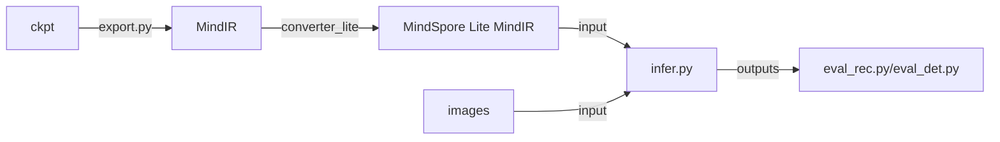

## 推理 - MindOCR模型支持列表
### 1. MindOCR推理流程总览


### 2. MindOCR推理方法
#### 2.1 文本检测
下面以[附录表格](#31-文本检测)中的`DBNet ResNet-50 en`为例介绍推理方法：
- 下载附录表格中的[mindir文件](https://download.mindspore.cn/toolkits/mindocr/dbnet/dbnet_resnet50-c3a4aa24-fbf95c82.mindir)；
- 在Ascend310/310P上使用converter_lite工具将下载的文件转换为MindSpore Lite可使用的mindir：

创建`config.txt`并指定模型输入shape：
```
[ascend_context]
input_format=NCHW
input_shape=x:[1,3,736,1280]
```
执行以下命令：
```shell
converter_lite \
    --saveType=MINDIR \
    --NoFusion=false \
    --fmk=MINDIR \
    --device=Ascend \
    --modelFile=dbnet_resnet50-c3a4aa24-fbf95c82.mindir \
    --outputFile=dbnet_resnet50 \
    --configFile=config.txt
```
上述命令执行完成后会生成`dbnet_resnet50.mindir`模型文件;
> 了解更多[模型转换教程](convert_tutorial.md)

> 了解更多[converter_lite](https://www.mindspore.cn/lite/docs/zh-CN/master/use/cloud_infer/converter_tool.html)

- 使用`/deploy/py_infer/infer.py`脚本和`dbnet_resnet50.mindir`文件执行推理：
```shell
python infer.py \
    --input_images_dir=/path/to/ic15/ch4_test_images \
    --det_model_path=/path/to/mindir/dbnet_resnet50.mindir \
    --det_model_name_or_config=en_ms_det_dbnet_resnet50 \
    --res_save_dir=/path/to/dbnet_resnet50_results
```
执行完成后，在参数`--res_save_dir`所指目录下生成预测文件`det_results.txt`；

在进行推理时，可使用`--vis_det_save_dir`参数进行结果可视化：
<p align="center">

</p>
<p align="center">
<em>文本检测结果可视化</em>
</p>

> 了解更多[infer.py](inference_tutorial.md#42-详细推理参数解释)推理参数

- 使用以下命令评估结果：
```shell
python deploy/eval_utils/eval_det.py \
		--gt_path=/path/to/ic15/test_det_gt.txt \
		--pred_path=/path/to/dbnet_resnet50_results/det_results.txt
```
结果为: `{'recall': 0.8348579682233991, 'precision': 0.8657014478282576, 'f-score': 0.85}`
<br></br>
#### 2.2 文本识别
下面以[附录表格](#32-文本识别)中的`CRNN ResNet34_vd en`为例介绍推理方法：
- 下载附录表格中的[mindir文件](https://download.mindspore.cn/toolkits/mindocr/crnn/crnn_resnet34-83f37f07-eb10a0c9.mindir)；
- 在Ascend310/310P上使用converter_lite工具将下载的文件转换为MindSpore Lite可使用的mindir：

创建`config.txt`并指定模型输入shape：
```
[ascend_context]
input_format=NCHW
input_shape=x:[1,3,32,100]
```
执行以下命令：
```shell
converter_lite \
    --saveType=MINDIR \
    --NoFusion=false \
    --fmk=MINDIR \
    --device=Ascend \
    --modelFile=crnn_resnet34-83f37f07-eb10a0c9.mindir \
    --outputFile=crnn_resnet34vd \
    --configFile=config.txt
```
上述命令执行完成后会生成`crnn_resnet34vd.mindir`模型文件；
> 了解更多[模型转换教程](convert_tutorial.md)

> 了解更多[converter_lite](https://www.mindspore.cn/lite/docs/zh-CN/master/use/cloud_infer/converter_tool.html)

- 使用`/deploy/py_infer/infer.py`脚本和`crnn_resnet34vd.mindir`文件执行推理：
```shell
python infer.py \
    --input_images_dir=/path/to/ic15/ch4_test_word_images \
    --rec_model_path=/path/to/mindir/crnn_resnet34vd.mindir \
    --rec_model_name_or_config=../../configs/rec/crnn/crnn_resnet34.yaml \
    --res_save_dir=/path/to/rec_infer_results
```
执行完成后，在参数`--res_save_dir`所指目录下生成预测文件`rec_results.txt`。
> 了解更多[infer.py](inference_tutorial.md#42-详细推理参数解释)推理参数
- 使用以下命令评估结果：
```shell
python deploy/eval_utils/eval_rec.py \
		--gt_path=/path/to/ic15/rec_gt.txt \
		--pred_path=/path/to/rec_infer_results/rec_results.txt
```
结果为: `{'acc': 0.6966779232025146, 'norm_edit_distance': 0.8627135157585144}`
<br></br>


### 3. 附录-MindOCR模型支持列表
MindOCR推理支持训练端ckpt导出的模型，本文档展示了已适配的模型列表。
#### 3.1 文本检测

| 模型                                                                              | 骨干网络        | 语言      | 数据集    | F-score(%) | FPS   | 配置文件                                                                                                     | 下载                                                                                                                     |
|:--------------------------------------------------------------------------------|:------------|---------|:-------|:--------|:------|:---------------------------------------------------------------------------------------------------------|:-----------------------------------------------------------------------------------------------------------------------|
| [DBNet](https://github.com/mindspore-lab/mindocr/tree/main/configs/det/dbnet)   | MobileNetV3 | en      | IC15   | 76.96  | 26.19 | [yaml](https://github.com/mindspore-lab/mindocr/tree/main/configs/det/dbnet/db_mobilenetv3_icdar15.yaml) | [mindir](https://download.mindspore.cn/toolkits/mindocr/dbnet/dbnet_mobilenetv3-62c44539-f14c6a13.mindir)              |
|                                                                                 | ResNet-18   | en      | IC15   | 81.73  | 24.04 | [yaml](https://github.com/mindspore-lab/mindocr/tree/main/configs/det/dbnet/db_r18_icdar15.yaml)         | [mindir](https://download.mindspore.cn/toolkits/mindocr/dbnet/dbnet_resnet18-0c0c4cfa-cf46eb8b.mindir)                 |
|                                                                                 | ResNet-50   | en      | IC15   | 85.00  | 21.69 | [yaml](https://github.com/mindspore-lab/mindocr/tree/main/configs/det/dbnet/db_r50_icdar15.yaml)         | [mindir](https://download.mindspore.cn/toolkits/mindocr/dbnet/dbnet_resnet50-c3a4aa24-fbf95c82.mindir)                 |
|                                                                                 | ResNet-50   | ch + en | 12个数据集 | 83.41  | 21.69 | [yaml](https://github.com/mindspore-lab/mindocr/tree/main/configs/det/dbnet/db_r50_icdar15.yaml)         | [mindir](https://download.mindspore.cn/toolkits/mindocr/dbnet/dbnet_resnet50_ch_en_general-a5dbb141-912f0a90.mindir)   |
| [DBNet++](https://github.com/mindspore-lab/mindocr/tree/main/configs/det/dbnet) | ResNet-50   | en      | IC15   | 86.79  | 8.46  | [yaml](https://github.com/mindspore-lab/mindocr/tree/main/configs/det/dbnet/db++_r50_icdar15.yaml)       | [mindir](https://download.mindspore.cn/toolkits/mindocr/dbnet/dbnetpp_resnet50-068166c2-9934aff0.mindir)               |
|                                                                                 | ResNet-50   | ch + en | 12个数据集 | 84.30  | 8.46  | [yaml](https://github.com/mindspore-lab/mindocr/tree/main/configs/det/dbnet/db++_r50_icdar15.yaml)       | [mindir](https://download.mindspore.cn/toolkits/mindocr/dbnet/dbnetpp_resnet50_ch_en_general-884ba5b9-b3f52398.mindir) |
| [EAST](https://github.com/mindspore-lab/mindocr/tree/main/configs/det/east)     | ResNet-50   | en      | IC15   | 86.86  | 6.72  | [yaml](https://github.com/mindspore-lab/mindocr/tree/main/configs/det/east/east_r50_icdar15.yaml)        | [mindir](https://download.mindspore.cn/toolkits/mindocr/east/east_resnet50_ic15-7262e359-5f05cd42.mindir)              |
| [EAST](https://github.com/mindspore-lab/mindocr/tree/main/configs/det/east)     | MobileNetV3   | en      | IC15   | 75.32  | 26.77  | [yaml](https://github.com/mindspore-lab/mindocr/blob/main/configs/det/east/east_mobilenetv3_icdar15.yaml)        | [mindir](https://download.mindspore.cn/toolkits/mindocr/east/east_mobilenetv3_ic15-4288dba1-5bf242c5.mindir)              |
| [PSENet](https://github.com/mindspore-lab/mindocr/tree/main/configs/det/psenet) | ResNet-152  | en      | IC15   | 82.50  | 2.31  | [yaml](https://github.com/mindspore-lab/mindocr/tree/main/configs/det/psenet/pse_r152_icdar15.yaml)      | [mindir](https://download.mindspore.cn/toolkits/mindocr/psenet/psenet_resnet152_ic15-6058a798-0d755205.mindir)         |
| [PSENet](https://github.com/mindspore-lab/mindocr/tree/main/configs/det/psenet) | ResNet-50  | en      | IC15   | 81.37  | 1.00  | [yaml](https://github.com/mindspore-lab/mindocr/tree/main/configs/det/psenet/pse_r50_icdar15.yaml)      | [mindir](https://download.mindspore.cn/toolkits/mindocr/psenet/psenet_resnet50_ic15-7e36cab9-c9f670e2.mindir)         |
| [PSENet](https://github.com/mindspore-lab/mindocr/tree/main/configs/det/psenet) | MobileNetV3  | en      | IC15   | 68.41  | 1.06  | [yaml](https://github.com/mindspore-lab/mindocr/tree/main/configs/det/psenet/pse_mv3_icdar15.yaml)      | [mindir](https://download.mindspore.cn/toolkits/mindocr/psenet/psenet_mobilenetv3_ic15-bf2c1907-3de07064.mindir)         |

#### 3.2 文本识别

| 模型                                                                         | 骨干网络     | 字典文件                                                                                           | 数据集 | Acc(%)    | FPS    | 配置文件                                                                                           | 下载                                                                                                            |
|:----------------------------------------------------------------------------|:------------|:-------------------------------------------------------------------------------------------------|:------|:-------|:-------|:--------------------------------------------------------------------------------------------------|:---------------------------------------------------------------------------------------------------------------|
| [CRNN](https://github.com/mindspore-lab/mindocr/tree/main/configs/rec/crnn) | VGG7        | Default                                                                                          | IC15  | 66.01 | 465.64 | [yaml](https://github.com/mindspore-lab/mindocr/tree/main/configs/rec/crnn/crnn_vgg7.yaml)        | [mindir](https://download.mindspore.cn/toolkits/mindocr/crnn/crnn_vgg7-ea7e996c-573dbd61.mindir)               |
|                                                                             | ResNet34_vd | Default                                                                                          | IC15  | 69.67 | 397.29 | [yaml](https://github.com/mindspore-lab/mindocr/tree/main/configs/rec/crnn/crnn_resnet34.yaml)    | [mindir](https://download.mindspore.cn/toolkits/mindocr/crnn/crnn_resnet34-83f37f07-eb10a0c9.mindir)           |
|                                                                             | ResNet34_vd | [ch_dict.txt](https://github.com/mindspore-lab/mindocr/tree/main/mindocr/utils/dict/ch_dict.txt) | /     | /      | /      | [yaml](https://github.com/mindspore-lab/mindocr/tree/main/configs/rec/crnn/crnn_resnet34_ch.yaml) | [mindir](https://download.mindspore.cn/toolkits/mindocr/crnn/crnn_resnet34_ch-7a342e3c-105bccb2.mindir)        |
| [Rare](https://github.com/mindspore-lab/mindocr/tree/main/configs/rec/rare) | ResNet34_vd | Default                                                                                          | IC15  | 69.47 | 273.23 | [yaml](https://github.com/mindspore-lab/mindocr/blob/main/configs/rec/rare/rare_resnet34.yaml)    | [mindir](https://download.mindspore.cn/toolkits/mindocr/rare/rare_resnet34_ascend-309dc63e-b96c2a4b.mindir)    |
|                                                                             | ResNet34_vd | [ch_dict.txt](https://github.com/mindspore-lab/mindocr/tree/main/mindocr/utils/dict/ch_dict.txt) | /     | /      | /      | [yaml](https://github.com/mindspore-lab/mindocr/blob/main/configs/rec/rare/rare_resnet34_ch.yaml) | [mindir](https://download.mindspore.cn/toolkits/mindocr/rare/rare_resnet34_ch_ascend-5f3023e2-11f0d554.mindir) |
