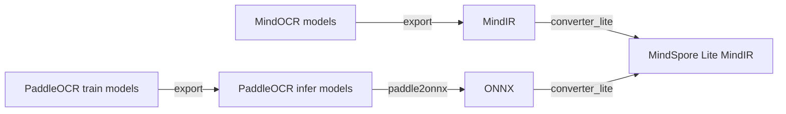

# Model Converter Tutorial

The tutorial includes the process of converting the trained model into the 'MindSpore Lite MindIR' used for inference. The process is as follows:



- MindOCR checkpoint -> MindSpore MindIR -> MindSpore Lite MindIR;
- PaddleOCR train model -> ONNX -> MindSpore Lite MindIR;

## 1. Model Export

This chapter includes the process of exporting MindIR or ONNX files of training models.

Some models provide download links for MIndIR/ONNX export files, as shown in [MindOCR Models List](mindocr_models_list.md), [PPOCR Models List](mindocr_models_list.md).

### 1.1 MindOCR Model Export

Export a MindIR file by checkpoint file after training. Please execute `tools/export.py`:

``` shell
# export static shape `crnn_resnet34` model MindIR
python tools/export.py --model_name_or_config configs/rec/crnn/crnn_resnet34.yaml --model_type rec --local_ckpt_path ~/.mindspore/models/crnn_resnet34-83f37f07.ckpt --data_shape 32 100

# export dynamic grading `crnn_resnet34` model MindIR
python tools/export.py --model_name_or_config configs/rec/crnn/crnn_resnet34.yaml --model_type rec --local_ckpt_path ~/.mindspore/models/crnn_resnet34-83f37f07.ckpt --is_dynamic_shape True

For more details on usage, please execute `python tools/export.py -h`.
```

Some parameter descriptions:

- model_name_or_config: Name of the model to be converted, or the path to the model YAML config file.
- model_type: Model type, support ["det", "rec", "cls"].
- local_ckpt_path: Path to a local checkpoint. If set, export mindir by loading local ckpt. Otherwise, export mindir by downloading online ckpt.
- data_shape: The data shape [H, W] for exporting mindir files. Required when arg `is_dynamic_shape` is False. It is recommended to be the same as the rescaled data shape in evaluation to get the best inference performance.
- is_dynamic_shape: Whether the export data shape is dynamic or static.

### 1.2 PaddleOCR Model Export

[PaddleOCR](https://github.com/PaddlePaddle/PaddleOCR) have two formats of Paddle models, training model and inference model, with the following differences:

| Model Type | Model format                             | Introduction                                                      |
|:-------|:---------------------------------------|:-----------------------------------------------------------|
| Training Model | .pdparams、.pdopt、.states             | PaddlePaddle training model which save model weights and optimizer states |
| Inference Model | inference.pdmodel、inference.pdiparams | PaddlePaddle inference model which save model weights and network structure |

Download the model file and extract it. Please distinguish whether it is a training model or an inference model based on the model format.

#### 1.2.1 Training Model -> Inference Model

In the download link of PaddleOCR model, there are two formats: trained model and inference model. If a training model is provided, it needs to be converted to the format of inference model.

On the original PaddleOCR introduction page of each trained model, there are usually conversion script samples that only need to input the config file, model file, and save path of the trained model.
The [example](https://github.com/PaddlePaddle/PaddleOCR/blob/release/2.6/doc/doc_ch/algorithm_det_db.md) is as follows:

```shell
# git clone https://github.com/PaddlePaddle/PaddleOCR.git
# cd PaddleOCR
python tools/export_model.py \
    -c configs/det/det_r50_vd_db.yml \
    -o Global.pretrained_model=./det_r50_vd_db_v2.0_train/best_accuracy  \
    Global.save_inference_dir=./det_db
```

#### 1.2.2 Inference Model -> ONNX

Install model conversion tool paddle2onnx：`pip install paddle2onnx==0.9.5`

For detailed usage tutorials, please refer to [Paddle2ONNX model transformation and prediction](https://github.com/PaddlePaddle/PaddleOCR/blob/release/2.6/deploy/paddle2onnx/readme.md)。

Run the conversion command to generate the onnx model:

```shell
paddle2onnx \
    --model_dir det_db \
    --model_filename inference.pdmodel \
    --params_filename inference.pdiparams \
    --save_file det_db.onnx \
    --opset_version 11 \
    --input_shape_dict="{'x':[-1,3,-1,-1]}" \
    --enable_onnx_checker True
```

The `input_shape_dict` in the parameter can generally be viewed by opening the inference model using the [Netron](https://github.com/lutzroeder/netron),
or found in the code in [tools/export_model. py](https://github.com/PaddlePaddle/PaddleOCR/blob/release/2.6/tools/export_model.py) above.

## 2. MindSpore Lite MindIR Convert

You need to use the `converter_lite` tool to convert the above exported MindIR file offline so that it can be used for MindSpore Lite inference.

The tutorial for the `converter_lite` command can be referred to [Offline Conversion of Inference Models](https://www.mindspore.cn/lite/docs/en/r2.0/use/cloud_infer/converter_tool.html).

Assuming the input model is input.mindir and the output model after `converter_lite` conversion is output.mindir, the conversion command is as follows:

```shell
converter_lite \
    --saveType=MINDIR \
    --fmk={fmk} \
    --optimize=ascend_oriented \
    --modelFile=model.mindir \
    --outputFile=model_lite \
    --configFile=config.txt
```

FMK is the original format of the input model, which can be MindIR or ONNX.

`config.txt` is the configuration path for extended settings. In MindOCR, `config.txt` can be used to set dynamic shape format and precision mode. We will discuss it in detail in the next chapter.

### 2.1 Shape Format Settings

#### 2.1.1 Static Shape

If the input name of the exported model is `x`, and the input shape is `(1,3,736,1280)`, then the `config.txt` is as follows:

```text
[ascend_context]
input_format=NCHW
input_shape=x:[1,3,736,1280]
```

The generated output.mindir is a static shape version, and the input image during inference needs to be resized to this input_shape to meet the input requirements.

#### 2.1.2 Dynamic Shape(scaling)

**Note: ascend 310 not support dynamic shape.**

In some inference scenarios, such as detecting a target and then executing the target recognition network, the number and size of targets is not fixed resulting. If each inference is computed at the maximum Batch Size or maximum Image Size, it will result in wasted computational resources.

Assuming the exported model input shape is (-1, 3, -1, -1), and the NHW axes are dynamic. Therefore, some optional values can be set during model conversion to adapt to input images of various size during inference.

`converter_lite` achieves this by setting the `dynamic_dims` parameter in `[ascend_context]` through `--configFile`. Please refer to the [Dynamic Shape Configuration](https://www.mindspore.cn/lite/docs/en/master/use/cloud_infer/converter_tool_ascend.html#dynamic-shape-configuration) for details. We will refer to it as **Model Shape Scaling** for short.

So, there are two options for conversion, by setting different config.txt:

- **Dynamic Image Size**

    N uses fixed values, HW uses multiple optional values, the config.txt is as follows:

    ```shell
    [ascend_context]
    input_format=NCHW
    input_shape=x:[1,3,-1,-1]
    dynamic_dims=[736,1280],[768,1280],[896,1280],[1024,1280]
    ```

- **Dynamic Batch Size**

    N uses multiple optional values, HW uses fixed values, the config.txt is as follows:

    ```shell
    [ascend_context]
    input_format=NCHW
    input_shape=x:[-1,3,736,1280]
    dynamic_dims=[1],[4],[8],[16],[32]
    ```

When converting the dynamic batch size/image size model, the option of NHW values can be set by the user based on empirical values or calculated from the dataset.

If your model needs to support both dynamic batch size and dynamic image size togather, you can combine multiple models with different batch size, each using the same dynamic image size.

In order to simplify the model conversion process, we have developed an automatic tool that can complete the dynamic value selection and model conversion. For detailed tutorials, please refer to [Model Shape Scaling](convert_dynamic.md).

**Note:**

If the exported model is a static shape version, it cannot infer dynamic shape, and it is necessary to ensure that the exported model is a dynamic shape version.

### 2.2 Model Precision Mode Setting

For the precision of model inference, it is necessary to set it in `converter_lite` when converting the model.
Please refer to the [Ascend Conversion Tool Description](https://www.mindspore.cn/lite/docs/en/master/use/cloud_infer/converter_tool_ascend.html#configuration-file), the usage of `precision_mode` parameter is described in the table of the configuration file, you can choose `enforce_fp16`, `enforce_fp32`, `preferred_fp32` and `enforce_origin` etc.
So, you can add the `precision_mode` parameter in the `[Ascend_context]` of the above config.txt file to set the precision mode:

```
[ascend_context]
input_format=NCHW
input_shape=x:[1,3,736,1280]
precision_mode=enforce_fp32
```

If not set, defaults to `enforce_fp16`.
