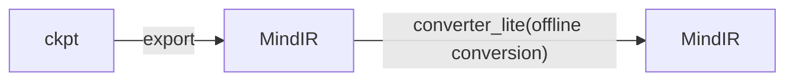
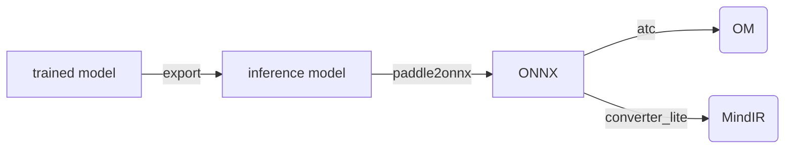
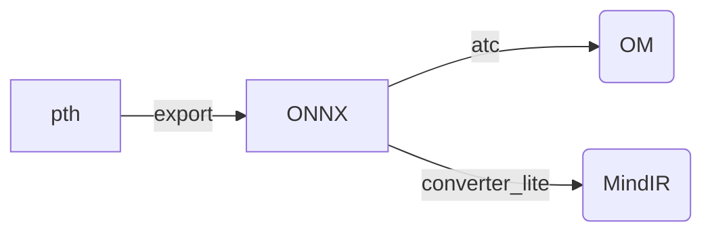

English | [中文](../../cn/inference/convert_tutorial_cn.md)

## Inference - Model Conversion Tutorial

### 1. MindOCR models

The inference of MindOCR models supports [MindSpore Lite](https://www.mindspore.cn/lite) backend.



Please prepare the model file first. You can [export](../../../configs/README.md) MindIR from the trained ckpt file, or directly download the pre-exported MindIR from the [model list](models_list_en.md).
And then run the `converter_lite` command to convert the ckpt trained model to a MindIR offline model.

The tutorial for the `converter_lite` command can refer to [Offline Conversion of Inference Models](https://www.mindspore.cn/lite/docs/en/r2.0/use/cloud_infer/converter_tool.html).
The corresponding conversion parameters in the model list can be found in [Model Conversion Parameters](./convert_parameter_list_en.md).

#### 1.1 Model Conversion

Assuming the input model is input.mindir and the output model after `converter_lite` conversion is output.mindir, the conversion command is as follows:

```shell
converter_lite \
    --saveType=MINDIR \
    --NoFusion=false \
    --fmk=MINDIR \
    --device=Ascend \
    --modelFile=input.mindir \
    --outputFile=output \
    --configFile=config.txt
```

The content of config.txt is as follows:

```
 [ascend_context]
 input_format=NCHW
 input_shape=x:[1,3,736,1280]
```

The `input_shape` in config.txt needs to be replaced with the corresponding values during model export. During inference, the input image will be resized to `input_shape` to meet input requirements.


#### 1.2 Model Shape Scaling

In some inference scenarios, such as detecting a target and then executing the target recognition network, the number and size of targets is not fixed resulting.
If each inference is computed at the maximum Batch Size or maximum Image Size, it will result in wasted computational resources.

Therefore, it needs to support dynamic batch size and dynamic image size scenarios during inference. Lite is implemented by configuring the `dynamic_dims` parameters in `[ascend_context]` through `--configFile`.

Please refer to the [Dynamic Shape Configuration](https://www.mindspore.cn/lite/docs/en/master/use/cloud_infer/converter_tool_ascend.html#dynamic-shape-configuration) for details.
Hereafter we will refer to it as Model Shape Scaling for short.

Assuming the exported model input shape is (-1, 3, -1, -1), and the NHW axes are dynamic. Therefore, some optional values can be set during model conversion to adapt to input images of various size during inference.

So, there are three options for conversion, by setting different config.txt:

(1) Static Shape

NHW uses fixed values, the config.txt is as follows:

```
 [ascend_context]
 input_format=NCHW
 input_shape=x:[1,3,736,1280]
```

(2) Dynamic Image Size

N uses fixed values, HW uses multiple optional values, the config.txt is as follows:

```shell
 [ascend_context]
 input_format=NCHW
 input_shape=x:[1,3,-1,-1]
 dynamic_dims=[736,1280],[768,1280],[896,1280],[1024,1280]
```

(3) Dynamic Batch Size

N uses multiple optional values, HW uses fixed values, the config.txt is as follows:

```shell
 [ascend_context]
 input_format=NCHW
 input_shape=x:[-1,3,736,1280]
 dynamic_dims=[1],[4],[8],[16],[32]
```

When converting the dynamic batch size/image size model, the option of NHW values can be set by the user based on empirical values or calculated from the dataset.

If your model needs to support both dynamic batch size and dynamic image size togather, you can combine multiple models with different batch size, each using the same dynamic image size.

In order to simplify the model conversion process, we have developed an automatic tool that can complete the dynamic value selection and model conversion.
For detailed tutorials, please refer to [Model Shape Scaling](./convert_dynamic_en.md).

### 2. PaddleOCR models

The PaddleOCR models support two inference backends: [ACL](https://www.hiascend.com/document/detail/zh/canncommercial/63RC1/inferapplicationdev/aclcppdevg/aclcppdevg_000004.html) and [MindSpore Lite](https://www.mindspore.cn/lite),
corresponding to the OM model and MindIR model, respectively.




The corresponding conversion parameters in the model list can be found in [Model Conversion Parameters](./convert_parameter_list_en.md).

#### 2.1 Trained -> Inference model

In the download link of PaddleOCR model, there are two formats: trained model and inference model. If a training model is provided, it needs to be converted to the format of inference model.

On the original PaddleOCR introduction page of each trained model, there are usually conversion script samples that only need to input the config file, model file, and save path of the trained model.
The [example](https://github.com/PaddlePaddle/PaddleOCR/blob/release/2.6/doc/doc_ch/algorithm_det_db.md) is as follows:

```shell
# git clone https://github.com/PaddlePaddle/PaddleOCR.git
# cd PaddleOCR
python tools/export_model.py \
	-c configs/det/det_r50_vd_db.yml \
	-o Global.pretrained_model=./det_r50_vd_db_v2.0_train/best_accuracy  \
	Global.save_inference_dir=./det_db
```

#### 2.2 Inference model -> ONNX

Install model conversion tool paddle2onnx：`pip install paddle2onnx==0.9.5`

For detailed usage tutorials, please refer to [Paddle2ONNX model transformation and prediction](https://github.com/PaddlePaddle/PaddleOCR/blob/release/2.6/deploy/paddle2onnx/readme.md)。

Run the conversion command to generate the onnx model:

```shell
paddle2onnx \
    --model_dir det_db \
    --model_filename inference.pdmodel \
    --params_filename inference.pdiparams \
    --save_file det_db.onnx \
    --opset_version 11 \
    --input_shape_dict="{'x':[-1,3,-1,-1]}" \
    --enable_onnx_checker True
```

The `input_shape_dict` in the parameter can generally be viewed by opening the inference model using the [Netron](https://github.com/lutzroeder/netron),
or found in the code in [tools/export_model. py](https://github.com/PaddlePaddle/PaddleOCR/blob/release/2.6/tools/export_model.py) above.

#### 2.3 ONNX -> OM

The ONNX model can be converted into an OM model by ATC tools.

Ascend Tensor Compiler (ATC) is a model conversion tool built upon the heterogeneous computing architecture CANN.
It is designed to convert models of open-source frameworks into .om offline models supported by Ascend AI Processor.
A detailed tutorial on the tool can be found in [ATC Instructions](https://www.hiascend.com/document/detail/en/CANNCommunityEdition/600alphaX/infacldevg/atctool/atctool_0001.html).

The exported ONNX in the example has an input Shape of (-1, 3, -1, -1), and the NHW axes are dynamic.
Therefore, some optional values can be set during model conversion to adapt to input images of various size during inference.

So, there are three options for conversion:

(1) Static Shape

NHW uses fixed values, the command is as follows:

```shell
atc --model=det_db.onnx \
	--framework=5 \
	--input_shape="x:1,3,736,1280" \
	--input_format=ND \
	--soc_version=Ascend310P3 \
	--output=det_db_static \
	--log=error
```

(2) Dynamic Image Size

N uses fixed values, HW uses multiple optional values, the command is as follows:

```shell
atc --model=det_db.onnx \
	--framework=5 \
	--input_shape="x:1,3,-1,-1" \
	--input_format=ND \
	--dynamic_dims="736,1280;768,1280;896,1280;1024,1280" \
	--soc_version=Ascend310P3 \
	--output=det_db_dynamic_bs \
	--log=error
```

(3) Dynamic Batch Size

N uses multiple optional values, HW uses fixed values, the command is as follows:

```shell
atc --model=det_db.onnx \
	--framework=5 \
	--input_shape="x:-1,3,736,1280" \
	--input_format=ND \
	--dynamic_dims="1;4;8;16;32" \
	--soc_version=Ascend310P3 \
	--output=det_db_dynamic_bs \
	--log=error
```

When converting the dynamic batch size/image size model, the option of NHW values can be set by the user based on empirical values or calculated from the dataset.

If your model needs to support both dynamic batch size and dynamic image size togather, you can combine multiple models with different batch size, each using the same dynamic image size.

In order to simplify the model conversion process, we have developed an automatic tool that can complete the dynamic value selection and model conversion.
For detailed tutorials, please refer to [Model Shape Scaling](./convert_dynamic_en.md).

#### 2.3 ONNX -> MindIR

The `converter_lite` can be used to convert the ONNX into a MindIR. For detailed usage tutorials,
please refer to [Offline Conversion of Inference Models](https://www.mindspore.cn/lite/docs/en/r2.0/use/cloud_infer/converter_tool.html)。

The conversion command is as follows:

```shell
converter_lite \
    --saveType=MINDIR \
    --NoFusion=false \
    --fmk=ONNX \
    --device=Ascend \
    --modelFile=det_db.onnx \
    --outputFile=det_db_output \
    --configFile=config.txt
```

The conversion process is completely the same as the [MindOCR models](#1-mindocr-models),
except that `--fmk` needs to specify that the input is the ONNX, which will not be repeated here.

### 3. MMOCR models

MMOCR uses Pytorch, and its model files typically have a pth format suffix. You need to first export it to ONNX format
and then convert to an OM/MindIR format file supported by
[ACL](https://www.hiascend.com/document/detail/zh/canncommercial/63RC1/inferapplicationdev/aclcppdevg/aclcppdevg_000004.html)/[MindSpore Lite](https://www.mindspore.cn/lite).



#### 3.1 MMOCR model -> ONNX

MMDeploy provides the command to export MMOCR models to ONNX. For detailed tutorials, please refer to
[How to convert model](https://github.com/open-mmlab/mmdeploy/blob/main/docs/en/02-how-to-run/convert_model.md).

For parameter `deploy_cfg`, you need to select the `*_onnxruntime_dynamic.py` file in directory
[mmdeploy/configs/mmocr](https://github.com/open-mmlab/mmdeploy/tree/main/configs/mmocr) to export as a dynamic shape
ONNX model.

#### 3.2 ONNX -> OM

Please refer to [ONNX -> OM](#23-onnx---om) in the PaddleOCR section above.

#### 3.3 ONNX -> MindIR

Please refer to [ONNX -> MIndIR](#23-onnx---mindir) in the PaddleOCR section above.
