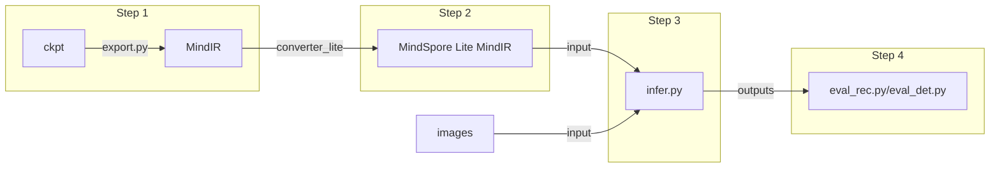

## Inference - MindOCR Models
### 1. MindOCR Model Support List
#### 1.1 Text detection

| Model                                                                           | Backbone    | Language | Dataset      | F-score(%)  | FPS    | data shape (NCHW) | Config                                                                                                              | Download                                                                                                                |
|:--------------------------------------------------------------------------------|:------------|:---------|--------------|:---------|:---------|:-------|:--------------------------------------------------------------------------------------------------------------------|:------------------------------------------------------------------------------------------------------------------------|
| [DBNet](https://github.com/mindspore-lab/mindocr/tree/main/configs/det/dbnet)   | MobileNetV3 | en      | IC15   | 76.96  | 26.19 | (1,3,736,1280) |[yaml](https://github.com/mindspore-lab/mindocr/tree/main/configs/det/dbnet/db_mobilenetv3_icdar15.yaml) | [ckpt](https://download.mindspore.cn/toolkits/mindocr/dbnet/dbnet_mobilenetv3-62c44539.ckpt) \| [mindir](https://download.mindspore.cn/toolkits/mindocr/dbnet/dbnet_mobilenetv3-62c44539-f14c6a13.mindir)              |
|                                                                                 | ResNet-18   | en      | IC15   | 81.73  | 24.04 | (1,3,736,1280) | [yaml](https://github.com/mindspore-lab/mindocr/tree/main/configs/det/dbnet/db_r18_icdar15.yaml)         | [ckpt](https://download.mindspore.cn/toolkits/mindocr/dbnet/dbnet_resnet18-0c0c4cfa.ckpt) \| [mindir](https://download.mindspore.cn/toolkits/mindocr/dbnet/dbnet_resnet18-0c0c4cfa-cf46eb8b.mindir)                 |
|                                                                                 | ResNet-50   | en      | IC15   | 85.00  | 21.69 | (1,3,736,1280) | [yaml](https://github.com/mindspore-lab/mindocr/tree/main/configs/det/dbnet/db_r50_icdar15.yaml)         | [ckpt](https://download.mindspore.cn/toolkits/mindocr/dbnet/dbnet_resnet50-c3a4aa24.ckpt) \| [mindir](https://download.mindspore.cn/toolkits/mindocr/dbnet/dbnet_resnet50-c3a4aa24-fbf95c82.mindir)                 |
|                                                                                 | ResNet-50   | ch + en | 12 Datasets | 83.41  | 21.69 | (1,3,736,1280) | [yaml](https://github.com/mindspore-lab/mindocr/tree/main/configs/det/dbnet/db_r50_icdar15.yaml)         | [ckpt](https://download.mindspore.cn/toolkits/mindocr/dbnet/dbnet_resnet50_ch_en_general-a5dbb141.ckpt) \| [mindir](https://download.mindspore.cn/toolkits/mindocr/dbnet/dbnet_resnet50_ch_en_general-a5dbb141-912f0a90.mindir)   |
| [DBNet++](https://github.com/mindspore-lab/mindocr/tree/main/configs/det/dbnet) | ResNet-50   | en      | IC15   | 86.79  | 8.46  | (1,3,1152,2048) | [yaml](https://github.com/mindspore-lab/mindocr/tree/main/configs/det/dbnet/db++_r50_icdar15.yaml)       | [ckpt](https://download.mindspore.cn/toolkits/mindocr/dbnet/dbnetpp_resnet50-068166c2.ckpt) \| [mindir](https://download.mindspore.cn/toolkits/mindocr/dbnet/dbnetpp_resnet50-068166c2-9934aff0.mindir)               |
|                                                                                 | ResNet-50   | ch + en | 12 Datasets | 84.30  | 8.46  | (1,3,1152,2048) | [yaml](https://github.com/mindspore-lab/mindocr/tree/main/configs/det/dbnet/db++_r50_icdar15.yaml)       | [ckpt](https://download.mindspore.cn/toolkits/mindocr/dbnet/dbnetpp_resnet50_ch_en_general-884ba5b9.ckpt) \| [mindir](https://download.mindspore.cn/toolkits/mindocr/dbnet/dbnetpp_resnet50_ch_en_general-884ba5b9-b3f52398.mindir) |
| [EAST](https://github.com/mindspore-lab/mindocr/tree/main/configs/det/east)     | ResNet-50   | en      | IC15   | 86.86  | 6.72  | (1,3,720,1280) | [yaml](https://github.com/mindspore-lab/mindocr/tree/main/configs/det/east/east_r50_icdar15.yaml)        | [ckpt](https://download.mindspore.cn/toolkits/mindocr/east/east_resnet50_ic15-7262e359.ckpt) \| [mindir](https://download.mindspore.cn/toolkits/mindocr/east/east_resnet50_ic15-7262e359-5f05cd42.mindir)              |
|                                                                                 | MobileNetV3   | en      | IC15   | 75.32  | 26.77  | (1,3,720,1280) | [yaml](https://github.com/mindspore-lab/mindocr/blob/main/configs/det/east/east_mobilenetv3_icdar15.yaml)        | [ckpt](https://download.mindspore.cn/toolkits/mindocr/east/east_mobilenetv3_ic15-4288dba1.ckpt) \| [mindir](https://download.mindspore.cn/toolkits/mindocr/east/east_mobilenetv3_ic15-4288dba1-5bf242c5.mindir)              |
| [PSENet](https://github.com/mindspore-lab/mindocr/tree/main/configs/det/psenet) | ResNet-152  | en      | IC15   | 82.50  | 2.52  | (1,3,1472,2624) | [yaml](https://github.com/mindspore-lab/mindocr/tree/main/configs/det/psenet/pse_r152_icdar15.yaml)      | [ckpt](https://download.mindspore.cn/toolkits/mindocr/psenet/psenet_resnet152_ic15-6058a798.ckpt) \| [mindir](https://download.mindspore.cn/toolkits/mindocr/psenet/psenet_resnet152_ic15-6058a798-0d755205.mindir)         |
|                                                                                 | ResNet-50  | en      | IC15   | 81.37  | 10.16  | (1,3,736,1312) | [yaml](https://github.com/mindspore-lab/mindocr/tree/main/configs/det/psenet/pse_r50_icdar15.yaml)      | [ckpt](https://download.mindspore.cn/toolkits/mindocr/psenet/psenet_resnet50_ic15-7e36cab9.ckpt) \| [mindir](https://download.mindspore.cn/toolkits/mindocr/psenet/psenet_resnet50_ic15-7e36cab9-cfd2ee6c.mindir)         |
|                                                                                 | MobileNetV3  | en      | IC15   | 70.56  | 10.38  | (1,3,736,1312) | [yaml](https://github.com/mindspore-lab/mindocr/tree/main/configs/det/psenet/pse_mv3_icdar15.yaml)      | [ckpt](https://download.mindspore.cn/toolkits/mindocr/psenet/psenet_mobilenetv3_ic15-bf2c1907.ckpt) \| [mindir](https://download.mindspore.cn/toolkits/mindocr/psenet/psenet_mobilenetv3_ic15-bf2c1907-da7cfe09.mindir)         |
| [FCENet](https://github.com/mindspore-lab/mindocr/tree/main/configs/det/fcenet) | ResNet50 | en | IC15 | 78.94 | 14.59 | (1,3,736,1280) | [yaml](https://github.com/mindspore-lab/mindocr/blob/main/configs/det/fcenet/fce_icdar15.yaml) | [ckpt](https://download.mindspore.cn/toolkits/mindocr/fcenet/fcenet_resnet50-43857f7f.ckpt) \| [mindir](https://download.mindspore.cn/toolkits/mindocr/fcenet/fcenet_resnet50-43857f7f-dad7dfcc.mindir) |

#### 1.2 Text recognition

| Model                                                                       | Backbone    | Dict File                                                                                        | Dataset | Acc(%)    | FPS    | data shape (NCHW) | Config                                                                                            | Download                                                                                                       |
|:----------------------------------------------------------------------------|:------------|:------------|:-------------------------------------------------------------------------------------------------|:--------|:-------|:-------|:--------------------------------------------------------------------------------------------------|:---------------------------------------------------------------------------------------------------------------|
| [CRNN](https://github.com/mindspore-lab/mindocr/tree/main/configs/rec/crnn) | VGG7        | Default                                                                                          | IC15  | 66.01 | 465.64 | (1,3,32,100) | [yaml](https://github.com/mindspore-lab/mindocr/tree/main/configs/rec/crnn/crnn_vgg7.yaml)        | [ckpt](https://download.mindspore.cn/toolkits/mindocr/crnn/crnn_vgg7-ea7e996c.ckpt) \| [mindir](https://download.mindspore.cn/toolkits/mindocr/crnn/crnn_vgg7-ea7e996c-573dbd61.mindir)               |
|                                                                             | ResNet34_vd | Default                                                                                          | IC15  | 69.67 | 397.29 | (1,3,32,100) |[yaml](https://github.com/mindspore-lab/mindocr/tree/main/configs/rec/crnn/crnn_resnet34.yaml)    | [ckpt](https://download.mindspore.cn/toolkits/mindocr/crnn/crnn_resnet34-83f37f07.ckpt) \| [mindir](https://download.mindspore.cn/toolkits/mindocr/crnn/crnn_resnet34-83f37f07-eb10a0c9.mindir)           |
|                                                                             | ResNet34_vd | [ch_dict.txt](https://github.com/mindspore-lab/mindocr/tree/main/mindocr/utils/dict/ch_dict.txt) | /     | /      | /      | (1,3,32,320) | [yaml](https://github.com/mindspore-lab/mindocr/tree/main/configs/rec/crnn/crnn_resnet34_ch.yaml) | [ckpt](https://download.mindspore.cn/toolkits/mindocr/crnn/crnn_resnet34_ch-7a342e3c.ckpt) \| [mindir](https://download.mindspore.cn/toolkits/mindocr/crnn/crnn_resnet34_ch-7a342e3c-105bccb2.mindir)        |
| [SVTR](https://github.com/mindspore-lab/mindocr/tree/main/configs/rec/svtr) | Tiny        | Default                                                                                          | IC15  | 79.92 | 338.04 | (1,3,64,256)  | [yaml](https://github.com/mindspore-lab/mindocr/blob/main/configs/rec/svtr/svtr_tiny.yaml)    | [ckpt](https://download.mindspore.cn/toolkits/mindocr/svtr/svtr_tiny-950be1c3.ckpt) \| [mindir](https://download.mindspore.cn/toolkits/mindocr/svtr/svtr_tiny-950be1c3-86ece8c8.mindir)    |
| [Rare](https://github.com/mindspore-lab/mindocr/tree/main/configs/rec/rare) | ResNet34_vd | Default                                                                                          | IC15  | 69.47 | 273.23 | (1,3,32,100) | [yaml](https://github.com/mindspore-lab/mindocr/blob/main/configs/rec/rare/rare_resnet34.yaml)    | [ckpt](https://download.mindspore.cn/toolkits/mindocr/rare/rare_resnet34-309dc63e.ckpt) \| [mindir](https://download.mindspore.cn/toolkits/mindocr/rare/rare_resnet34_ascend-309dc63e-b96c2a4b.mindir)    |
|                                                                             | ResNet34_vd | [ch_dict.txt](https://github.com/mindspore-lab/mindocr/tree/main/mindocr/utils/dict/ch_dict.txt) | /     | /      | /      | (1,3,32,320) | [yaml](https://github.com/mindspore-lab/mindocr/blob/main/configs/rec/rare/rare_resnet34_ch.yaml) | [ckpt](https://download.mindspore.cn/toolkits/mindocr/rare/rare_resnet34_ch-5f3023e2.ckpt) \| [mindir](https://download.mindspore.cn/toolkits/mindocr/rare/rare_resnet34_ch_ascend-5f3023e2-11f0d554.mindir) |
| [RobustScanner](https://github.com/mindspore-lab/mindocr/tree/main/configs/rec/robustscanner) | ResNet-31 | [en_dict90.txt](https://github.com/mindspore-lab/mindocr/blob/main/mindocr/utils/dict/en_dict90.txt) | IC15 | 73.71 | 22.30 | (1,3,48,160) | [yaml](https://github.com/mindspore-lab/mindocr/blob/main/configs/rec/robustscanner/robustscanner_resnet31.yaml) | [ckpt](https://download.mindspore.cn/toolkits/mindocr/robustscanner/robustscanner_resnet31-f27eab37.ckpt) \| [mindir](https://download.mindspore.cn/toolkits/mindocr/robustscanner/robustscanner_resnet31-f27eab37-158bde10.mindir) |
| [VisionLAN](https://github.com/mindspore-lab/mindocr/tree/main/configs/rec/visionlan) | ResNet-45 | Default |  IC15 |  80.07  |  321.37 | (1,3,64,256) | [yaml(LA)](https://github.com/mindspore-lab/mindocr/blob/main/configs/rec/visionlan/visionlan_resnet45_LA.yaml) | [ckpt(LA)](https://download.mindspore.cn/toolkits/mindocr/visionlan/visionlan_resnet45_LA-e9720d9e.ckpt) \| [mindir(LA)](https://download.mindspore.cn/toolkits/mindocr/visionlan/visionlan_resnet45_LA-e9720d9e-71b38d2d.mindir) |

<br></br>
### 2. Overview of MindOCR Inference

As shown in the figure above, the inference process is divided into the following steps:

1. Use ```tools/export.py``` to export the ckpt model to MindIR model;
2. Download and configure the [model converter](https://www.mindspore.cn/lite/docs/en/master/use/cloud_infer/converter_tool.html) (i.e. **converter_lite**), and use the converter_lite tool to convert the MindIR to the MindSpore Lite MindIR;
3. After preparing the MindSpore Lite MindIR and the input image, use ```deploy/py_infer/infer.py``` to perform inference;
4. Depending on the type of model, use ```deploy/eval_utils/eval_det.py``` to evaluate the inference results of the text detection models, or use ```deploy/eval_utils/eval_rec.py``` for text recognition models.

**Note: Step 1 runs on Ascend910, GPU or CPU. Step 2, 3, 4 run on Ascend310 or 310P.**
<br></br>

### 3. MindOCR Inference Methods

#### 3.1 Text Detection

Let's take `DBNet ResNet-50 en` in the [model support list](#11-text-detection) as an example to introduce the inference method:
- Download the [ckpt file](https://download.mindspore.cn/toolkits/mindocr/dbnet/dbnet_resnet50-c3a4aa24.ckpt) in the model support list and use the following command to export to MindIR, or directly download the exported [mindir file](https://download.mindspore.cn/toolkits/mindocr/dbnet/dbnet_resnet50-c3a4aa24-fbf95c82.mindir) from the model support list:
``` shell
# Use the local ckpt file to export the MindIR of the `DBNet ResNet-50 en` model
# For more parameter usage details, please execute `python tools/export.py -h`
python tools/export.py --model_name_or_config dbnet_resnet50 --data_shape 736 1280 --local_ckpt_path /path/to/dbnet.ckpt
```
In the above command, ```--model_name_or_config``` is the model name in MindOCR or we can pass the yaml directory to it (for example ```--model_name_or_config configs/rec/crnn/crnn_resnet34.yaml```);

The ```--data_shape 736 1280``` parameter indicates that the size of the model input image is [736, 1280], and each MindOCR model corresponds to a fixed export data shape. For details, see **data shape** in the model support list;

```--local_ckpt_path /path/to/dbnet.ckpt``` parameter indicates that the model file to be exported is ```/path/to/dbnet.ckpt```

- Use the converter_lite tool on Ascend310 or 310P to convert the MindIR to MindSpore Lite MindIR:

Run the following command:
```shell
converter_lite \
     --saveType=MINDIR \
     --fmk=MINDIR \
     --optimize=ascend_oriented \
     --modelFile=dbnet_resnet50-c3a4aa24-fbf95c82.mindir \
     --outputFile=dbnet_resnet50
```
In the above command:

```--fmk=MINDIR``` indicates that the original format of the input model is MindIR, and the ```--fmk``` parameter also supports ONNX, etc.;

```--saveType=MINDIR``` indicates that the output model format is MindIR format;

```--optimize=ascend_oriented``` indicates that optimize for Ascend devices;

```--modelFile=dbnet_resnet50-c3a4aa24-fbf95c82.mindir``` indicates that the current model path to be converted is ```dbnet_resnet50-c3a4aa24-fbf95c82.mindir```;

```--outputFile=dbnet_resnet50``` indicates that the path of the output model is ```dbnet_resnet50```, which can be automatically generated without adding the .mindir suffix;

After the above command is executed, the `dbnet_resnet50.mindir` model file will be generated;
> Learn more about [converter_lite](https://www.mindspore.cn/lite/docs/en/master/use/cloud_infer/converter_tool.html)

> Learn more about [Model Conversion Tutorial](convert_tutorial.md)

- Perform inference using `/deploy/py_infer/infer.py` codes and `dbnet_resnet50.mindir` file:

```shell
python infer.py \
     --input_images_dir=/path/to/ic15/ch4_test_images \
     --det_model_path=/path/to/mindir/dbnet_resnet50.mindir \
     --det_model_name_or_config=en_ms_det_dbnet_resnet50 \
     --res_save_dir=/path/to/dbnet_resnet50_results
```
After the execution is completed, the prediction file `det_results.txt` will be generated in the directory pointed to by the parameter `--res_save_dir`

When doing inference, you can use the `--vis_det_save_dir` parameter to visualize the results:
<p align="center">

</p>
<p align="center">
<em>Visualization of text detection results</em>
</p>

> Learn more about [infer.py](inference_tutorial.md#42-detail-of-inference-parameter) inference parameters

- Evaluate the results with the following command:

```shell
python deploy/eval_utils/eval_det.py \
     --gt_path=/path/to/ic15/test_det_gt.txt \
     --pred_path=/path/to/dbnet_resnet50_results/det_results.txt
```
The result is: `{'recall': 0.8348579682233991, 'precision': 0.8657014478282576, 'f-score': 0.85}`
<br></br>

#### 3.2 Text Recognition
Let's take `CRNN ResNet34_vd en` in the [model support list](#12-text-recognition) as an example to introduce the inference method:

- Download the [MindIR file](https://download.mindspore.cn/toolkits/mindocr/crnn/crnn_resnet34-83f37f07-eb10a0c9.mindir) in the model support list;

- Use the converter_lite tool on Ascend310 or 310P to convert the MindIR to MindSpore Lite MindIR:

Run the following command:
```shell
converter_lite \
     --saveType=MINDIR \
     --fmk=MINDIR \
     --optimize=ascend_oriented \
     --modelFile=crnn_resnet34-83f37f07-eb10a0c9.mindir \
     --outputFile=crnn_resnet34vd
```
After the above command is executed, the `crnn_resnet34vd.mindir` model file will be generated;

For a brief description of the converter_lite parameters, see the text detection example above.
> Learn more about [converter_lite](https://www.mindspore.cn/lite/docs/en/master/use/cloud_infer/converter_tool.html)

> Learn more about [Model Conversion Tutorial](convert_tutorial.md)

- Perform inference using `/deploy/py_infer/infer.py` codes and `crnn_resnet34vd.mindir` file:

```shell
python infer.py \
     --input_images_dir=/path/to/ic15/ch4_test_word_images \
     --rec_model_path=/path/to/mindir/crnn_resnet34vd.mindir \
     --rec_model_name_or_config=../../configs/rec/crnn/crnn_resnet34.yaml \
     --res_save_dir=/path/to/rec_infer_results
```
After the execution is completed, the prediction file `rec_results.txt` will be generated in the directory pointed to by the parameter `--res_save_dir`.
> Learn more about [infer.py](inference_tutorial.md#42-detail-of-inference-parameter) inference parameters

- Evaluate the results with the following command:

```shell
python deploy/eval_utils/eval_rec.py \
     --gt_path=/path/to/ic15/rec_gt.txt \
     --pred_path=/path/to/rec_infer_results/rec_results.txt
```
The result is: `{'acc': 0.6966779232025146, 'norm_edit_distance': 0.8627135157585144}`
