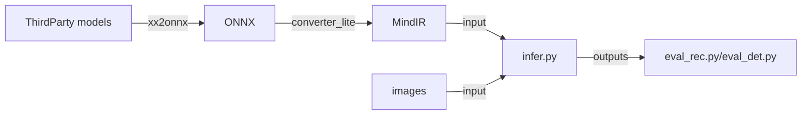

## Third-party Models Offline Inference - Quick Start
### 1. Third-Party Model Support List
MindOCR supports the inference of third-party models (PaddleOCR, MMOCR, etc.), and this document displays a list of adapted models. The performance test is based on Ascend310P, and some models have no test data set yet.

#### 1.1 Text Detection
|            name             |  model  |  backbone   | dataset | F-score(%) |  FPS  |  source   |                                                                   config                                                                    |                                                                                download                                                                                 |                                                        reference                                                         |
|:---------------------------:|:-------:|:-----------:|:-------:|:----------:|:-----:|:---------:|:-------------------------------------------------------------------------------------------------------------------------------------------:|:-----------------------------------------------------------------------------------------------------------------------------------------------------------------------:|:------------------------------------------------------------------------------------------------------------------------:|
|          ch_pp_det_OCRv4          | DBNet   | MobileNetV3 | / | /  | / | PaddleOCR |   [yaml](https://github.com/mindspore-lab/mindocr/tree/main/deploy/py_infer/src/configs/det/ppocr/ch_PP-OCRv4_det_cml.yaml)     | [infer model](https://paddleocr.bj.bcebos.com/PP-OCRv4/chinese/ch_PP-OCRv4_det_infer.tar)                                                                         | [ch_PP-OCRv4_det](https://github.com/PaddlePaddle/PaddleOCR/blob/release/2.7/doc/doc_ch/PP-OCRv4_introduction.md) |
|    ch_pp_server_det_v2.0    |  DBNet  | ResNet18_vd | MLT17 |   46.22    | 21.65 | PaddleOCR |         [yaml](https://github.com/mindspore-lab/mindocr/tree/main/deploy/py_infer/src/configs/det/ppocr/ch_det_res18_db_v2.0.yaml)          |                                      [infer model](https://paddleocr.bj.bcebos.com/dygraph_v2.0/ch/ch_ppocr_server_v2.0_det_infer.tar)                                       |   [ch_ppocr_server_v2.0_det](https://github.com/PaddlePaddle/PaddleOCR/blob/release/2.6/doc/doc_en/models_list_en.md)    |
|       ch_pp_det_OCRv3       |  DBNet  | MobileNetV3 | MLT17 |   33.89    | 22.40 | PaddleOCR |          [yaml](https://github.com/mindspore-lab/mindocr/tree/main/deploy/py_infer/src/configs/det/ppocr/ch_PP-OCRv3_det_cml.yaml)          |                                          [infer model](https://paddleocr.bj.bcebos.com/PP-OCRv3/chinese/ch_PP-OCRv3_det_infer.tar)                                           |        [ch_PP-OCRv3_det](https://github.com/PaddlePaddle/PaddleOCR/blob/release/2.6/doc/doc_en/models_list_en.md)        |
|       ch_pp_det_OCRv2       |  DBNet  | MobileNetV3 | MLT17 |   42.99    | 21.90 | PaddleOCR |          [yaml](https://github.com/mindspore-lab/mindocr/tree/main/deploy/py_infer/src/configs/det/ppocr/ch_PP-OCRv2_det_cml.yaml)          |                                          [infer model](https://paddleocr.bj.bcebos.com/PP-OCRv2/chinese/ch_PP-OCRv2_det_infer.tar)                                           |        [ch_PP-OCRv2_det](https://github.com/PaddlePaddle/PaddleOCR/blob/release/2.6/doc/doc_en/models_list_en.md)        |
| ch_pp_mobile_det_v2.0_slim  |  DBNet  | MobileNetV3 | MLT17 |   31.66    | 19.88 | PaddleOCR |          [yaml](https://github.com/mindspore-lab/mindocr/tree/main/deploy/py_infer/src/configs/det/ppocr/ch_det_mv3_db_v2.0.yaml)           |                                  [infer model](https://paddleocr.bj.bcebos.com/dygraph_v2.0/slim/ch_ppocr_mobile_v2.0_det_prune_infer.tar)                                   | [ch_ppocr_mobile_slim_v2.0_det](https://github.com/PaddlePaddle/PaddleOCR/blob/release/2.6/doc/doc_en/models_list_en.md) |
|    ch_pp_mobile_det_v2.0    |  DBNet  | MobileNetV3 | MLT17 |   31.56    | 21.96 | PaddleOCR |          [yaml](https://github.com/mindspore-lab/mindocr/tree/main/deploy/py_infer/src/configs/det/ppocr/ch_det_mv3_db_v2.0.yaml)           |                                      [infer model](https://paddleocr.bj.bcebos.com/dygraph_v2.0/ch/ch_ppocr_mobile_v2.0_det_infer.tar)                                       |   [ch_ppocr_mobile_v2.0_det](https://github.com/PaddlePaddle/PaddleOCR/blob/release/2.6/doc/doc_en/models_list_en.md)    |
|       en_pp_det_OCRv3       |  DBNet  | MobileNetV3 | IC15  |   42.14    | 55.55 | PaddleOCR |          [yaml](https://github.com/mindspore-lab/mindocr/tree/main/deploy/py_infer/src/configs/det/ppocr/ch_PP-OCRv3_det_cml.yaml)          |                                          [infer model](https://paddleocr.bj.bcebos.com/PP-OCRv3/english/en_PP-OCRv3_det_infer.tar)                                           |        [en_PP-OCRv3_det](https://github.com/PaddlePaddle/PaddleOCR/blob/release/2.6/doc/doc_en/models_list_en.md)        |
|       ml_pp_det_OCRv3       |  DBNet  | MobileNetV3 | MLT17 |   66.01    | 22.48 | PaddleOCR |          [yaml](https://github.com/mindspore-lab/mindocr/tree/main/deploy/py_infer/src/configs/det/ppocr/ch_PP-OCRv3_det_cml.yaml)          |                                   [infer model](https://paddleocr.bj.bcebos.com/PP-OCRv3/multilingual/Multilingual_PP-OCRv3_det_infer.tar)                                   |        [ml_PP-OCRv3_det](https://github.com/PaddlePaddle/PaddleOCR/blob/release/2.6/doc/doc_en/models_list_en.md)        |
| en_pp_det_dbnet_resnet50vd  |  DBNet  | ResNet50_vd | IC15  |   79.89    | 21.17 | PaddleOCR |             [yaml](https://github.com/mindspore-lab/mindocr/tree/main/deploy/py_infer/src/configs/det/ppocr/det_r50_vd_db.yaml)             |                                         [infer model](https://paddleocr.bj.bcebos.com/dygraph_v2.0/en/det_r50_vd_db_v2.0_infer.tar)                                          |          [DBNet](https://github.com/PaddlePaddle/PaddleOCR/blob/release/2.6/doc/doc_en/algorithm_det_db_en.md)           |
| en_pp_det_psenet_resnet50vd |   PSE   | ResNet50_vd | IC15  |   80.44    | 7.75  | PaddleOCR |            [yaml](https://github.com/mindspore-lab/mindocr/tree/main/deploy/py_infer/src/configs/det/ppocr/det_r50_vd_pse.yaml)             |                                       [train model](https://paddleocr.bj.bcebos.com/dygraph_v2.1/en_det/det_r50_vd_pse_v2.0_train.tar)                                       |         [PSE](https://github.com/PaddlePaddle/PaddleOCR/blob/release/2.6/doc/doc_en/algorithm_det_psenet_en.md)          |
|  en_pp_det_east_resnet50vd  |  EAST   | ResNet50_vd | IC15  |   85.58    | 20.70 | PaddleOCR |            [yaml](https://github.com/mindspore-lab/mindocr/tree/main/deploy/py_infer/src/configs/det/ppocr/det_r50_vd_east.yaml)            |                                        [train model](https://paddleocr.bj.bcebos.com/dygraph_v2.0/en/det_r50_vd_east_v2.0_infer.tar)                                         |          [EAST](https://github.com/PaddlePaddle/PaddleOCR/blob/release/2.6/doc/doc_en/algorithm_det_east_en.md)          |
|  en_pp_det_sast_resnet50vd  |  SAST   | ResNet50_vd | IC15  |   81.77    | 22.14 | PaddleOCR |        [yaml](https://github.com/mindspore-lab/mindocr/tree/main/deploy/py_infer/src/configs/det/ppocr/det_r50_vd_sast_icdar15.yaml)        |                                    [train model](https://paddleocr.bj.bcebos.com/dygraph_v2.0/en/det_r50_vd_sast_icdar15_v2.0_train.tar)                                     |          [SAST](https://github.com/PaddlePaddle/PaddleOCR/blob/release/2.6/doc/doc_en/algorithm_det_sast_en.md)          |
| en_mm_det_dbnetpp_resnet50  | DBNet++ |  ResNet50   | IC15  |   81.36    | 10.66 |   MMOCR   | [yaml](https://github.com/mindspore-lab/mindocr/tree/main/deploy/py_infer/src/configs/det/mmocr/dbnetpp_resnet50_fpnc_1200e_icdar2015.yaml) | [train model](https://download.openmmlab.com/mmocr/textdet/dbnetpp/dbnetpp_resnet50_fpnc_1200e_icdar2015/dbnetpp_resnet50_fpnc_1200e_icdar2015_20221025_185550-013730aa.pth) |                [DBNetpp](https://github.com/open-mmlab/mmocr/blob/main/configs/textdet/dbnetpp/README.md)                |
|  en_mm_det_fcenet_resnet50  | FCENet  |  ResNet50   | IC15  |   83.67    | 3.34  |   MMOCR   |  [yaml](https://github.com/mindspore-lab/mindocr/tree/main/deploy/py_infer/src/configs/det/mmocr/fcenet_resnet50_fpn_1500e_icdar2015.yaml)  |   [train model](https://download.openmmlab.com/mmocr/textdet/fcenet/fcenet_resnet50_fpn_1500e_icdar2015/fcenet_resnet50_fpn_1500e_icdar2015_20220826_140941-167d9042.pth)    |                 [FCENet](https://github.com/open-mmlab/mmocr/blob/main/configs/textdet/fcenet/README.md)                 |          |

**Notice: When using the en_pp_det_psenet_resnet50vd model for inference, you need to modify the onnx file with the
following command**

```shell
python deploy/models_utils/onnx_optim/insert_pse_postprocess.py \
      --model_path=./pse_r50vd.onnx \
      --binary_thresh=0.0 \
      --scale=1.0
```

#### 1.2 Text recognition

|               name                |  model  |      backbone      |  dataset   | Acc(%) |  FPS   |  source   |                                                        dict file                                                         | config                                                                                                                                 | download                                                                                                                                                     | reference                                                                                                                 |
|:---------------------------------:|:-------:|:------------------:|:----------:|:------:|:------:|:---------:|:------------------------------------------------------------------------------------------------------------------------:|:---------------------------------------------------------------------------------------------------------------------------------------|:-------------------------------------------------------------------------------------------------------------------------------------------------------------|:--------------------------------------------------------------------------------------------------------------------------|
|          ch_pp_rec_OCRv4          |  CRNN   | MobileNetV1Enhance | / | /  | / | PaddleOCR |      [ppocr_keys_v1.txt](https://github.com/PaddlePaddle/PaddleOCR/blob/release/2.6/ppocr/utils/ppocr_keys_v1.txt)       | [yaml](https://github.com/mindspore-lab/mindocr/tree/main/deploy/py_infer/src/configs/rec/ppocr/ch_PP-OCRv4_rec_distillation.yaml)     | [infer model](https://paddleocr.bj.bcebos.com/PP-OCRv4/chinese/ch_PP-OCRv4_rec_infer.tar)                                                                | [ch_PP-OCRv4_rec](https://github.com/PaddlePaddle/PaddleOCR/blob/release/2.7/doc/doc_ch/PP-OCRv4_introduction.md)|
|       ch_pp_server_rec_v2.0       |  CRNN   |      ResNet34      | MLT17 (ch) | 49.91  | 154.16 | PaddleOCR |      [ppocr_keys_v1.txt](https://github.com/PaddlePaddle/PaddleOCR/blob/release/2.6/ppocr/utils/ppocr_keys_v1.txt)       | [yaml](https://github.com/mindspore-lab/mindocr/tree/main/deploy/py_infer/src/configs/rec/ppocr/rec_chinese_common_v2.0.yaml)    | [infer model](https://paddleocr.bj.bcebos.com/dygraph_v2.0/ch/ch_ppocr_server_v2.0_rec_infer.tar)                                                                 | [ch_ppocr_server_v2.0_rec](https://github.com/PaddlePaddle/PaddleOCR/blob/release/2.6/doc/doc_en/models_list_en.md)       |
|          ch_pp_rec_OCRv3          |  SVTR   | MobileNetV1Enhance | MLT17 (ch) | 49.91  | 408.38 | PaddleOCR |      [ppocr_keys_v1.txt](https://github.com/PaddlePaddle/PaddleOCR/blob/release/2.6/ppocr/utils/ppocr_keys_v1.txt)       | [yaml](https://github.com/mindspore-lab/mindocr/tree/main/deploy/py_infer/src/configs/rec/ppocr/ch_PP-OCRv3_rec_distillation.yaml)     | [infer model](https://paddleocr.bj.bcebos.com/PP-OCRv3/chinese/ch_PP-OCRv3_rec_infer.tar)                                                                         | [ch_PP-OCRv3_rec](https://github.com/PaddlePaddle/PaddleOCR/blob/release/2.6/doc/doc_en/models_list_en.md)                |
|          ch_pp_rec_OCRv2          |  CRNN   | MobileNetV1Enhance | MLT17 (ch) | 44.59  | 203.34 | PaddleOCR |      [ppocr_keys_v1.txt](https://github.com/PaddlePaddle/PaddleOCR/blob/release/2.6/ppocr/utils/ppocr_keys_v1.txt)       | [yaml](https://github.com/mindspore-lab/mindocr/tree/main/deploy/py_infer/src/configs/rec/ppocr/ch_PP-OCRv2_rec_distillation.yaml)     | [infer model](https://paddleocr.bj.bcebos.com/PP-OCRv2/chinese/ch_PP-OCRv2_rec_infer.tar)                                                                         | [ch_PP-OCRv2_rec](https://github.com/PaddlePaddle/PaddleOCR/blob/release/2.6/doc/doc_en/models_list_en.md)                |
|       ch_pp_mobile_rec_v2.0       |  CRNN   |    MobileNetV3     | MLT17 (ch) | 24.59  | 167.67 | PaddleOCR |      [ppocr_keys_v1.txt](https://github.com/PaddlePaddle/PaddleOCR/blob/release/2.6/ppocr/utils/ppocr_keys_v1.txt)       | [yaml](https://github.com/mindspore-lab/mindocr/tree/main/deploy/py_infer/src/configs/rec/ppocr/rec_chinese_lite_v2.0.yaml)      | [infer model](https://paddleocr.bj.bcebos.com/dygraph_v2.0/ch/ch_ppocr_mobile_v2.0_rec_infer.tar)                                                                 | [ch_ppocr_mobile_v2.0_rec](https://github.com/PaddlePaddle/PaddleOCR/blob/release/2.6/doc/doc_en/models_list_en.md)       |
|          en_pp_rec_OCRv3          |  SVTR   | MobileNetV1Enhance | MLT17 (en) | 79.79  | 917.01 | PaddleOCR |            [en_dict.txt](https://github.com/PaddlePaddle/PaddleOCR/blob/release/2.6/ppocr/utils/en_dict.txt)             | [yaml](https://github.com/mindspore-lab/mindocr/tree/main/deploy/py_infer/src/configs/rec/ppocr/en_PP-OCRv3_rec.yaml)                  | [infer model](https://paddleocr.bj.bcebos.com/PP-OCRv3/english/en_PP-OCRv3_rec_infer.tar)                                                                         | [en_PP-OCRv3_rec](https://github.com/PaddlePaddle/PaddleOCR/blob/release/2.6/doc/doc_en/models_list_en.md)                |
| en_pp_mobile_rec_number_v2.0_slim |  CRNN   |    MobileNetV3     |     /      |   /    |   /    | PaddleOCR |            [en_dict.txt](https://github.com/PaddlePaddle/PaddleOCR/blob/release/2.6/ppocr/utils/en_dict.txt)             | [yaml](https://github.com/mindspore-lab/mindocr/tree/main/deploy/py_infer/src/configs/rec/ppocr/rec_en_number_lite.yaml)         | [infer model](https://paddleocr.bj.bcebos.com/dygraph_v2.0/en/en_number_mobile_v2.0_rec_slim_infer.tar)                                                           | [en_number_mobile_slim_v2.0_rec](https://github.com/PaddlePaddle/PaddleOCR/blob/release/2.6/doc/doc_en/models_list_en.md) |
|   en_pp_mobile_rec_number_v2.0    |  CRNN   |    MobileNetV3     |     /      |   /    |   /    | PaddleOCR |            [en_dict.txt](https://github.com/PaddlePaddle/PaddleOCR/blob/release/2.6/ppocr/utils/en_dict.txt)             | [yaml](https://github.com/mindspore-lab/mindocr/tree/main/deploy/py_infer/src/configs/rec/ppocr/rec_en_number_lite.yaml)         | [infer model](https://paddleocr.bj.bcebos.com/dygraph_v2.0/multilingual/en_number_mobile_v2.0_rec_infer.tar)                                                      | [en_number_mobile_v2.0_rec](https://github.com/PaddlePaddle/PaddleOCR/blob/release/2.6/doc/doc_en/models_list_en.md)      |
|        korean_pp_rec_OCRv3        |  SVTR   | MobileNetV1Enhance |     /      |   /    |   /    | PaddleOCR |      [korean_dict.txt](https://github.com/PaddlePaddle/PaddleOCR/blob/release/2.6/ppocr/utils/dict/korean_dict.txt)      | [yaml](https://github.com/mindspore-lab/mindocr/tree/main/deploy/py_infer/src/configs/rec/ppocr/korean_PP-OCRv3_rec.yaml)              | [infer model](https://paddleocr.bj.bcebos.com/PP-OCRv3/multilingual/korean_PP-OCRv3_rec_infer.tar)                                                                | [korean_PP-OCRv3_rec](https://github.com/PaddlePaddle/PaddleOCR/blob/release/2.6/doc/doc_en/models_list_en.md)            |
|        japan_pp_rec_OCRv3         |  SVTR   | MobileNetV1Enhance |     /      |   /    |   /    | PaddleOCR |       [japan_dict.txt](https://github.com/PaddlePaddle/PaddleOCR/blob/release/2.6/ppocr/utils/dict/japan_dict.txt)       | [yaml](https://github.com/mindspore-lab/mindocr/tree/main/deploy/py_infer/src/configs/rec/ppocr/japan_PP-OCRv3_rec.yaml)               | [infer model](https://paddleocr.bj.bcebos.com/PP-OCRv3/multilingual/japan_PP-OCRv3_rec_infer.tar)                                                                 | [japan_PP-OCRv3_rec](https://github.com/PaddlePaddle/PaddleOCR/blob/release/2.6/doc/doc_en/models_list_en.md)             |
|     chinese_cht_pp_rec_OCRv3      |  SVTR   | MobileNetV1Enhance |     /      |   /    |   /    | PaddleOCR | [chinese_cht_dict.txt](https://github.com/PaddlePaddle/PaddleOCR/blob/release/2.6/ppocr/utils/dict/chinese_cht_dict.txt) | [yaml](https://github.com/mindspore-lab/mindocr/tree/main/deploy/py_infer/src/configs/rec/ppocr/chinese_cht_PP-OCRv3_rec.yaml)         | [infer model](https://paddleocr.bj.bcebos.com/PP-OCRv3/multilingual/chinese_cht_PP-OCRv3_rec_infer.tar)                                                           | [chinese_cht_PP-OCRv3_rec](https://github.com/PaddlePaddle/PaddleOCR/blob/release/2.6/doc/doc_en/models_list_en.md)       |
|          te_pp_rec_OCRv3          |  SVTR   | MobileNetV1Enhance |     /      |   /    |   /    | PaddleOCR |          [te_dict.txt](https://github.com/PaddlePaddle/PaddleOCR/blob/release/2.6/ppocr/utils/dict/te_dict.txt)          | [yaml](https://github.com/mindspore-lab/mindocr/tree/main/deploy/py_infer/src/configs/rec/ppocr/te_PP-OCRv3_rec.yaml)                  | [infer model](https://paddleocr.bj.bcebos.com/PP-OCRv3/multilingual/te_PP-OCRv3_rec_infer.tar)                                                                    | [te_PP-OCRv3_rec](https://github.com/PaddlePaddle/PaddleOCR/blob/release/2.6/doc/doc_en/models_list_en.md)                |
|          ka_pp_rec_OCRv3          |  SVTR   | MobileNetV1Enhance |     /      |   /    |   /    | PaddleOCR |          [ka_dict.txt](https://github.com/PaddlePaddle/PaddleOCR/blob/release/2.6/ppocr/utils/dict/ka_dict.txt)          | [yaml](https://github.com/mindspore-lab/mindocr/tree/main/deploy/py_infer/src/configs/rec/ppocr/ka_PP-OCRv3_rec.yaml)                  | [infer model](https://paddleocr.bj.bcebos.com/PP-OCRv3/multilingual/ka_PP-OCRv3_rec_infer.tar)                                                                    | [ka_PP-OCRv3_rec](https://github.com/PaddlePaddle/PaddleOCR/blob/release/2.6/doc/doc_en/models_list_en.md)                |
|          ta_pp_rec_OCRv3          |  SVTR   | MobileNetV1Enhance |     /      |   /    |   /    | PaddleOCR |          [ta_dict.txt](https://github.com/PaddlePaddle/PaddleOCR/blob/release/2.6/ppocr/utils/dict/ta_dict.txt)          | [yaml](https://github.com/mindspore-lab/mindocr/tree/main/deploy/py_infer/src/configs/rec/ppocr/ta_PP-OCRv3_rec.yaml)                  | [infer model](https://paddleocr.bj.bcebos.com/PP-OCRv3/multilingual/ta_PP-OCRv3_rec_infer.tar)                                                                    | [ta_PP-OCRv3_rec](https://github.com/PaddlePaddle/PaddleOCR/blob/release/2.6/doc/doc_en/models_list_en.md)                |
|        latin_pp_rec_OCRv3         |  SVTR   | MobileNetV1Enhance |     /      |   /    |   /    | PaddleOCR |       [latin_dict.txt](https://github.com/PaddlePaddle/PaddleOCR/blob/release/2.6/ppocr/utils/dict/latin_dict.txt)       | [yaml](https://github.com/mindspore-lab/mindocr/tree/main/deploy/py_infer/src/configs/rec/ppocr/latin_PP-OCRv3_rec.yaml)               | [infer model](https://paddleocr.bj.bcebos.com/PP-OCRv3/multilingual/latin_PP-OCRv3_rec_infer.tar)                                                                 | [latin_PP-OCRv3_rec](https://github.com/PaddlePaddle/PaddleOCR/blob/release/2.6/doc/doc_en/models_list_en.md)             |
|        arabic_pp_rec_OCRv3        |  SVTR   | MobileNetV1Enhance |     /      |   /    |   /    | PaddleOCR |      [arabic_dict.txt](https://github.com/PaddlePaddle/PaddleOCR/blob/release/2.6/ppocr/utils/dict/arabic_dict.txt)      | [yaml](https://github.com/mindspore-lab/mindocr/tree/main/deploy/py_infer/src/configs/rec/ppocr/arabic_PP-OCRv3_rec.yaml)              | [infer model](https://paddleocr.bj.bcebos.com/PP-OCRv3/multilingual/arabic_PP-OCRv3_rec_infer.tar)                                                                | [arabic_PP-OCRv3_rec](https://github.com/PaddlePaddle/PaddleOCR/blob/release/2.6/doc/doc_en/models_list_en.md)            |
|       cyrillic_pp_rec_OCRv3       |  SVTR   | MobileNetV1Enhance |     /      |   /    |   /    | PaddleOCR |    [cyrillic_dict.txt](https://github.com/PaddlePaddle/PaddleOCR/blob/release/2.6/ppocr/utils/dict/cyrillic_dict.txt)    | [yaml](https://github.com/mindspore-lab/mindocr/tree/main/deploy/py_infer/src/configs/rec/ppocr/cyrillic_PP-OCRv3_rec.yaml)            | [infer model](https://paddleocr.bj.bcebos.com/PP-OCRv3/multilingual/cyrillic_PP-OCRv3_rec_infer.tar)                                                              | [cyrillic_PP-OCRv3_rec](https://github.com/PaddlePaddle/PaddleOCR/blob/release/2.6/doc/doc_en/models_list_en.md)          |
|      devanagari_pp_rec_OCRv3      |  SVTR   | MobileNetV1Enhance |     /      |   /    |   /    | PaddleOCR |  [devanagari_dict.txt](https://github.com/PaddlePaddle/PaddleOCR/blob/release/2.6/ppocr/utils/dict/devanagari_dict.txt)  | [yaml](https://github.com/mindspore-lab/mindocr/tree/main/deploy/py_infer/src/configs/rec/ppocr/devanagari_PP-OCRv3_rec.yaml)          | [infer model](https://paddleocr.bj.bcebos.com/PP-OCRv3/multilingual/devanagari_PP-OCRv3_rec_infer.tar)                                                            | [devanagari_PP-OCRv3_rec](https://github.com/PaddlePaddle/PaddleOCR/blob/release/2.6/doc/doc_en/models_list_en.md)        |
|     en_pp_rec_crnn_resnet34vd     |  CRNN   |    ResNet34_vd     |    IC15    | 66.35  | 420.80 | PaddleOCR |          [ic15_dict.txt](https://github.com/PaddlePaddle/PaddleOCR/blob/release/2.6/ppocr/utils/ic15_dict.txt)           | [yaml](https://github.com/mindspore-lab/mindocr/tree/main/deploy/py_infer/src/configs/rec/ppocr/rec_r34_vd_none_bilstm_ctc.yaml)       | [infer model](https://paddleocr.bj.bcebos.com/dygraph_v2.0/en/rec_r34_vd_none_bilstm_ctc_v2.0_infer.tar)                                                          | [CRNN](https://github.com/PaddlePaddle/PaddleOCR/blob/release/2.6rc/doc/doc_en/algorithm_rec_crnn_en.md)                  |
|   en_pp_rec_rosetta_resnet34vd    | Rosetta |    Resnet34_vd     |    IC15    | 64.28  | 552.40 | PaddleOCR |          [ic15_dict.txt](https://github.com/PaddlePaddle/PaddleOCR/blob/release/2.6/ppocr/utils/ic15_dict.txt)           | [yaml](https://github.com/mindspore-lab/mindocr/tree/main/deploy/py_infer/src/configs/rec/ppocr/rec_r34_vd_none_none_ctc.yaml)         | [infer model](https://paddleocr.bj.bcebos.com/dygraph_v2.0/en/rec_r34_vd_none_none_ctc_v2.0_infer.tar)                                                            | [Rosetta](https://github.com/PaddlePaddle/PaddleOCR/blob/release/2.6/doc/doc_en/algorithm_rec_rosetta_en.md)              |
|      en_pp_rec_vitstr_vitstr      | ViTSTR  |       ViTSTR       |    IC15    | 68.42  | 364.67 | PaddleOCR |     [EN_symbol_dict.txt](https://github.com/PaddlePaddle/PaddleOCR/blob/release/2.6/ppocr/utils/EN_symbol_dict.txt)      | [yaml](https://github.com/mindspore-lab/mindocr/tree/main/deploy/py_infer/src/configs/rec/ppocr/rec_vitstr_none_ce.yaml)               | [train model](https://paddleocr.bj.bcebos.com/rec_vitstr_none_ce_train.tar)                                                                                       | [ViTSTR](https://github.com/PaddlePaddle/PaddleOCR/blob/release/2.6/doc/doc_en/algorithm_rec_vitstr_en.md)                |
|      en_mm_rec_nrtr_resnet31      |  NRTR   |      ResNet31      |    IC15    | 67.26  | 32.63  |   MMOCR   |       [english_digits_symbols.txt](https://github.com/open-mmlab/mmocr/blob/main/dicts/english_digits_symbols.txt)       | [yaml](https://github.com/mindspore-lab/mindocr/tree/main/deploy/py_infer/src/configs/rec/mmocr/nrtr_resnet31-1by8-1by4_6e_st_mj.yaml) | [train model](https://download.openmmlab.com/mmocr/textrecog/nrtr/nrtr_resnet31-1by8-1by4_6e_st_mj/nrtr_resnet31-1by8-1by4_6e_st_mj_20220916_103322-a6a2a123.pth) | [NRTR](https://github.com/open-mmlab/mmocr/blob/main/configs/textrecog/nrtr/README.md)                                    |
|    en_mm_rec_satrn_shallowcnn     |  SATRN  |     ShallowCNN     |    IC15    | 73.52  | 32.14  |   MMOCR   |       [english_digits_symbols.txt](https://github.com/open-mmlab/mmocr/blob/main/dicts/english_digits_symbols.txt)       | [yaml](https://github.com/mindspore-lab/mindocr/tree/main/deploy/py_infer/src/configs/rec/mmocr/satrn_shallow_5e_st_mj.yaml)           | [train model](https://download.openmmlab.com/mmocr/textrecog/satrn/satrn_shallow_5e_st_mj/satrn_shallow_5e_st_mj_20220915_152443-5fd04a4c.pth)                    | [SATRN](https://github.com/open-mmlab/mmocr/blob/main/configs/textrecog/satrn/README.md)                                  |

#### 1.3 Text angle classification

|         name          |    model    | dataset | Acc(%) | FPS |  source   |                                                    config                                                     |                                           download                                           |                                                      reference                                                      |
|:---------------------:|:-----------:|:-------:|:------:|:---:|:---------:|:-------------------------------------------------------------------------------------------------------------:|:--------------------------------------------------------------------------------------------:|:-------------------------------------------------------------------------------------------------------------------:|
| ch_pp_mobile_cls_v2.0 | MobileNetV3 |   /   |   /    |  /  | PaddleOCR | [yaml](https://github.com/mindspore-lab/mindocr/tree/main/deploy/py_infer/src/configs/cls/ppocr/cls_mv3.yaml) | [infer model](https://paddleocr.bj.bcebos.com/dygraph_v2.0/ch/ch_ppocr_mobile_v2.0_cls_infer.tar) | [ch_ppocr_mobile_v2.0_cls](https://github.com/PaddlePaddle/PaddleOCR/blob/release/2.6/doc/doc_en/models_list_en.md) |

### 2. Overview of Third-Party Inference


### 3. Third-Party Model Inference Methods

#### 3.1 Text Detection

Let's take `ch_pp_det_OCRv4` in [Third-Party Model Support List](#11-text-detection) as an example to introduce the inference method:

#### 3.1.1 Download Thirdparty model file
- In [Third-Party Model Support List](#11-text-detection), `infer model` indicates model file for inference; `train model` indicates model file for training, and it need to be converted to inference model first.
- If the model file is `infer model`, like `ch_pp_det_OCRv4`, dowload and extract [infer model](https://paddleocr.bj.bcebos.com/PP-OCRv4/chinese/ch_PP-OCRv4_det_infer.tar) and get the following folder:
     ```text
    ch_PP-OCRv4_det_infer/
    ├── inference.pdmodel
    ├── inference.pdiparams
    ├── inference.pdiparams.info
    ```
- If the model file is `train model`, like `en_pp_det_psenet_resnet50vd`, dowload and extract [train model](https://paddleocr.bj.bcebos.com/dygraph_v2.1/en_det/det_r50_vd_pse_v2.0_train.tar) and get the following folder:
    ```text
    det_r50_vd_pse_v2.0_train/
    ├── train.log
    ├── best_accuracy.pdopt
    ├── best_accuracy.states
    ├── best_accuracy.pdparams
    ```
    And it need to be converted by the following commands:
    ```shell
    git clone https://github.com/PaddlePaddle/PaddleOCR.git
    cd PaddleOCR
    python tools/export_model.py \
        -c configs/det/det_r50_vd_pse.yml \
        -o Global.pretrained_model=./det_r50_vd_pse_v2.0_train/best_accuracy  \
        Global.save_inference_dir=./det_db
    ```
    and you will get the following folder:
    ``` text
    det_db/
    ├── inference.pdmodel
    ├── inference.pdiparams
    ├── inference.pdiparams.info
    ```

#### 3.1.2 Convert the thirdparty model to onnx file
Download and use the paddle2onnx tool

```shell
pip install paddle2onnx
```
and convert the inference model into an onnx file:

```shell
paddle2onnx \
     --model_dir det_db \
     --model_filename inference.pdmodel \
     --params_filename inference.pdiparams\
     --save_file det_db.onnx \
     --opset_version 11 \
     --input_shape_dict="{'x':[-1,3,-1,-1]}" \
     --enable_onnx_checker True
```
A brief explanation of parameters for paddle2onnx is as follows:

| Parameter | Description |
|-----------|-------------|
|--model_dir | Configures the directory path containing the Paddle model.|
|--model_filename | **[Optional]** Configures the file name storing the network structure located under `--model_dir`.|
|--params_filename | **[Optional]** Configures the file name storing the model parameters located under `--model_dir`.|
|--save_file | Specifies the directory path for saving the converted model.|
|--opset_version | **[Optional]** Configures the OpSet version for converting to ONNX. Multiple versions, such as 7~16, are currently supported, and the default is 9.|
|--input_shape_dict | Specifies the shape of the input tensor for generating a dynamic ONNX model. The format is "{'x': [N, C, H, W]}", where -1 represents dynamic shape.|
|--enable_onnx_checker| **[Optional]** Configures whether to check the correctness of the exported ONNX model. It is recommended to enable this switch, and the default is False.|

The value of `--input_shape_dict` in the parameter can be viewed by opening the inference model through the [Netron](https://github.com/lutzroeder/netron) tool.
> Learn more about [paddle2onnx](https://github.com/PaddlePaddle/Paddle2ONNX/tree/develop)

The `det_db.onnx` file will be generated after the above command is executed;

#### 3.1.3 Convert onnx file to Lite MindIR file
Use `converter_lite` tool on Ascend310/310P to convert onnx files to mindir:

Create `config.txt` and specify the model input shape:

 - If converting to static shape model, like static shape of `[1,3,736,1280]`, the config is as following
     ```text
     [ascend_context]
     input_format=NCHW
     input_shape=x:[1,3,736,1280]
     ```
 - If converting to dynamic shape(scaling) model, the config is as following
     ```text
     [ascend_context]
     input_format=NCHW
     input_shape=x:[1,3,-1,-1]
     dynamic_dims=[736,1280],[768,1280],[896,1280],[1024,1280]
     ```
 - If converting to dynamic shape model, the config is as following
     ```text
     [acl_build_options]
     input_format=NCHW
     input_shape_range=x:[-1,3,-1,-1]
     ```

A brief explanation of the configuration file parameters is as follows:

|     Parameter     | Attribute |                                       Function Description                                       | Data Type |                       Value Description                      |
|:-----------------:|:---------:|:-------------------------------------------------------------------------------------------------:|:---------:|:-------------------------------------------------------------:|
|   input_format    | Optional  |                                  Specify the format of the model input                                 |  String   |                   Optional values are "NCHW", "NHWC", "ND"                  |
|    input_shape    | Optional  | Specify the shape of the model input. The input_name must be the input name in the original model, arranged in order of input, separated by ";" |  String   |            For example: "input1:[1,64,64,3];input2:[1,256,256,3]"            |
|    dynamic_dims   | Optional  |                             Specify dynamic BatchSize and dynamic resolution parameters                             |  String   |                     For example: "dynamic_dims=[48,520],[48,320],[48,384]"                    |

> Learn more about [Configuration File Parameters](https://www.mindspore.cn/lite/docs/en/master/use/cloud_infer/converter_tool_ascend.html)

Run the following command:
```shell
converter_lite\
     --saveType=MINDIR \
     --fmk=ONNX \
     --optimize=ascend_oriented \
     --modelFile=det_db.onnx \
     --outputFile=det_db_lite \
     --configFile=config.txt
```
After the above command is executed, the `det_db_lite.mindir` file will be generated;

A brief explanation of the `converter_lite` parameters is as follows:

|         Parameter         | Required |                                Parameter Description                               |          Value Range         | Default |                                Remarks                                |
|:-------------------------:|:--------:|:---------------------------------------------------------------------------------:|:-----------------------------:|:-------:|:--------------------------------------------------------------------:|
|        fmk        |    Yes   |                                Input model format                                | MINDIR, CAFFE, TFLITE, TF, ONNX |    -    |                                     -                                    |
|   saveType   |    No    |             Set the exported model to MINDIR or MS model format.              |           MINDIR, MINDIR_LITE           | MINDIR  | The cloud-side inference version can only infer models converted to MINDIR format |
|  modelFile  |    Yes   |                                  Input model path                                 |                -                |    -    |                                     -                                    |
| outputFile |    Yes   | Output model path. Do not add a suffix, ".mindir" suffix will be generated automatically. |                -                |    -    |                                     -                                    |
| configFile |    No    |     1) Path to the quantization configuration file after training; 2) Path to the configuration file for extended functions |                -                |    -    |                                     -                                    |
|  optimize     |    No    |   Set the model optimization type for the device. Default is none.            |      none、general、gpu_oriented、ascend_oriented     |    -    |                                     -                                    |


> Learn more about [converter_lite](https://www.mindspore.cn/lite/docs/en/master/use/cloud_infer/converter_tool.html)

> Learn more about [Model Conversion Tutorial](convert_tutorial.md)

#### 3.1.4 Inference with Lite MindIR
Perform inference using `deploy/py_infer/infer.py` codes and `det_db_lite.mindir` model file:

```shell
python deploy/py_infer/infer.py \
    --input_images_dir=/path/to/ic15/ch4_test_images \
    --det_model_path=/path/to/mindir/det_db_lite.mindir \
    --det_model_name_or_config=ch_pp_det_OCRv4 \
    --res_save_dir=/path/to/ch_pp_det_OCRv4_results
```
After the execution is completed, the prediction file `det_results.txt` will be generated in the directory pointed to by the parameter `--res_save_dir`.

When doing inference, you can use the `--vis_det_save_dir` parameter to visualize the results

> Learn more about [infer.py](inference_tutorial.md#42-detail-of-inference-parameter) inference parameters

#### 3.1.5 Evalution
Evaluate the results using the following command:

```shell
python deploy/eval_utils/eval_det.py\
    --gt_path=/path/to/ic15/test_det_gt.txt\
    --pred_path=/path/to/ch_pp_det_OCRv4_results/det_results.txt
```

### 3.2 Text Recognition

Let's take `ch_pp_rec_OCRv4` in [Third-Party Model Support List](#12-text-recognition) as an example to introduce the inference method:

#### 3.2.1 Download Thirdparty model file

- In [Third-Party Model Support List](#12-text-recognition), `infer model` indicates model file for inference; `train model` indicates model file for training, and it need to be converted to inference model first.
- If the model file is `infer model`, like `ch_pp_rec_OCRv4`, dowload and extract [infer model](https://paddleocr.bj.bcebos.com/PP-OCRv4/chinese/ch_PP-OCRv4_rec_infer.tar) and get the following folder:

    ```text
    ch_PP-OCRv4_det_infer/
    ├── inference.pdmodel
    ├── inference.pdiparams
    ├── inference.pdiparams.info
    ```

- If the model file is `train model`, like `en_pp_rec_vitstr_vitstr`, dowload and extract [train model](https://paddleocr.bj.bcebos.com/rec_vitstr_none_ce_train.tar) and get the following folder:

    ```text
    rec_vitstr_none_ce_train/
    ├── train.log
    ├── best_accuracy.pdopt
    ├── best_accuracy.states
    ├── best_accuracy.pdparams
    ```
    And it need to be converted by the following commands:

    ```shell
    git clone https://github.com/PaddlePaddle/PaddleOCR.git
    cd PaddleOCR
    python tools/export_model.py \
        -c configs/rec/rec_vitstr_none_ce.yml \
        -o Global.pretrained_model=./rec_vitstr_none_ce_train/best_accuracy  \
        Global.save_inference_dir=./rec_vitstr
    ```

    and you will get the following folder:

    ``` text
    rec_vitstr/
    ├── inference.pdmodel
    ├── inference.pdiparams
    ├── inference.pdiparams.info
    ```

#### 3.2.2 Convert the thirdparty model to onnx file
Download and use the paddle2onnx tool

```shell
pip install paddle2onnx
```
and convert the inference model into an onnx file:

```shell
paddle2onnx \
    --model_dir ch_PP-OCRv4_rec_infer \
    --model_filename inference.pdmodel \
    --params_filename inference.pdiparams \
    --save_file rec_crnn.onnx \
    --opset_version 11 \
    --input_shape_dict="{'x':[-1,3,48,-1]}" \
    --enable_onnx_checker True
```

The `rec_crnn.onnx` file will be generated after the above command is executed;

Please refer to [3.1.2 Convert the thirdparty model to onnx file](#312-convert-the-thirdparty-model-to-onnx-file) for details about `paddle2onnx`.

#### 3.2.3 Convert onnx file to Lite MindIR file

Use `converter_lite` tool on Ascend310/310P to convert onnx files to mindir:

Create `config.txt` and specify the model input shape:

 - If converting to static shape model, like static shape of `[1,3,48,320]`, the config is as following
    ```text
    [ascend_context]
    input_format=NCHW
    input_shape=x:[1,3,48,320]
    ```
 - If converting to dynamic shape(scaling) model, the config is as following
    ```
    [ascend_context]
    input_format=NCHW
    input_shape=x:[1,3,-1,-1]
    dynamic_dims=[48,520],[48,320],[48,384],[48,360],[48,394],[48,321],[48,336],[48,368],[48,328],[48,685],[48,347]
    ```
 - If converting to dynamic shape model, the config is as following
    ```text
    [acl_build_options]
    input_format=NCHW
    input_shape_range=x:[-1,3,-1,-1]
    ```


For a brief description of the configuration parameters, please refer to [3.1.3 Convert onnx file to Lite MindIR file](#313-convert-onnx-file-to-lite-mindir-file)


Run the following command:
```shell
converter_lite \
    --saveType=MINDIR \
    --fmk=ONNX \
    --optimize=ascend_oriented \
    --modelFile=rec_crnn.onnx \
    --outputFile=rec_crnn_lite \
    --configFile=config.txt
```

After the above command is executed, the `rec_crnn_lite.mindir.mindir` file will be generated;

For a brief description of the `converter_lite` parameters, see the text detection example above.
> Learn more about [converter_lite](https://www.mindspore.cn/lite/docs/en/master/use/cloud_infer/converter_tool.html)

> Learn more about [Model Conversion Tutorial](convert_tutorial.md)

#### 3.2.4 Download the Dictionary File for Recognition
According to [Third-Party Model Support List](#12-text-recognition), download [ppocr_keys_v1.txt](https://github.com/PaddlePaddle/PaddleOCR/blob/release/2.6/ppocr/utils/ppocr_keys_v1.txt) which matches with `ch_pp_rec_OCRv4`.

#### 3.2.5 Inference with Lite MindIR
Perform inference using `deploy/py_infer/infer.py` codes and `rec_crnn_lite.mindir` model file:

```shell
python deploy/py_infer/infer.py \
    --input_images_dir=/path/to/mlt17_ch \
    --rec_model_path=/path/to/mindir/rec_crnn_lite.mindir \
    --rec_model_name_or_config=ch_pp_rec_OCRv4 \
    --character_dict_path=/path/to/ppocr_keys_v1.txt \
    --res_save_dir=/path/to/ch_rec_infer_results
```

After the execution is completed, the prediction file `rec_results.txt` will be generated in the directory pointed to by the parameter `--res_save_dir`.
> Learn more about [infer.py](inference_tutorial.md#42-detail-of-inference-parameter) inference parameters

#### 3.2.6 Evalution
Evaluate the results using the following command:

```shell
python deploy/eval_utils/eval_rec.py \
    --gt_path=/path/to/mlt17_ch/chinese_gt.txt \
    --pred_path=/path/to/en_rec_infer_results/rec_results.txt
```
Refer [Dataset converters](/docs/en/datasets/converters.md) for dataset preparation.

### 3.3 Text Direction Classification
Let's take `ch_pp_mobile_cls_v2` in [Third-Party Model Support List](#13-text-angle-classification) as an example to introduce the inference method:

#### 3.3.1 Download Thirdparty model file
In [Third-Party Model Support List](#13-text-angle-classification)
，`ch_pp_mobile_cls_v2.0` is a [infer model](https://paddleocr.bj.bcebos.com/dygraph_v2.0/ch/ch_ppocr_mobile_v2.0_cls_infer.tar)，so convertion is not needed. dowload and extract it and get the following folder:

```text
ch_ppocr_mobile_v2.0_cls_infer/
├── inference.pdmodel
├── inference.pdiparams
├── inference.pdiparams.info
```

#### 3.3.2 Convert the thirdparty model to onnx file
convert the inference model into an onnx file:

```shell
paddle2onnx \
    --model_dir cls_mv3 \
    --model_filename inference.pdmodel \
    --params_filename inference.pdiparams \
    --save_file cls_mv3.onnx \
    --opset_version 11 \
    --input_shape_dict="{'x':[-1,3,-1,-1]}" \
    --enable_onnx_checker True
```

The `cls_mv3.onnx` file will be generated after the above command is executed;

Please refer to [3.1.2 Convert the thirdparty model to onnx file](#312-convert-the-thirdparty-model-to-onnx-file) for details about `paddle2onnx`.

#### 3.3.3 Convert onnx file to Lite MindIR file

Refer to [3.1.3 Convert onnx file to Lite MindIR file](#313-convert-onnx-file-to-lite-mindir-file) and create `config.txt`, here we take dynamic shape config as example
```text
[acl_build_options]
input_format=NCHW
input_shape_range=x:[-1,3,-1,-1]
```
And run the following command:

```shell
converter_lite \
    --saveType=MINDIR \
    --fmk=ONNX \
    --optimize=ascend_oriented \
    --modelFile=cls_mv3.onnx \
    --outputFile=cls_mv3_lite \
    --configFile=config.txt
```

After the above command is executed, the `cls_mv3_lite.mindir.mindir` file will be generated

### 3.4 End to End Inference
Prepare mindIR according to [Text Detection](#31-text-detection), [Text Recognition](#32-text-recognition), [Text Direction Classification](#33-text-direction-classification), and run the following command to do end-to-end inference
```shell
python deploy/py_infer/infer.py \
    --input_images_dir=/path/to/ic15/ch4_test_images \
    --det_model_path=/path/to/mindir/det_db_lite.mindir \
    --det_model_name_or_config=ch_pp_det_OCRv4 \
    --cls_model_path=/path/to/mindir/cls_mv3_lite.mindir \
    --cls_model_name_or_config=ch_pp_mobile_cls_v2.0 \
    --rec_model_path=/path/to/mindir/rec_crnn_lite.mindir \
    --rec_model_name_or_config=ch_pp_rec_OCRv4 \
    --character_dict_path=/path/to/ppocr_keys_v1.txt \
    --res_save_dir=/path/to/infer_results
```

## 4.FAQ about converting and inference
For problems about converting model and inference, please refer to [FAQ](../tutorials/frequently_asked_questions.md) for solutions.
