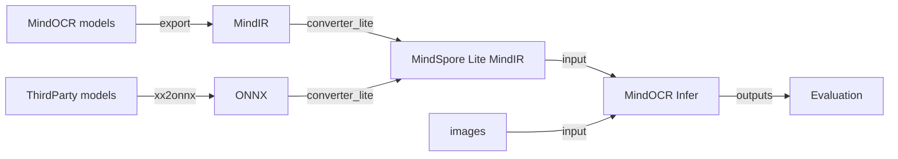

# MindOCR Offline Inference

## Introduction

MindOCR inference supports Ascend310/Ascend310P devices, supports [MindSpore Lite](https://www.mindspore.cn/lite)
inference backend, integrates text detection, angle classification, and text recognition, implements end-to-end OCR
inference process, and optimizes inference performance using pipeline parallelism.

MindOCR supported models can find in [MindOCR models list](mindocr_models_list.md)，[PPOCR models list](thirdparty_models_list.md), You can jump to the models list page to download MindIR/ONNX for converting MindSpore Lite offline models.

The overall process of MindOCR Lite inference is as follows:



## 2. Environment Instalation

Please refer to [Offline Inference Environment Installation](environment.md).

## 3. Model conversion

Please refer to [Model Converter Tutorial](convert_tutorial.md).

## 4. Inference (Python)

Enter the inference directory：`cd deploy/py_infer`.

### 4.1 Detection + Classification + Recognition

```shell
python infer.py \
    --input_images_dir=/path/to/images \
    --det_model_path=/path/to/mindir/dbnet_resnet50.mindir \
    --det_model_name_or_config=../../configs/det/dbnet/db_r50_icdar15.yaml \
    --cls_model_path=/path/to/mindir/cls_mv3.mindir \
    --cls_model_name_or_config=ch_pp_mobile_cls_v2.0 \
    --rec_model_path=/path/to/mindir/crnn_resnet34.mindir \
    --rec_model_name_or_config=../../configs/rec/crnn/crnn_resnet34.yaml \
    --res_save_dir=det_cls_rec \
    --vis_pipeline_save_dir=det_cls_rec
```

> Note: set `--character_dict_path=/path/to/xxx_dict.txt` if not only use numbers and lowercase.

The visualization images are stored in det_cls_rec, as shown in the picture.

<p align="center">
  
</p>
<p align="center">
  <em>Visualization of text detection and recognition result</em>
</p>

The results are saved in det_cls_rec/pipeline_results.txt in the following format:

```
img_182.jpg	[{"transcription": "cocoa", "points": [[14.0, 284.0], [222.0, 274.0], [225.0, 325.0], [17.0, 335.0]]}, {...}]
```

### 4.2 Detection + Recognition

If you don't enter the parameters related to classification, it will skip and only perform detection+recognition.

```shell
python infer.py \
    --input_images_dir=/path/to/images \
    --det_model_path=/path/to/mindir/dbnet_resnet50.mindir \
    --det_model_name_or_config=../../configs/det/dbnet/db_r50_icdar15.yaml \
    --rec_model_path=/path/to/mindir/crnn_resnet34.mindir \
    --rec_model_name_or_config=../../configs/rec/crnn/crnn_resnet34.yaml \
    --res_save_dir=det_rec \
    --vis_pipeline_save_dir=det_rec
```

> Note: set `--character_dict_path=/path/to/xxx_dict.txt` if not only use numbers and lowercase.

The visualization images are stored in det_rec folder, as shown in the picture.

<p align="center">
  
</p>
<p align="center">
  <em>Visualization of text detection and recognition result</em>
</p>

The recognition results are saved in det_rec/pipeline_results.txt in the following format:

```
img_498.jpg	[{"transcription": "keep", "points": [[819.0, 71.0], [888.0, 67.0], [891.0, 104.0], [822.0, 108.0]]}, {...}]
```

### 4.3 Detection

Run text detection alone.

```shell
python infer.py \
    --input_images_dir=/path/to/images \
    --det_model_path=/path/to/mindir/dbnet_resnet50.mindir \
    --det_model_name_or_config=../../configs/det/dbnet/db_r50_icdar15.yaml \
    --res_save_dir=det \
    --vis_det_save_dir=det
```

The visualization results are stored in the det folder, as shown in the picture.

<p align="center">
  
</p>
<p align="center">
  <em>Visualization of text detection result</em>
</p>

The detection results are saved in the det/det_results.txt file in the following format:

```
img_108.jpg	[[[226.0, 442.0], [402.0, 416.0], [404.0, 433.0], [228.0, 459.0]], [...]]
```

### 4.4 Classification

Run text angle classification alone.

```shell
# cls_mv3.mindir is converted from ppocr
python infer.py \
    --input_images_dir=/path/to/images \
    --cls_model_path=/path/to/mindir/cls_mv3.mindir \
    --cls_model_name_or_config=ch_pp_mobile_cls_v2.0 \
    --res_save_dir=cls
```

  The results will be saved in cls/cls_results.txt, with the following format:

```
word_867.png   ["180", 0.5176]
word_1679.png  ["180", 0.6226]
word_1189.png  ["0", 0.9360]
```

### 4.5 Recognition

Run text recognition alone.

```shell
python infer.py \
    --input_images_dir=/path/to/images \
    --backend=lite \
    --rec_model_path=/path/to/mindir/crnn_resnet34.mindir \
    --rec_model_name_or_config=../../configs/rec/crnn/crnn_resnet34.yaml \
    --res_save_dir=rec
```

> Note: set `--character_dict_path=/path/to/xxx_dict.txt` if not only use numbers and lowercase.

The results will be saved in rec/rec_results.txt, with the following format:

```
word_421.png   "under"
word_1657.png  "candy"
word_1814.png  "cathay"
```

### 4.6 Detail of inference parameter

<details>
<summary> Details </summary>

- Basic settings

  | name             | type | default | description                                              |
  |:-----------------|:-----|:--------|:---------------------------------------------------------|
  | input_images_dir | str  | None    | Image or folder path for inference                       |
  | device           | str  | Ascend  | Device type, support Ascend                              |
  | device_id        | int  | 0       | Device id                                                |
  | backend          | str  | lite    | Inference backend, support acl, lite                     |
  | parallel_num     | int  | 1       | Number of parallel in each stage of pipeline parallelism |
  | precision_mode   | str  | None    | Precision mode, only supports setting by [Model Conversion](convert_tutorial.md) currently, and it takes no effect here |

- Saving Result

  | name                  | type | default           | description                                            |
  |:----------------------|:-----|:------------------|:-------------------------------------------------------|
  | res_save_dir          | str  | inference_results | Saving dir for inference results                       |
  | vis_det_save_dir      | str  | None              | Saving dir for images of with detection boxes          |
  | vis_pipeline_save_dir | str  | None              | Saving dir for images of with detection boxes and text |
  | vis_font_path         | str  | None              | Font path for drawing text                             |
  | crop_save_dir         | str  | None              | Saving path for cropped images after detection         |
  | show_log              | bool | False             | Whether show log when inferring                        |
  | save_log_dir          | str  | None              | Log saving dir                                         |

- Text detection

  | name                     | type | default | description                                            |
  |:-------------------------|:-----|:--------|:-------------------------------------------------------|
  | det_model_path           | str  | None    | Model path for text detection                          |
  | det_model_name_or_config | str  | None    | Model name or YAML config file path for text detection |

- Text angle classification

  | name                     | type | default | description                                                       |
  |:-------------------------|:-----|:--------|:------------------------------------------------------------------|
  | cls_model_path           | str  | None    | Model path for text angle classification                          |
  | cls_model_name_or_config | str  | None    | Model name or YAML config file path for text angle classification |

- Text recognition

  | name                     | type | default | description                                                                 |
  |:-------------------------|:-----|:--------|:----------------------------------------------------------------------------|
  | rec_model_path           | str  | None    | Model path for text recognition                                             |
  | rec_model_name_or_config | str  | None    | Model name or YAML config file path for text recognition                    |
  | character_dict_path      | str  | None    | Dict file for text recognition，default only supports numbers and lowercase |

Notes：

`*_model_name_or_config` can be the model name or YAML config file path, please refer to [MindOCR models list](mindocr_models_list.md)，[PPOCR models list](thirdparty_models_list.md).

</details>

## 5. Model Inference Evaluation

### 5.1 Text detection

After inference, please use the following command to evaluate the results:

```shell
python deploy/eval_utils/eval_det.py \
    --gt_path=/path/to/det_gt.txt \
    --pred_path=/path/to/prediction/det_results.txt
```

### 5.2 Text recognition

After inference, please use the following command to evaluate the results:

```shell
python deploy/eval_utils/eval_rec.py \
    --gt_path=/path/to/rec_gt.txt \
    --pred_path=/path/to/prediction/rec_results.txt \
    --character_dict_path=/path/to/xxx_dict.txt
```

Please note that **character_dict_path** is an optional parameter, and the default dictionary only supports numbers and English lowercase.

When evaluating the PaddleOCR series models, please refer to [Third-party Model Support List](inference_thirdparty_quickstart.md) to use the corresponding dictionary.
