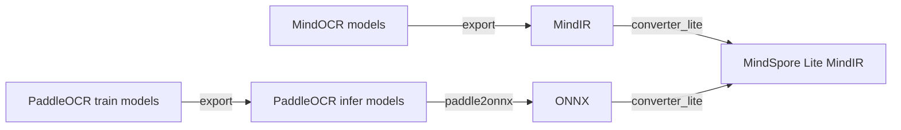

# 模型转换教程

本教程主要包含训练后模型转换成推理使用的`MindSpore Lite MindIR`的过程，涉及场景有：



- MindOCR训练ckpt文件 -> MindSpore MindIR -> MindSpore Lite MindIR;
- PaddleOCR训练文件 -> ONNX -> MindSpore Lite MindIR;

## 1. 模型导出

本章节主要包含训练模型导出`MindIR`或者`ONNX`文件的过程。

部分模型提供了MIndIR/ONNX导出文件的下载链接，见[MindOCR模型列表](mindocr_models_list.md)，[PPOCR模型列表](thirdparty_models_list.md)，可跳转到对应模型的介绍页面进行下载。

### 1.1 MindOCR 模型导出

训练端的ckpt文件导出为MindIR文件，请执行`tools/export.py`：

``` shell
# 导出静态shape版本 `crnn_resnet34` 模型的MindIR
python tools/export.py --model_name_or_config configs/rec/crnn/crnn_resnet34.yaml --model_type rec --local_ckpt_path ~/.mindspore/models/crnn_resnet34-83f37f07.ckpt --data_shape 32 100

# 导出动态分档的 `crnn_resnet34` 模型的MindIR
python tools/export.py --model_name_or_config configs/rec/crnn/crnn_resnet34.yaml --model_type rec --local_ckpt_path ~/.mindspore/models/crnn_resnet34-83f37f07.ckpt --is_dynamic_shape True

更多参数使用详情，请执行 `python tools/export.py -h`.
```

一些常用参数说明：

- model_name_or_config: 模型的名字或者模型配置yaml文件路径，若传入模型名，这个模型名需要在MindOCR支持列表中，MindOCR会自动下载ckpt文件。
- model_type：模型任务类型，支持 ["det", "rec", "cls"]。
- local_ckpt_path：本地模型checkpoint文件路径，如使用，则不会下载预置模型checkpoint文件，使用本地checkpoint文件。
- data_shape：静态shape的值。
- is_dynamic_shape：动态分档配置项，默认是False，与data_shape二选一。

### 1.2 PaddleOCR 模型导出

[PaddleOCR](https://github.com/PaddlePaddle/PaddleOCR) 涉及到2种格式的Paddle模型，训练模型和推理模型，区别如下：

| 模型类型 | 模型格式                                | 简介                                                       |
|:-------|:---------------------------------------|:-----------------------------------------------------------|
| 训练模型 | .pdparams、.pdopt、.states             | PaddlePaddle训练模型，可保存的模型的权重、优化器状态等信息         |
| 推理模型 | inference.pdmodel、inference.pdiparams | PaddlePaddle推理模型，可由其训练模型导出得到，保存了模型的结构和参数 |

下载模型文件并解压，请根据模型格式来区别是训练模型还是推理模型。

#### 1.2.1 训练模型 -> 推理模型

在PaddleOCR模型的下载链接中，有训练模型和推理模型两种格式，如果提供的是训练模型，则需要将其转换为推理模型的格式。

在每个训练模型的原PaddleOCR介绍页面，一般会有转换脚本样例，只需要传入训练模型的配置文件、模型文件和保存路径即可。
[示例](https://github.com/PaddlePaddle/PaddleOCR/blob/release/2.6/doc/doc_ch/algorithm_det_db.md)如下：

```shell
# git clone https://github.com/PaddlePaddle/PaddleOCR.git
# cd PaddleOCR
python tools/export_model.py \
    -c configs/det/det_r50_vd_db.yml \
    -o Global.pretrained_model=./det_r50_vd_db_v2.0_train/best_accuracy  \
    Global.save_inference_dir=./det_db
```

#### 1.2.2 推理模型 -> ONNX

安装模型转换工具paddle2onnx：`pip install paddle2onnx==0.9.5`

详细使用教程请参考[Paddle2ONNX模型转化与预测](https://github.com/PaddlePaddle/PaddleOCR/blob/release/2.6/deploy/paddle2onnx/readme.md)。

执行转换命令，生成onnx模型：

```shell
paddle2onnx \
    --model_dir det_db \
    --model_filename inference.pdmodel \
    --params_filename inference.pdiparams \
    --save_file det_db.onnx \
    --opset_version 11 \
    --input_shape_dict="{'x':[-1,3,-1,-1]}" \
    --enable_onnx_checker True
```

参数中input_shape_dict的值，一般可以通过[Netron](https://github.com/lutzroeder/netron)工具打开推理模型查看，或者在上述[tools/export_model.py](https://github.com/PaddlePaddle/PaddleOCR/blob/release/2.6/tools/export_model.py)的代码中找到。

## 2. MindSpore Lite MindIR 转换

需要使用`converter_lite`工具，将上述导出的MindIR/ONNX文件进行离线转换，从而用于MindSpore Lite的推理。

`converter_lite`的详细教程见[推理模型离线转换](https://www.mindspore.cn/lite/docs/zh-CN/r2.2/use/converter_tool.html)。

假设输入模型为model.mindir，经过`converter_lite`工具转换后的输出模型为model_lite.mindir，则模型转换命令如下：

```shell
converter_lite \
    --saveType=MINDIR \
    --fmk={fmk} \
    --optimize=ascend_oriented \
    --modelFile=model.mindir \
    --outputFile=model_lite \
    --configFile=config.txt
```

fmk为输入模型的原始格式，可以是MindIR或者ONNX。

`config.txt`为扩展功能的配置路径，在MindOCR里`config.txt`主要可以用来进行shape的设置和推理精度的配置，我们在下一章节细讲。

### 2.1 shape的设置

#### 2.1.1 静态Shape

如果导出模型的输入名为`x`，input_format为NCHW，输入Shape为`(1,3,736,1280)`，则config.txt如下：

```text
[ascend_context]
input_format=NCHW
input_shape=x:[1,3,736,1280]
```

转换生成的output.mindir为静态shape版，推理时的输入图像需要Resize到该input_shape以满足输入要求。

#### 2.1.2 动态Shape(分档)

**注意：ascend 310不支持动态shape。**

在某些推理场景（如检测出文本区域后，再执行文本识别网络），由于文本区域的个数和分辨率不固定，每次推理都按照最大的BatchSize或最大ImageSize进行计算，会造成计算资源浪费。

假设导出模型输入Shape为(-1, 3, -1, -1)，NHW这3个轴是动态的，所以可以在模型转换时设置一些可选值，以适应推理时各种Shape大小的输入图像，详细信息可参考[动态shape配置](https://www.mindspore.cn/lite/docs/zh-CN/r2.2/use/cloud_infer/converter_tool_ascend.html#%E5%8A%A8%E6%80%81shape%E9%85%8D%E7%BD%AE) 。

- **动态Image Size**

    N使用固定值，HW使用多个可选值，config.txt如下：

    ```shell
    [ascend_context]
    input_format=NCHW
    input_shape=x:[1,3,-1,-1]
    dynamic_dims=[736,1280],[768,1280],[896,1280],[1024,1280]
    ```

- **动态Batch Size**

    N使用多个可选值，HW使用固定值，config.txt如下：

    ```shell
    [ascend_context]
    input_format=NCHW
    input_shape=x:[-1,3,736,1280]
    dynamic_dims=[1],[4],[8],[16],[32]
    ```

在转换动态Batch Size/Image Size模型时，NHW值的选择可以由用户根据经验值设定，也可以从数据集中统计而来。

如果模型转换时需要同时支持动态Batch Size和动态Image Size，可以组合多个不同Batch Size的模型，每个模型使用相同的动态Image Size。

为了简化模型转换流程，我们开发了**自动分档工具**，可以从数据集中统计选择动态值和模型转换，详细教程请参考[模型Shape分档](convert_dynamic.md)。

**注意：**

如果导出的模型是静态Shape版的，则无法分档，需确保导出动态Shape版的模型。

### 2.2 模型精度模式配置

对于模型推理的精度，需要在转换模型时通过`converter_lite`设置。

请参考[Ascend转换工具功能说明](https://www.mindspore.cn/lite/docs/zh-CN/r2.2/use/cloud_infer/converter_tool_ascend.html#%E9%85%8D%E7%BD%AE%E6%96%87%E4%BB%B6) ，在配置文件的表格中描述了`precision_mode`参数的使用方法，可选择`enforce_fp16`、`enforce_fp32`、`preferred_fp32`和`enforce_origin`等。

故而，可以在上述`config.txt`的`[ascend_context]`中增加`precision_mode`参数来设置精度：

```
[ascend_context]
input_format=NCHW
input_shape=x:[1,3,736,1280]
precision_mode=enforce_fp32
```

如不设置，默认为`enforce_fp16`。
