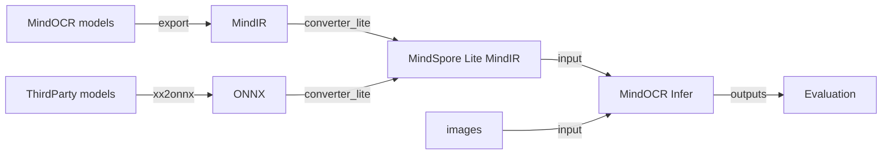

# MindOCR 离线推理

## 1. 简介

MindOCR的推理支持Ascend310/Ascend310P设备，采用[MindSpore Lite](https://www.mindspore.cn/lite)推理，
集成了文本检测、角度分类和文字识别模块，实现了端到端的OCR推理过程，并采用流水并行化方式优化推理性能。

当前支持的模型有：[MindOCR模型列表](mindocr_models_list.md)，[PPOCR模型列表](thirdparty_models_list.md)，可跳转到对应模型的介绍页面下载MindIR/ONNX用于转换MindSpore Lite离线模型进行推理。

MindOCR Lite整体的推理流程如下：



## 2. 运行环境

请参考[运行环境准备](environment.md)，配置MindOCR的推理运行环境。

## 3. 模型转换

请参考[模型转换教程](convert_tutorial.md)，将其转换为MindOCR推理支持的模型格式。

## 4. 推理 (Python)

进入到MindOCR推理侧目录下：`cd deploy/py_infer`.

### 4.1 检测+分类+识别

```shell
python infer.py \
    --input_images_dir=/path/to/images \
    --det_model_path=/path/to/mindir/dbnet_resnet50.mindir \
    --det_model_name_or_config=../../configs/det/dbnet/db_r50_icdar15.yaml \
    --cls_model_path=/path/to/mindir/cls_mv3.mindir \
    --cls_model_name_or_config=ch_pp_mobile_cls_v2.0 \
    --rec_model_path=/path/to/mindir/crnn_resnet34.mindir \
    --rec_model_name_or_config=../../configs/rec/crnn/crnn_resnet34.yaml \
    --res_save_dir=det_cls_rec \
    --vis_pipeline_save_dir=det_cls_rec
```

> 注意：设置 `--character_dict_path=/path/to/xxx_dict.txt` 当不仅含有数字及小写字母时。

- det_model_path，cls_model_path，rec_model_path为模型转换后的MindSpore Lite MindIR。
- 可视化图片存放在det_cls_rec中,如图所示：

  <p align="center">
    
  </p>
  <p align="center">
    <em>文本检测识别结果可视化</em>
  </p>

  结果保存在det_cls_rec/pipeline_results.txt，格式如下：

  ```
  img_182.jpg	[{"transcription": "cocoa", "points": [[14.0, 284.0], [222.0, 274.0], [225.0, 325.0], [17.0, 335.0]]}, {...}]
  ```

### 4.2 检测+识别

不传入方向分类相关的参数，就会跳过方向分类流程，只执行检测+识别

```shell
python infer.py \
    --input_images_dir=/path/to/images \
    --det_model_path=/path/to/mindir/dbnet_resnet50.mindir \
    --det_model_name_or_config=../../configs/det/dbnet/db_r50_icdar15.yaml \
    --rec_model_path=/path/to/mindir/crnn_resnet34.mindir \
    --rec_model_name_or_config=../../configs/rec/crnn/crnn_resnet34.yaml \
    --res_save_dir=det_rec \
    --vis_pipeline_save_dir=det_rec
```

> 注意：设置 `--character_dict_path=/path/to/xxx_dict.txt` 当不仅含有数字及小写字母时。

可视化结果存放在det_rec文件夹中，如图所示：

<p align="center">
  
</p>
<p align="center">
  <em>文本检测识别结果可视化</em>
</p>

识别结果保存在det_rec/pipeline_results.txt，格式如下：

```
img_498.jpg	[{"transcription": "keep", "points": [[819.0, 71.0], [888.0, 67.0], [891.0, 104.0], [822.0, 108.0]]}, {...}]
```

### 4.3 检测

可以单独运行文本检测

```shell
python infer.py \
    --input_images_dir=/path/to/images \
    --det_model_path=/path/to/mindir/dbnet_resnet50.mindir \
    --det_model_name_or_config=../../configs/det/dbnet/db_r50_icdar15.yaml \
    --res_save_dir=det \
    --vis_det_save_dir=det
```

可视化结果存放在det中，如图所示：

<p align="center">
  
</p>
<p align="center">
  <em>文本检测结果可视化</em>
</p>

检测结果保存在det/det_results.txt，格式如下：

```
img_108.jpg	[[[226.0, 442.0], [402.0, 416.0], [404.0, 433.0], [228.0, 459.0]], [...]]
```

### 4.4 分类

可以单独运行文本方向分类

```shell
# cls_mv3.mindir is converted from ppocr
python infer.py \
    --input_images_dir=/path/to/images \
    --cls_model_path=/path/to/mindir/cls_mv3.mindir \
    --cls_model_name_or_config=ch_pp_mobile_cls_v2.0 \
    --res_save_dir=cls
```

结果保存在cls/cls_results.txt，格式如下：

```
word_867.png   ["180", 0.5176]
word_1679.png  ["180", 0.6226]
word_1189.png  ["0", 0.9360]
```

### 4.5 识别

可以单独运行文字识别

```shell
python infer.py \
    --input_images_dir=/path/to/images \
    --backend=lite \
    --rec_model_path=/path/to/mindir/crnn_resnet34.mindir \
    --rec_model_name_or_config=../../configs/rec/crnn/crnn_resnet34.yaml \
    --res_save_dir=rec
```

> 注意：设置 `--character_dict_path=/path/to/xxx_dict.txt` 当不仅含有数字及小写字母时。

结果保存在rec/rec_results.txt，格式如下：

```
word_421.png   "under"
word_1657.png  "candy"
word_1814.png  "cathay"
```

### 4.6 详细推理参数解释

<details>
<summary> 详情 </summary>

- 基本设置

  | 参数名称          | 类型 | 默认值   | 含义                    |
  |:-----------------|:----|:-------|:-----------------------|
  | input_images_dir | str | 无      | 单张图像或者图片文件夹     |
  | device           | str | Ascend | 推理设备名称，支持：Ascend |
  | device_id        | int | 0      | 推理设备id               |
  | backend          | str | lite   | 推理后端，支持：acl, lite |
  | parallel_num     | int | 1      | 推理流水线中每个节点并行数  |
  | precision_mode   | str | 无      | 推理的精度模式，暂只支持在[模型转换](convert_tutorial.md)时设置，此处不生效 |

- 结果保存

  | 参数名称               | 类型  | 默认值             | 含义                      |
  |:----------------------|:-----|:------------------|:-------------------------|
  | res_save_dir          | str  | inference_results | 推理结果的保存路径           |
  | vis_det_save_dir      | str  | 无                | 绘制检测框的图片保存路径      |
  | vis_pipeline_save_dir | str  | 无                | 绘制检测框和文本的图片保存路径 |
  | vis_font_path         | str  | 无                | 绘制文字时的字体路径         |
  | crop_save_dir         | str  | 无                | 文本检测后裁剪图片的保存路径   |
  | show_log              | bool | False             | 是否打印日志                |
  | save_log_dir          | str  | 无                | 日志保存文件夹              |

- 文本检测

  | 参数名称                  | 类型 | 默认值 | 含义                        |
  |:-------------------------|:----|:------|:---------------------------|
  | det_model_path           | str | 无    | 文本检测模型的文件路径          |
  | det_model_name_or_config | str | 无    | 文本检测模型的名称或配置文件路径 |

- 文本方向分类

  | 参数名称                  | 类型 | 默认值 | 含义                           |
  |:-------------------------|:----|:------|:------------------------------|
  | cls_model_path           | str | 无    | 文本方向分类模型的文件路径          |
  | cls_model_name_or_config | str | 无    | 文本方向分类模型的名称或配置文件路径 |

- 文本识别

  | 参数名称                  | 类型 | 默认值 | 含义                                             |
  |:-------------------------|:----|:------|:------------------------------------------------|
  | rec_model_path           | str | 无    | 文本识别模型的文件路径                               |
  | rec_model_name_or_config | str | 无    | 文本识别模型的名称或配置文件路径                       |
  | character_dict_path      | str | 无    | 文本识别模型对应的词典文件路径，默认值只支持数字和英文小写，其他语言请在对应模型列表页面下载character_dict |

说明：

`*_model_name_or_config`可以填模型名或YAML配置文件路径，可参考[MindOCR模型列表](mindocr_models_list.md)，[PPOCR模型列表](thirdparty_models_list.md)。

</details>

## 5. 模型推理精度评估

### 5.1 文本检测

完成推理后，使用以下命令评估检测结果：

```shell
python deploy/eval_utils/eval_det.py \
    --gt_path=/path/to/det_gt.txt \
    --pred_path=/path/to/prediction/det_results.txt
```

### 5.2 文本识别

完成推理后，使用以下命令评估识别结果：

```shell
python deploy/eval_utils/eval_rec.py \
    --gt_path=/path/to/rec_gt.txt \
    --pred_path=/path/to/prediction/rec_results.txt \
    --character_dict_path=/path/to/xxx_dict.txt
```

请注意，character_dict_path是可选参数，默认字典仅支持数字和英文小写，其他语言请在对应模型列表页面下载character_dict。
