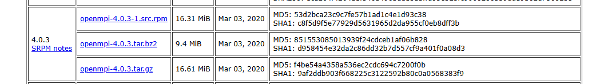
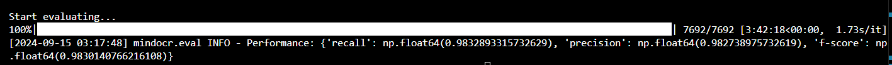
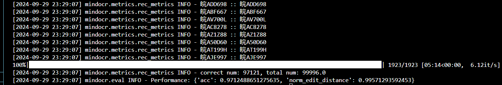
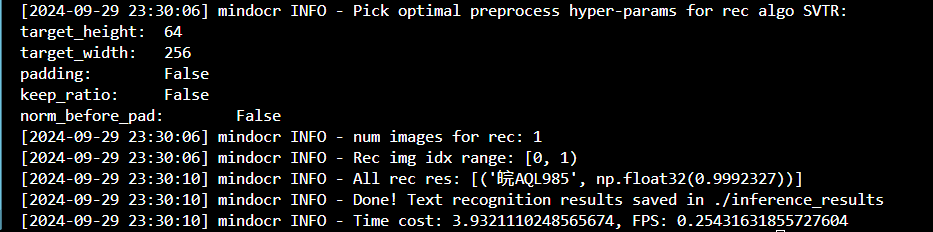
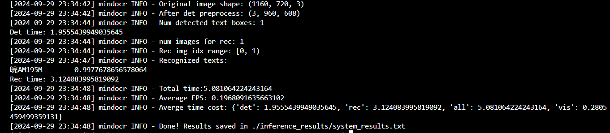

English | [中文](./README_CN.md)

# License plate recognition based on MindOCR

# Dataset processing

## Introduction to CCPD

Due to the lack of publicly available large and diverse datasets, most current license plate detection and recognition methods are evaluated on small and often unrepresentative datasets. This paper propose a large and comprehensive license plate dataset, CCPD (Chinese City Parking Dataset), all images of which are manually captured and carefully annotated by workers from a roadside parking management company. CCPD is the largest publicly available license plate dataset to date, with more than 250,000 unique car images, and the only dataset that provides vertex position annotations.

Paper: [Towards End-to-End License Plate Detection and Recognition: A Large Dataset and Baseline](https://openaccess.thecvf.com/content_ECCV_2018/papers/Zhenbo_Xu_Towards_End-to-End_License_ECCV_2018_paper.pdf)

Code repository: [https://github.com/detectRecog/CCPD](https://github.com/detectRecog/CCPD)

## Dataset download

Download the dataset following the instructions on the [CCPD official project website](https://github.com/detectRecog/CCPD), then unzip the dataset into the CCPD_Tutorial/datasets directory:
```shell
tar xf CCPD2019.tar.xz
```

The directory structure are as follows:
```text
CCPD_Tutorial
└── datasets
    └── CCPD2019                  #  Number of Images      Description
        ├── ccpd_base             #  199997                Normal License Plates
        ├── ccpd_blur             #  20612                 Blurred License Plates
        ├── ccpd_challenge        #  50004                 Challenging License Plates
        ├── ccpd_db               #  10133                 Poorly Lit or Overexposed
        ├── ccpd_fn               #  20968                 Far or Close to Camera
        ├── ccpd_np               #  3036                  New Cars Without Plates
        ├── ccpd_rotate           #  10054                 Horizontal Tilt 20-50°, Vertical Tilt -10-10°
        ├── ccpd_tilt             #  30271                 Horizontal Tilt 15-45°, Vertical Tilt 15-45°
        ├── ccpd_weather          #  10000                 License Plates in Rain, Snow, or Fog
        ├── LICENSE
        ├── README.md
        └── splits
```

## Dataset annotation

The CCPD dataset does not have a dedicated annotation file. The file name of each image is the corresponding data label.

For example, `025-95_113-154&383_386&473-386&473_177&454_154&383_363&402-0_0_22_27_27_33_16-37-15.jpg` is divided into seven parts by the separator '-':

* **Area: ​**The ratio of the license plate area to the entire image area. `025` means 2.5%.
* **Tilt: ​**Horizontal tilt and vertical tilt. `95_113` corresponds to two angles, horizontal 95° and vertical 113°.
* **Bounding box coordinates:** The coordinates of the upper left and lower right vertices. `154&383_386&473` corresponds to the bounding box coordinates: upper left (154, 383), lower right (386, 473).
* **Four vertex positions:** The exact (x, y) coordinates of the four vertices of the LP (License Plate) in the entire image. These coordinates start from the vertex in the lower right corner. `386&473_177&454_154&383_363&402` correspond to the coordinates of the four corner points.
* **License plate number:** There is only one LP in each image of CCPD. Each LP number consists of a Chinese character, a letter, and five letters or numbers. A valid Chinese license plate consists of 7 characters: province (1 character), letter (1 character), letter + number (5 characters). "0_0_22_27_27_33_16" is the index of each character. The three arrays are defined as follows. The last character of each array is the letter O, not the number 0. We use O as a sign of "no character" because there is no O in the Chinese license plate characters.
* **Brightness: ​**The brightness of the license plate area. `37` indicates brightness.
* **Blur:** The blurriness of the license plate area. `15` indicates blurriness.

## Map license plate character to array

```python
provinces = ["皖", "沪", "津", "渝", "冀", "晋", "蒙", "辽", "吉", "黑", "苏", "浙", "京", "闽", "赣", "鲁", "豫", "鄂", "湘", "粤", "桂", "琼", "川", "贵", "云", "藏", "陕", "甘", "青", "宁", "新", "警", "学", "O"]
alphabets = ['A', 'B', 'C', 'D', 'E', 'F', 'G', 'H', 'J', 'K', 'L', 'M', 'N', 'P', 'Q', 'R', 'S', 'T', 'U', 'V', 'W',
             'X', 'Y', 'Z', 'O']
ads = ['A', 'B', 'C', 'D', 'E', 'F', 'G', 'H', 'J', 'K', 'L', 'M', 'N', 'P', 'Q', 'R', 'S', 'T', 'U', 'V', 'W', 'X',
       'Y', 'Z', '0', '1', '2', '3', '4', '5', '6', '7', '8', '9', 'O']
```

## Dataset partitioning

Split the ccpd_base dataset into training, testing, and validation datasets according to the train.txt, test.txt, and val.txt files in the splits folder. The splitting code can be found in split.py.

# [MindOCR environment installation](https://github.com/mindspore-lab/mindocr)

## Requirements

### Ascend

|mindspore|ascend driver|firmware|cann toolkit/kernel|
| :---------: | :-------------: | :-----------: | :-------------------: |
|2.2.14|23.0.3|7.1.0.5.220|7.0.0.beta1|

### GPU

|mindspore|gpu driver|cuda version|     gpu type     |
| :---------: | :----------: | :------------: |:----------------:|
|2.2.14|535.183.06|cuda11.6| GeForce RTX 4090 |

## Installation steps

### Installation environment dependencies

1. Creating a Python Virtual Environment with Conda

```shell
conda create -n mindspore2.2.14_mindocr python=3.9
```

2. [Installing MindSpore 2.2.14](https://www.mindspore.cn/install/)

According to the guidelines on the [MindSpore official website](https://www.mindspore.cn/install/), install MindSpore version 2.2.14 along with the corresponding GPU or Ascend AI processor software packages.

3. [Install Open MPI 4.0.3](https://www.open-mpi.org/software/ompi/v4.0/) (For distributed training and evaluation, you can skip it if distributed training is not required)

Download Open MPI v4.0.3 from the official website, and then unzip the tar.gz file to the project-related folder:

​​

Unzip the Open MPI source package:

```shell
tar -xvf openmpi-4.0.3.tar.gz
```

Navigate to the source root directory and execute the configuration file to start the installation:

```shell
cd openmpi-4.0.0/
./configure --prefix=/installation_directory/openmpi
make
make install
```

Configure environment variables:

```shell
vim /etc/profile
```

```text
## OpenMPI ##
export PATH=$PATH:/installation_directory/openmpi/bin
export LD_LIBRARY_PATH=/installation_directory/openmpi/lib
```

```shell
source /etc/profile
```

Test the installation:

```shell
cd /installation_directory/openmpi/examples
make
./hello_c
```

## Install MindOCR

Based on the version compatibility between MindSpore and MindOCR, please download and install MindOCR version 0.3.

|mindocr|mindspore|
| :-------: | :---------: |
|master|master|
|0.4|2.3.0|
|0.3|2.2.10|
|0.1|1.8|

```shell
git clone https://github.com/mindspore-lab/mindocr.git
git checkout v0.3.2
cd mindocr
pip install -r requirements.txt
pip install -e .
```

# Training [DBNet](https://github.com/mindspore-lab/mindocr/blob/main/configs/det/dbnet/README.md) model for text detection

## Dataset preparation

1. Copy the `ccpd_train`​, `ccpd_test`​, and `ccpd_val`​ datasets into the `train`​, `test`​, and `val`​ directories under `images`​, respectively.

2. Run the [script](https://github.com/mindspore-lab/mindocr/blob/main/docs/zh/datasets/ccpd.md) provided by MindOCR to convert the data annotation format:

```shell
python tools/dataset_converters/convert.py \
    --dataset_name ccpd --task det \
    --image_dir path/to/CCPD2019/ccpd_base \
    --label_dir path/to/CCPD2019/splits/train.txt \
    --output_path path/to/CCPD2019/det_gt.txt
```

3. The dataset structure is as follows:

```shell
.
├── val
│   ├── images
│   │   ├── img_1.jpg
│   │   ├── img_2.jpg
│   │   └── ...
│   └── val_det_gt.txt
├── test
│   ├── images
│   │   ├── img_1.jpg
│   │   ├── img_2.jpg
│   │   └── ...
│   └── test_det_gt.txt
└── train
    ├── images
    │   ├── img_1.jpg
    │   ├── img_2.jpg
    │   └── ....jpg
    └── train_det_gt.txt
```

## Write the configuration file (Refer to db_r50_ccpd.yaml for the complete configuration file)

1. Create a `db_r50_ccpd.yaml`​ file in the `mindocr/configs/det/dbnet`​ directory.
2. Copy the contents of the `db_r50_ctw1500.yaml`​ file into the `db_r50_ccpd.yaml`​ file.
3. Modify the `box_type`​ and `box_thresh`​ under `postprocess`​ to be `quad`​ and `0.7`​, respectively.

```yaml
postprocess:
  name: DBPostprocess
  box_type: quad          # whether to output a polygon or a box
  binary_thresh: 0.3      # binarization threshold
  box_thresh: 0.7         # box score threshold
  max_candidates: 1000
  expand_ratio: 1.5       # coefficient for expanding predictions
```

4. Modify the data path configuration of train and test respectively to the location of the data

```yaml
dataset:
    type: DetDataset
    dataset_root: path/to/your/dataset/root
    data_dir: train/images
    label_file: train/train_det_gt.txt
```

5. Change the value of IOU from 0.5(default) to 0.7.

Location of code:./mindocr/metrics/det_metrics.py:L33

```python
...
def __init__(self, min_iou: float = 0.7, min_intersect: float = 0.5):
    self._min_iou = min_iou
    self._min_intersect = min_intersect
...
```

## Train

```shell
# Single Ascend/GPU Training (May Failed Due to Insufficient GPU/NPU on-Device Memory)
python tools/train.py --config configs/det/dbnet/db_r50_ccpd.yaml --device_target Ascend/GPU
# Multi-Ascend/GPU Training (Requires Correct OpenMPI Installation and Root Privileges)
mpirun --allow-run-as-root -n 2 python tools/train.py --config configs/det/dbnet/db_r50_ccpd.yaml --device_target Ascend/GPU
```

## Test

```shell
python tools/eval.py -c=configs/det/dbnet/db_r50_ccpd.yaml --device_target Ascend/GPU
```

Validation set test results:

​​

* ​`precision`​: 98.27%
* ​`recall`​: 98.33%
* ​`f-score`​: 98.30%

## Inference

```shell
python tools/infer/text/predict_det.py 	--image_dir path/to/image or path/to/image_dir \
                                --det_algorithm DB \
                                --det_model_dir path/to/best.ckpt \
                                --det_box_type quad \
                                --det_db_box_thresh 0.7 \
                                --visualize_output true
```

​​

# Training [SVTR](https://github.com/mindspore-lab/mindocr/blob/main/configs/rec/svtr/README.md) model for text recognition

## [Dataset processing](https://github.com/mindspore-lab/mindocr/blob/main/docs/zh/tutorials/training_recognition_custom_dataset.md)

1. Generate the label file using the [script](https://github.com/mindspore-lab/mindocr/blob/main/docs/zh/datasets/ccpd.md) provided by MindOCR, and run the provided `generate_data.py`​ script to crop the license plate areas from the images and extract the license plate numbers to form the SVTR training, testing, and validation datasets.

Please place all training images in the same folder and specify a text file in the parent directory to label all training image names and their corresponding labels. The format of the text file should be as follows:

```txt
# Filename		# Corresponding Label
0092816091954-94_82-181&490_358&548-363&554_189&540_190&484_364&498-0_0_28_29_16_29_32-133-13.jpg	皖A45S58
0104418103448-91_84-329&442_511&520-515&519_340&508_326&447_501&458-0_0_33_18_25_26_26-166-27.jpg	皖A9U122
023275862069-90_86-173&473_468&557-485&563_189&555_187&469_483&477-0_0_2_27_9_26_24-178-36.jpg	皖AC3K20
```

**Note:** Use `\tab`​ as the separator between the image name and label, avoiding spaces or other separators.

Finally, directory structure of the training dataset will be as follows:

```txt
|-data
    |- gt_training.txt
    |- training
        |- 0092816091954-94_82-181&490_358&548-363&554_189&540_190&484_364&498-0_0_28_29_16_29_32-133-13.jpg
		|- 0104418103448-91_84-329&442_511&520-515&519_340&508_326&447_501&458-0_0_33_18_25_26_26-166-27.jpg
		|- 023275862069-90_86-173&473_468&557-485&563_189&555_187&469_483&477-0_0_2_27_9_26_24-178-36.jpg
        | ...
```

The preparation method for the testing and validation datasets is the same.

## Dictionary preparation

Run the code in `generate_dict.py`​ with the following character set to generate the dictionary file `ccpd_dict.txt`​. Then place the dictionary file in the `mindocr/utils/dict`​ directory.

```python
provinces = ["皖", "沪", "津", "渝", "冀", "晋", "蒙", "辽", "吉", "黑", "苏", "浙", "京", "闽", "赣", "鲁", "豫", "鄂", "湘", "粤", "桂", "琼", "川", "贵", "云", "藏", "陕", "甘", "青", "宁", "新", "警", "学", "O"]
alphabets = ['A', 'B', 'C', 'D', 'E', 'F', 'G', 'H', 'J', 'K', 'L', 'M', 'N', 'P', 'Q', 'R', 'S', 'T', 'U', 'V', 'W',
             'X', 'Y', 'Z', 'O']
ads = ['A', 'B', 'C', 'D', 'E', 'F', 'G', 'H', 'J', 'K', 'L', 'M', 'N', 'P', 'Q', 'R', 'S', 'T', 'U', 'V', 'W', 'X',
       'Y', 'Z', '0', '1', '2', '3', '4', '5', '6', '7', '8', '9', 'O']
```

## Prepare the configuration file (refer to the complete configuration file in `svtr_ccpd.yaml`​)

1. Copy the file `mindocr/configs/rec/svtr/svtr_tiny_ch.yaml`​ to a new file.
2. Modify the following parameters in the new configuration file:

```yaml
common:
  character_dict_path: &character_dict_path mindocr/utils/dict/ccpd_dict.txt
  num_classes: &num_classes 69 # num_chars_in_dict + 1
  max_text_len: &max_text_len 7
  use_space_char: &use_space_char False
  batch_size: &batch_size 256
```

3. Update the training and validation datasets with the following parameters:

```yaml
train:
  ...
  dataset:
    type: RecDataset                                                  # File reading method, using a generic data reading method here
    dataset_root: dir/to/data/                                        # Root directory for the training dataset
    data_dir: training/                                               # Directory for the training dataset, will be concatenated with `dataset_root` to form the complete path
    label_file: gt_training.txt                                       # Location of the training dataset labels, will be concatenated with `dataset_root` to form the complete path
...

eval:
  dataset:
    type: RecDataset                                                  # File reading method, using a generic data reading method here
    dataset_root: dir/to/data/                                        # Root directory for the validation dataset
    data_dir: validation/                                             # Directory for the validation dataset, will be concatenated with `dataset_root` to form the complete path
    label_file: gt_validation.txt                                     # Location of the validation dataset labels, will be concatenated with `dataset_root` to form the complete path
  ...
```

4. Set `lower` under the `metric` section to `false`:

```yaml
metric:
  name: RecMetric
  main_indicator: acc
  character_dict_path: *character_dict_path
  ignore_space: True
  print_flag: True
  lower: false
```

5. Modify `RecCTCLabelEncode`​ to set `lower: false`​:

```yaml
- RecCTCLabelEncode:
    max_text_len: *max_text_len
    character_dict_path: *character_dict_path
    use_space_char: *use_space_char
    lower: False
```

## Train

```shell
python tools/train.py --config configs/rec/svtr/svtr_tiny_ccpd.yaml --device_target Ascend/GPU
```

### Modify training configurations

1. **Modify the Configuration File**: Change `loss`​ section's `pred_seq_len`​ to 10.

```text
valid res:
[2024-09-10 15:16:38] mindocr.metrics.rec_metrics INFO - correct num: 23, total num: 99996.0
[2024-09-10 15:16:38] mindocr.eval INFO - Performance: {'acc': 0.00023000920191407204, 'norm_edit_distance': 0.5451045036315918}
```

2. **Adjust image_shape**​: Set the 'img_size' of the 'model' section to [32, 80].

```text
valid res:
100%|███████████████████████████████████████████████████████████████████████████████████████████████████████████████| 1923/1923 [01:40<00:00, 19.07it/s]
[2024-09-10 19:14:02] mindocr.metrics.rec_metrics INFO - correct num: 6940, total num: 99996.0
[2024-09-10 19:14:02] mindocr.eval INFO - Performance: {'acc': 0.069402776658535, 'norm_edit_distance': 0.765773355960846}
```

3. **Resize Strategy**: `Resize`​ all text images to `32 * 100`​ without considering the aspect ratio and without padding; set `max_text_length`​ to 25.

```text
valid res:
100%|███████████████████████████████████████████████████████████████████████████████████████████████████████████████| 1923/1923 [01:59<00:00, 16.05it/s]
[2024-09-10 19:16:59] mindocr.metrics.rec_metrics INFO - correct num: 98681, total num: 99996.0
[2024-09-10 19:16:59] mindocr.eval INFO - Performance: {'acc': 0.9868494868278503, 'norm_edit_distance': 0.9979807138442993}
```

4. **Modify the Base YAML File**: Change to `svtr_tiny.yaml`​ and add the STN module.

```text
valid res:
100%|███████████████████████████████████████████████████████████████████████████████████████████████████████████████| 1923/1923 [05:02<00:00,  6.36it/s]
[2024-09-10 23:01:26] mindocr.metrics.rec_metrics INFO - correct num: 97956, total num: 99996.0
[2024-09-10 23:01:26] mindocr.eval INFO - Performance: {'acc': 0.9795991778373718, 'norm_edit_distance': 0.995379626750946}
```

5. **Increase the intensity of data augmentation**​: Set the `aug_type`​ in the 'SVTRRecAug' section of the configuration file to 1​.

```text
valid res:
100%|████████████████████████████████████████████████████████████████████████████████████████| 1923/1923 [05:55<00:00,  5.42it/s]
[2024-09-11 17:08:48] mindocr.metrics.rec_metrics INFO - correct num: 96064, total num: 99996.0
[2024-09-11 17:08:48] mindocr.eval INFO - Performance: {'acc': 0.9606783986091614, 'norm_edit_distance': 0.9910668730735779}
```

6. **Increase the intensity of data augmentation**: Set `deterioration_p`​ and `colorjitter_p`​ to 0.5 in the `SVTRRecAug` section of the configuration file​.

```text
valid res:
100%|███████████████████████████████████████████████████████████████████████████████████████████████████████████| 1923/1923 [05:40<00:00,  5.65it/s]
[2024-09-11 20:12:32] mindocr.metrics.rec_metrics INFO - correct num: 97973, total num: 99996.0
[2024-09-11 20:12:32] mindocr.eval INFO - Performance: {'acc': 0.9797691702842712, 'norm_edit_distance': 0.9954692125320435}
```

## Test

```shell
python tools/eval.py --config configs/rec/svtr/svtr_tiny_ccpd.yaml --device_target Ascend/GPU
```

​​

* ​`acc`​: 97.12%

## Inference

### Modify inference codes

Locate the `algo_to_model_name` dict in the file `/mindocr/tools/infer/text/predict_rec.py`, and then modify the module corresponding to `SVTR` to `svtr_ccpd`​.

```python
algo_to_model_name = {
    "CRNN": "crnn_resnet34",
    "RARE": "rare_resnet34",
    "CRNN_CH": "crnn_resnet34_ch",
    "RARE_CH": "rare_resnet34_ch",
    # "SVTR": "svtr_tiny",
    "SVTR": "svtr_ccpd",
    "SVTR_PPOCRv3_CH": "svtr_ppocrv3_ch",
}
```

Add the `svtr_ccpd`​ module in the file `./mindocr/models/rec_svtr.py`​:

```python
__all__ = ["SVTR", "svtr_tiny", "svtr_tiny_ch", "svtr_ppocrv3_ch","svtr_ccpd"]
...
@register_model
def svtr_ccpd(pretrained=False, **kwargs):
    model_config = {
        "transform": {
            "name": "STN_ON",
            "in_channels": 3,
            "tps_inputsize": [32, 64],
            "tps_outputsize": [32, 100],
            "num_control_points": 20,
            "tps_margins": [0.05, 0.05],
            "stn_activation": "none",
        },
        "backbone": {
            "name": "SVTRNet",
            "pretrained": False,
            "img_size": [32, 100],
            "out_channels": 192,
            "patch_merging": "Conv",
            "embed_dim": [64, 128, 256],
            "depth": [3, 6, 3],
            "num_heads": [2, 4, 8],
            "mixer": [
                "Local",
                "Local",
                "Local",
                "Local",
                "Local",
                "Local",
                "Global",
                "Global",
                "Global",
                "Global",
                "Global",
                "Global",
            ],
            "local_mixer": [[7, 11], [7, 11], [7, 11]],
            "last_stage": True,
            "prenorm": False,
        },
        "neck": {"name": "Img2Seq"},
        "head": {
            "name": "CTCHead",
            "out_channels": 69,
        },
    }

    model = SVTR(model_config)

    # load pretrained weights
    if pretrained:
        default_cfg = default_cfgs["svtr_tiny"]
        load_pretrained(model, default_cfg)

    return model
```

### Execute inference command

```shell
python tools/infer/text/predict_rec.py 	--image_dir path/to/image_path \
                        --rec_algorithm SVTR \
                        --rec_image_shape "3,32,100" \
                        --rec_model_dir path/to/best.ckpt \
                        --draw_img_save_dir path/to/save/res \
                        --rec_char_dict_path mindocr/utils/dict/ccpd_dict.txt \
                        --max_text_length 20 \
                        --visualize_output true
```

**Input:**

​​

**Output:**

​​

# DBNet and SVTR joint inference

```shell
python tools/infer/text/predict_system.py 	--image_dir path/to/image_path or image_dir \
                        --det_algorithm DB \
                        --det_model_dir path/to/dbnet/best.ckpt \
                        --det_box_type quad --det_db_box_thresh 0.7 \
                        --rec_algorithm SVTR \
                        --rec_model_dir path/to/svtr_ccpd/best.ckpt \
                        --rec_char_dict_path ./mindocr/utils/dict/ccpd_dict.txt \
                        --rec_image_shape "3,64,256" --max_text_length 24 --rec_amp_level O2 --visualize_output true
```

**Output:**

​​

**Visualized Result**:

​​

# Performance

Test results on Ascend 910* with MindSpore 2.2.14 graph mode :

|model name|cards|batch size|resolution|jit level|graph compile|s/step|img/s|
| :----------: | :-----: | :----------: | :----------: | :---------: | :-------------: | :------: | :------: |
|dbnet|1|16|640x640|O0|43.50s|0.26|61.59|
|svtr|1|256|64x256|O2|202.20s|0.77|331.70|

Test results on GeForce RTX 4090 with MindSpore 2.2.14 graph mode :

|model name|cards|batch size|resolution|jit level|graph compile|s/step|img/s|
| :----------: | :-----: | :----------: | :----------: | :---------: | :-------------: | :------: | :------: |
|dbnet|1|16|640x640|O0|1.07s|1.86|29.76|
|svtr|1|64|64x256|O2|0.57s|5.62|359.68|
