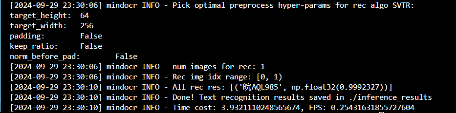
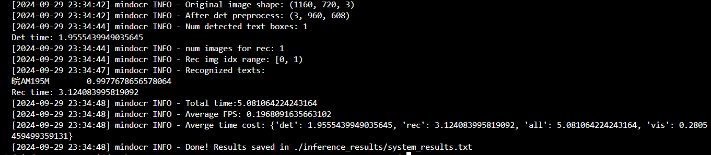

[English](./README.md) | 中文

# 基于MindOCR的车牌识别

# 数据集处理

## CCPD数据集介绍

由于没有公开可用的大型多样化数据集，当前大多数的车牌检测和识别方法都是在一些小且通常不具代表性的数据集进行评估。本文提出了一种大型且全面的车牌数据集CCPD (Chinese City Parking Dataset)，该数据集的所有图像都是由路边停车管理公司的工人手工拍摄并仔细标注的。CCPD是迄今为止最大的公开可用车牌数据集,拥有超过25万张独特的汽车图像,并且是唯一提供顶点位置标注的数据集。本文基于CCPD提出了一种新颖的网络模型,可以同时以高速和高精度预测边界框并识别相应的车牌号码。

论文：[Towards End-to-End License Plate Detection and Recognition: A Large Dataset and Baseline](https://openaccess.thecvf.com/content_ECCV_2018/papers/Zhenbo_Xu_Towards_End-to-End_License_ECCV_2018_paper.pdf)

代码仓库：[https://github.com/detectRecog/CCPD](https://github.com/detectRecog/CCPD)

## 数据集下载

按照[CCPD官方项目](https://github.com/detectRecog/CCPD)网页内的指引，下载数据集。然后，解压数据集到CCPD_Tutorial/datasets目录下：
```shell
tar xf CCPD2019.tar.xz
```

解压后的目录结构：
```text
CCPD_Tutorial
└── datasets
    └── CCPD2019                  #  图片数      说明
        ├── ccpd_base             #  199997	  正常车牌
        ├── ccpd_blur             #  20612	  模糊的车牌
        ├── ccpd_challenge		  #  50004	  比较有挑战性的车牌
        ├── ccpd_db				  #  10133	  光线较暗或较亮
        ├── ccpd_fn               #  20968	  距离摄像头较远或较近
        ├── ccpd_np               #  3036	  没上牌的新车
        ├── ccpd_rotate           #  10054	  水平倾斜20-50°，垂直倾斜-10-10°
        ├── ccpd_tilt             #  30271	  水平倾斜15-45°，垂直倾斜15-45°
        ├── ccpd_weather          #  10000	  雨天、雪天或者雾天的车牌
        ├── LICENSE
        ├── README.md
        └── splits
```

## 数据集标注

CCPD数据集没有专门的标注文件，每张图像的文件名就是对应的数据标注（label）。

例如：`025-95_113-154&383_386&473-386&473_177&454_154&383_363&402-0_0_22_27_27_33_16-37-15.jpg`由分隔符'-'分为七个部分:

1. 面积：车牌面积与整个画面面积的面积比。`025`表示占比2.5%。
2. 倾斜度：水平倾斜度和垂直倾斜度。`95_113` 对应两个角度, 水平95°, 竖直113°。
3. 边界框坐标：左上和右下顶点的坐标。`154&383_386&473`对应边界框坐标，即左上(154, 383)、右下(386, 473)。
4. 四个顶点位置：车牌区域的四个顶点在整幅图像中的确切(x, y)坐标。这些坐标从右下角的顶点开始。`386&473_177&454_154&383_363&402`对应四个角点坐标。
5. 车牌号码：CCPD的每个图像样本中只有一个车牌。每个车牌号码由一个汉字、一个字母和五个字母或数字组成。有效的中国车牌由省份(1个字符)、字母(1个字符)、字母+数字(5个字符)7个字符组成。`0_0_22_27_27_33_16`是每个字符的索引。这三个数组的定义如下。每个数组的最后一个字符是字母O，而不是数字0。我们用O作为“无字符”的标志，因为中国车牌字符中没有O。
6. 亮度：车牌区域的亮度。`37`表示亮度。
7. 模糊性：车牌区域的模糊性。`15`表示模糊度。

### 车牌字符映射数组

```python
provinces = ["皖", "沪", "津", "渝", "冀", "晋", "蒙", "辽", "吉", "黑", "苏", "浙", "京", "闽", "赣", "鲁", "豫", "鄂", "湘", "粤", "桂", "琼", "川", "贵", "云", "藏", "陕", "甘", "青", "宁", "新", "警", "学", "O"]
alphabets = ['A', 'B', 'C', 'D', 'E', 'F', 'G', 'H', 'J', 'K', 'L', 'M', 'N', 'P', 'Q', 'R', 'S', 'T', 'U', 'V', 'W',
             'X', 'Y', 'Z', 'O']
ads = ['A', 'B', 'C', 'D', 'E', 'F', 'G', 'H', 'J', 'K', 'L', 'M', 'N', 'P', 'Q', 'R', 'S', 'T', 'U', 'V', 'W', 'X',
       'Y', 'Z', '0', '1', '2', '3', '4', '5', '6', '7', '8', '9', 'O']
```

## 数据集分割

根据spilt文件夹中的`train.txt`、`test.txt`和`val.txt`，将ccpd_base数据集分割成训练数据集、测试数据集和验证数据集。分割代码参考`spilt.py`。

# [MindOCR环境安装](https://github.com/mindspore-lab/mindocr)

## 环境要求

### Ascend

|mindspore|ascend driver|firmware|cann toolkit/kernel|
| :---------: | :-------------: | :-----------: | :-------------------: |
|2.2.14|23.0.3|7.1.0.5.220|7.0.0.beta1|

### GPU

|mindspore|gpu driver|cuda version| gpu type |
| :---------: | :----------: | :------------: |:--------:|
|2.2.14|535.183.06|cuda11.6| GeForce RTX 4090 |

## 安装步骤

### 安装环境依赖

1. conda创建Python虚拟环境：

```shell
conda create -n mindspore2.2.14_mindocr python=3.9
```

2. [安装MindSpore 2.2.14](https://www.mindspore.cn/install/)

按照[MindSpore官网](https://www.mindspore.cn/install/)指引，安装MindSpore 2.2.14版本及其配套的GPU或昇腾AI处理器配套软件包。

3. [安装Open MPI v4.0.3](https://www.open-mpi.org/software/ompi/v4.0/) (for distributed training/evaluation)【用于模型分布式训练和评估，如不需要分布式训练，可跳过】

从Open MPI官网下载v4.0.3版本的tar.gz文件，并将其解压到项目相关文件夹

​​

解压Open MPI源码包

```shell
tar -xvf openmpi-4.0.3.tar.gz
```

进入源码根目录，运行配置文件执行Open MPI安装：

```shell
cd openmpi-4.0.0/
./configure --prefix=/安装目录/openmpi
make
make install
```

配置环境变量

```shell
vim /etc/profile
```

```text
##openmpi##
export PATH=$PATH:/安装目录/openmpi/bin
export LD_LIBRARY_PAHT=/安装目录/openmpii/lib
```

```shell
source /etc/profile
```

测试

```shell
cd /安装目录/openmpi/examples
make
./hello_c
```

### 下载安装MindOCR

根据MindSpore和MindOCR的版本配套关系，下载安装0.3版本的MindOCR。

|mindocr|mindspore|
| :-------: | :---------: |
|master|master|
|0.4|2.3.0|
|0.3|2.2.10|
|0.1|1.8|

```shell
git clone https://github.com/mindspore-lab/mindocr.git
git checkout v0.3.2
cd mindocr
pip install -r requirements.txt
pip install -e .
```

# 训练[DBNet](https://github.com/mindspore-lab/mindocr/blob/main/configs/det/dbnet/README_CN.md)文本检测模型

## 数据集准备

1. 将ccpd_train、ccpd_test、ccpd_val数据集分别置于train、test、val路径下的images文件夹中

2. 运行[mindocr提供的脚本](https://github.com/mindspore-lab/mindocr/blob/main/docs/zh/datasets/ccpd.md)转换数据标注格式

```shell
python tools/dataset_converters/convert.py \
    --dataset_name ccpd --task det \
    --image_dir path/to/CCPD2019/ccpd_base \
    --label_dir path/to/CCPD2019/splits/train.txt \
    --output_path path/to/CCPD2019/det_gt.txt
```

3. 数据集结构如下：

```txt
.
├── val
│   ├── images
│   │   ├── img_1.jpg
│   │   ├── img_2.jpg
│   │   └── ...
│   └── val_det_gt.txt
├── test
│   ├── images
│   │   ├── img_1.jpg
│   │   ├── img_2.jpg
│   │   └── ...
│   └── test_det_gt.txt
└── train
    ├── images
    │   ├── img_1.jpg
    │   ├── img_2.jpg
    │   └── ....jpg
    └── train_det_gt.txt
```

## 编写配置文件（完整配置文件见db_r50_ccpd.yaml)

1. 在mindocr/configs/det/dbnet下创建db_r50_ccpd.yaml文件
2. 复制db_r50_ctw1500.ymal文件的内容到db_r50_ccpd.yaml文件
3. 将`postprocess`​下的`box_type`​和`box_thresh`​分别修改为`quad`​和`0.7`​

```yaml
postprocess:
  name: DBPostprocess
  box_type: quad          # whether to output a polygon or a box
  binary_thresh: 0.3      # binarization threshold
  box_thresh: 0.7         # box score threshold
  max_candidates: 1000
  expand_ratio: 1.5       # coefficient for expanding predictions
```

4. 分别修改`train`​和`test`​的数据路径配置为数据所在位置

```yaml
dataset:
    type: DetDataset
    dataset_root: path/to/your/dataset/root
    data_dir: train/images
    label_file: train/train_det_gt.txt
```

5. 默认测试的IOU为0.5，修改为0.7

代码位置：./mindocr/metrics/det_metrics.py:L33

```python
...
def __init__(self, min_iou: float = 0.7, min_intersect: float = 0.5):
    self._min_iou = min_iou
    self._min_intersect = min_intersect
...
```

## 训练

```shell
# 单卡训练，可能因GPU或NPU片上存储不足失败
python tools/train.py --config configs/det/dbnet/db_r50_ccpd.yaml --device_target Ascend/GPU
# 多卡训练，需要正确安装opemmpi和使用root权限
mpirun --allow-run-as-root -n 2 python tools/train.py --config configs/det/dbnet/db_r50_ccpd.yaml --device_target Ascend/GPU
```

## 测试

```shell
python tools/eval.py -c=configs/det/dbnet/db_r50_ccpd.yaml --device_target Ascend/GPU
```

验证集测试结果：

​​

* ​`precision`​: 98.27%
* ​`recall`​: 98.33%
* ​`f-score`​: 98.30%

## 推理

```shell
python tools/infer/text/predict_det.py 	--image_dir path/to/image or path/to/image_dir \
                                --det_algorithm DB \
                                --det_model_dir path/to/best.ckpt \
                                --det_box_type quad \
                                --det_db_box_thresh 0.7 \
                                --visualize_output true
```

​​

# 训练[SVTR](https://github.com/mindspore-lab/mindocr/blob/main/configs/rec/svtr/README_CN.md)文本识别模型

## [数据集处理](https://github.com/mindspore-lab/mindocr/blob/main/docs/zh/tutorials/training_recognition_custom_dataset.md)

1. 根据[mindocr提供的脚本](https://github.com/mindspore-lab/mindocr/blob/main/docs/zh/datasets/ccpd.md)生成的label文件，运行提供的generate_data.py裁剪出图片中的车牌号区域并提取车牌号码形成SVTR训练、测试和验证数据集。

请将所有训练图片置入同一文件夹，并在上层路径指定一个txt文件用来标注所有训练图片名和对应标签。txt文件例子如下

```
# 文件名		# 对应标签
0092816091954-94_82-181&490_358&548-363&554_189&540_190&484_364&498-0_0_28_29_16_29_32-133-13.jpg	皖A45S58
0104418103448-91_84-329&442_511&520-515&519_340&508_326&447_501&458-0_0_33_18_25_26_26-166-27.jpg	皖A9U122
023275862069-90_86-173&473_468&557-485&563_189&555_187&469_483&477-0_0_2_27_9_26_24-178-36.jpg	皖AC3K20
```

*注意*：请将图片名和标签以 \tab 作为分隔，避免使用空格或其他分隔符。

最终训练集将以以下形式存放：

```
|-data
    |- gt_training.txt
    |- training
        |- 0092816091954-94_82-181&490_358&548-363&554_189&540_190&484_364&498-0_0_28_29_16_29_32-133-13.jpg
		|- 0104418103448-91_84-329&442_511&520-515&519_340&508_326&447_501&458-0_0_33_18_25_26_26-166-27.jpg
		|- 023275862069-90_86-173&473_468&557-485&563_189&555_187&469_483&477-0_0_2_27_9_26_24-178-36.jpg
        | ...
```

测试集和验证集的准备采用类似方式。

## 字典准备

根据以下字符集运行代码generate_dict.py，生成字典文件ccpd_dict.txt，并将其置于mindocr/utils/dict目录下。

```python
provinces = ["皖", "沪", "津", "渝", "冀", "晋", "蒙", "辽", "吉", "黑", "苏", "浙", "京", "闽", "赣", "鲁", "豫", "鄂", "湘", "粤", "桂", "琼", "川", "贵", "云", "藏", "陕", "甘", "青", "宁", "新", "警", "学", "O"]
alphabets = ['A', 'B', 'C', 'D', 'E', 'F', 'G', 'H', 'J', 'K', 'L', 'M', 'N', 'P', 'Q', 'R', 'S', 'T', 'U', 'V', 'W',
             'X', 'Y', 'Z', 'O']
ads = ['A', 'B', 'C', 'D', 'E', 'F', 'G', 'H', 'J', 'K', 'L', 'M', 'N', 'P', 'Q', 'R', 'S', 'T', 'U', 'V', 'W', 'X',
       'Y', 'Z', '0', '1', '2', '3', '4', '5', '6', '7', '8', '9', 'O']
```

## 准备配置文件(完整配置文件见svtr_ccpd.yaml)

1. 复制一份mindocr/configs/rec/svtr/svtr_tiny_ch.yaml文件，并对其进行修改
2. 修改字典配置`character_dict_path`​和字符种类数量`num_classes`​，以及最大字符长度`max_text_len`​的值，如下所示：

```yaml
common:
  character_dict_path: &character_dict_path mindocr/utils/dict/ccpd_dict.txt
  num_classes: &num_classes 69 # num_chars_in_dict + 1
  max_text_len: &max_text_len 7
  use_space_char: &use_space_char False
  batch_size: &batch_size 256
```

3. 修改训练数据集和验证数据集的`type`​、`dataset_root`​、`data_dir`​、`label_file`​

```yaml
...
train:
  ...
  dataset:
    type: RecDataset                                                  # 文件读取方式，这里用通用数据方式读取
    dataset_root: dir/to/data/                                        # 训练数据集根目录
    data_dir: training/                                               # 训练数据集目录，将与`dataset_root`拼接形成完整路径
    label_file: gt_training.txt                                       # 训练数据集标签摆放位置，将与`dataset_root`拼接形成完整路径
...
eval:
  dataset:
    type: RecDataset                                                  # 文件读取方式，这里用通用数据方式读取
    dataset_root: dir/to/data/                                        # 验证数据集根目录
    data_dir: validation/                                             # 验证数据集目录，将与`dataset_root`拼接形成完整路径
    label_file: gt_validation.txt                                     # 训练数据集标签摆放位置，将与`dataset_root`拼接形成完整路径
  ...
```

4. ​`metric`​中设置`lower`​为`false`​

```yaml
metric:
  name: RecMetric
  main_indicator: acc
  character_dict_path: *character_dict_path
  ignore_space: True
  print_flag: True
  lower: false
```

5. 修改`RecCTCLabelEncode`​的`lower`​为`false`​

```yaml
- RecCTCLabelEncode:
    max_text_len: *max_text_len
    character_dict_path: *character_dict_path
    use_space_char: *use_space_char
    lower: False
```

## 训练

```shell
python tools/train.py --config configs/rec/svtr/svtr_tiny_ccpd.yaml --device_target Ascend/GPU
```

### 修改训练配置

1. 修改配置文件`loss`​部分的`pred_seq_len`​为10

```text
valid res:
[2024-09-10 15:16:38] mindocr.metrics.rec_metrics INFO - correct num: 23, total num: 99996.0
[2024-09-10 15:16:38] mindocr.eval INFO - Performance: {'acc': 0.00023000920191407204, 'norm_edit_distance': 0.5451045036315918}
```

3. 修改配置文件`model`部分的`img_size`为[32，80]

```text
valid res:
100%|███████████████████████████████████████████████████████████████████████████████████████████████████████████████| 1923/1923 [01:40<00:00, 19.07it/s]
[2024-09-10 19:14:02] mindocr.metrics.rec_metrics INFO - correct num: 6940, total num: 99996.0
[2024-09-10 19:14:02] mindocr.eval INFO - Performance: {'acc': 0.069402776658535, 'norm_edit_distance': 0.765773355960846}
```

4. Resize策略：直接将所有文本图像`resize`​到`32 * 100`​,`Resize`​时不使用`Padding`​;`max_text_length`设置为25​;

```text
valid res:
100%|███████████████████████████████████████████████████████████████████████████████████████████████████████████████| 1923/1923 [01:59<00:00, 16.05it/s]
[2024-09-10 19:16:59] mindocr.metrics.rec_metrics INFO - correct num: 98681, total num: 99996.0
[2024-09-10 19:16:59] mindocr.eval INFO - Performance: {'acc': 0.9868494868278503, 'norm_edit_distance': 0.9979807138442993}
```

5. 修改基础yaml文件为`svtr_tiny.yaml`​，增加`STN`​模块

```text
valid res:
100%|███████████████████████████████████████████████████████████████████████████████████████████████████████████████| 1923/1923 [05:02<00:00,  6.36it/s]
[2024-09-10 23:01:26] mindocr.metrics.rec_metrics INFO - correct num: 97956, total num: 99996.0
[2024-09-10 23:01:26] mindocr.eval INFO - Performance: {'acc': 0.9795991778373718, 'norm_edit_distance': 0.995379626750946}
```

6. 增加数据增强强度：将​配置文件`SVTRRecAug`部分​的`aug_type`修改为1

```text
valid res:
100%|████████████████████████████████████████████████████████████████████████████████████████| 1923/1923 [05:55<00:00,  5.42it/s]
[2024-09-11 17:08:48] mindocr.metrics.rec_metrics INFO - correct num: 96064, total num: 99996.0
[2024-09-11 17:08:48] mindocr.eval INFO - Performance: {'acc': 0.9606783986091614, 'norm_edit_distance': 0.9910668730735779}
```

7. 增加数据增强强度：在​配置文件`SVTRRecAug`部分​增加`deterioration_p: 0.5`​、`colorjitter_p: 0.5`​

```text
valid res:
100%|███████████████████████████████████████████████████████████████████████████████████████████████████████████| 1923/1923 [05:40<00:00,  5.65it/s]
[2024-09-11 20:12:32] mindocr.metrics.rec_metrics INFO - correct num: 97973, total num: 99996.0
[2024-09-11 20:12:32] mindocr.eval INFO - Performance: {'acc': 0.9797691702842712, 'norm_edit_distance': 0.9954692125320435}
```

## 测试

```shell
python tools/eval.py --config configs/rec/svtr/svtr_tiny_ccpd.yaml --device_target Ascend/GPU
```

​​​​

* ​`acc`​: 97.12%

## 推理

### 修改推理代码

修改`/mindocr/tools/infer/text/predict_rec.py`​中的`algo_to_model_name`​,将`SVTR`​对应的模块修改为`svtr_ccpd`​

```python
algo_to_model_name = {
    "CRNN": "crnn_resnet34",
    "RARE": "rare_resnet34",
    "CRNN_CH": "crnn_resnet34_ch",
    "RARE_CH": "rare_resnet34_ch",
    # "SVTR": "svtr_tiny",
    "SVTR": "svtr_ccpd",
    "SVTR_PPOCRv3_CH": "svtr_ppocrv3_ch",
}
```

在代码`./mindocr/models/rec_svtr.py`​中添加svtr_ccpd模块：

```python
__all__ = ["SVTR", "svtr_tiny", "svtr_tiny_ch", "svtr_ppocrv3_ch","svtr_ccpd"]
...
@register_model
def svtr_ccpd(pretrained=False, **kwargs):
    model_config = {
        "transform": {
            "name": "STN_ON",
            "in_channels": 3,
            "tps_inputsize": [32, 64],
            "tps_outputsize": [32, 100],
            "num_control_points": 20,
            "tps_margins": [0.05, 0.05],
            "stn_activation": "none",
        },
        "backbone": {
            "name": "SVTRNet",
            "pretrained": False,
            "img_size": [32, 100],
            "out_channels": 192,
            "patch_merging": "Conv",
            "embed_dim": [64, 128, 256],
            "depth": [3, 6, 3],
            "num_heads": [2, 4, 8],
            "mixer": [
                "Local",
                "Local",
                "Local",
                "Local",
                "Local",
                "Local",
                "Global",
                "Global",
                "Global",
                "Global",
                "Global",
                "Global",
            ],
            "local_mixer": [[7, 11], [7, 11], [7, 11]],
            "last_stage": True,
            "prenorm": False,
        },
        "neck": {"name": "Img2Seq"},
        "head": {
            "name": "CTCHead",
            "out_channels": 69,
        },
    }

    model = SVTR(model_config)

    # load pretrained weights
    if pretrained:
        default_cfg = default_cfgs["svtr_tiny"]
        load_pretrained(model, default_cfg)

    return model
```

### 执行推理命令

```shell
python tools/infer/text/predict_rec.py 	--image_dir path/to/image_path \
                        --rec_algorithm SVTR \
                        --rec_image_shape "3,32,100" \
                        --rec_model_dir path/to/best.ckpt \
                        --draw_img_save_dir path/to/save/res \
                        --rec_char_dict_path mindocr/utils/dict/ccpd_dict.txt \
                        --max_text_length 20 \
                        --visualize_output true
```

**输入：**

​

**输出：**

​​

# 联合DBNet和SVTR推理

```shell
python tools/infer/text/predict_system.py 	--image_dir path/to/image_path or image_dir \
                        --det_algorithm DB \
                        --det_model_dir path/to/dbnet/best.ckpt \
                        --det_box_type quad --det_db_box_thresh 0.7 \
                        --rec_algorithm SVTR \
                        --rec_model_dir path/to/svtr_ccpd/best.ckpt \
                        --rec_char_dict_path ./mindocr/utils/dict/ccpd_dict.txt \
                        --rec_image_shape "3,64,256" --max_text_length 24 --rec_amp_level O2 --visualize_output true
```

**Output:**

​​

**Visualizing Results**:

​​

# 性能表现
在 Ascend 910* 上使用 MindSpore 2.2.14 的图模式进行实验测试:

|model name|cards|batch size|resolution|jit level|graph compile|s/step|img/s|
| :----------: | :-----: | :----------: | :----------: | :---------: | :-------------: | :------: | :------: |
|dbnet|1|16|640x640|O0|43.50s|0.26|61.59|
|svtr|1|256|64x256|O2|202.20s|0.77|331.70|

在 GeForce RTX 4090 上使用 MindSpore 2.2.14 的图模式进行实验测试:

|model name|cards|batch size|resolution|jit level|graph compile|s/step|img/s|
| :----------: | :-----: | :----------: | :----------: | :---------: | :-------------: | :------: | :------: |
|dbnet|1|16|640x640|O0|1.07s|1.86|29.76|
|svtr|1|64|64x256|O2|0.57s|5.62|359.68|
