# 简介
## 目的
在银行、交通、金融等行业中存在大量的版面分析、表格分析、图像中关键信息提取等可通过人工智能解决的任务。可以在MindSpore OCR 中集成智能文档分析模块，将调用不同模型所需要的数据前后处理以及不同模块间的数据流处理集成在智能文档分析模块，帮助开发者省去更多开发时间。
## 范围
#### 1. 软件名称
智能文档分析模块 MindViewer
#### 2.	软件功能
##### 1. 版面分析和表格识别
将合同、表单、证件等文件的图像格式转换成word或者excel等可编辑的文件格式，并保持原有的排列方式。
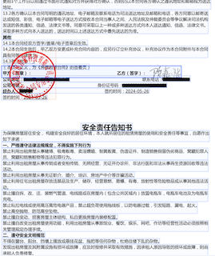
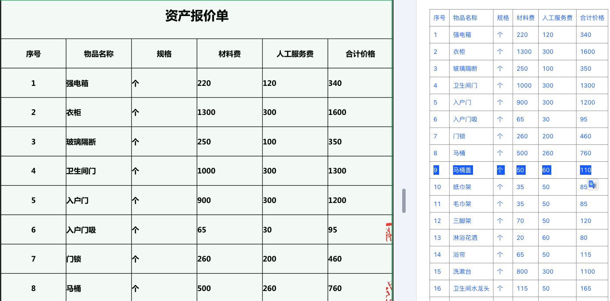
##### 2. 关键信息抽取
从图像中抽取给定关键字的信息，并以字典的形式输出。

# 第零层设计描述
## 软件系统上下文定义
安装的环境要求：同 MindSpore OCR 安装的环境要求相同。
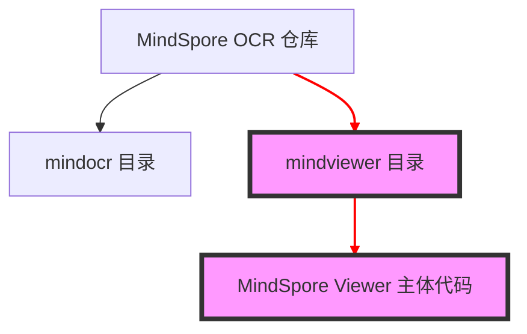
如图所示，原 MindSpore OCR 仓下主要的代码模块在 mindocr 目录下，需要添加 mindviewer 目录存放 MindSpore Viewer 主体代码，而 MindSpore Viewer 作为 MindSpore OCR 的一个子模块存在，在安装完 MindSpore OCR 后，用户可以通过 `from mindocr import mindviewer` 模块导入使用。**新增子模块对原mindocr的api无任何影响。**
 
## 设计约束
#### 1. 遵循标准
遵循Apache 2.0
#### 2.	硬件限制
Ascend：910A、910B
GPU：支持cuda10.1以上
CPU
#### 3. 技术限制
GPU、CPU暂不支持MindSpore 2.3
#### 4. 系统配置
openEuler: >= 20.3
CentOS：>= 7.6
Ubuntu：>= 18.04
Windows 10
MacOS：10.15/11.3
# 第一层设计描述
## 总体结构
MindSpore Viewer的整体架构如图所示
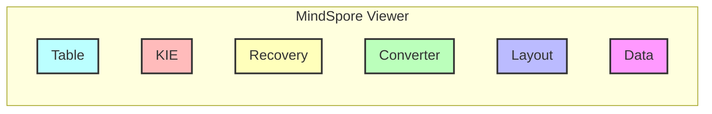
## 分解描述
#### 1. 模块分解
+ DataProcess（输入处理）
负责输入数据的预处理和后处理
+ Layout（版面分析）
负责将图像根据版面内容划分成图片、文字、标题、和表格四种区域，再进行下一步处理
+ Converter（格式转化）
负责将识别出来的pfd文档转换成word文档格式或相反
+ Recovery（版面恢复）
负责将图像、pdf内容像原文档一样输出到word文档中
+ KIE（关键信息抽取）
负责从文本或者图像中，抽取出关键信息作为OCR下游任务，如表单识别等
+ Table（表格分析）
负责从图像中识别出表格并识别表格中的文字以及排列方式
#### 2. 并发进程处理分解
MindSpore Viewer支持多进程并发处理，当前V1版本先支持单卡的训练及推理，V2版本开始加入多卡训练和推理。多进程特性在各模块后续的设计中加入，当前设计文档按单进程处理。
## 依赖性描述
#### 1.	运行设计
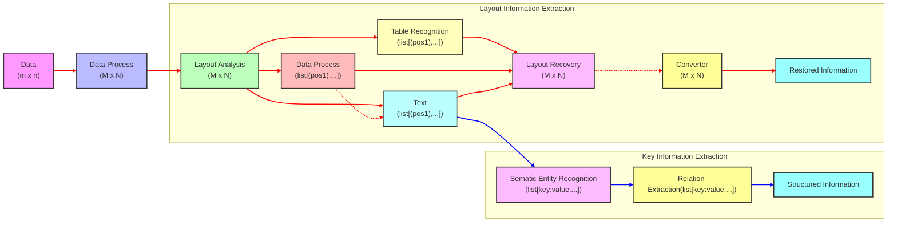
MindSpore Viewer运行流程图如图所示，首先原始图像输入会经过Data模块做预处理（缩放、旋转、格式转化等），处理好后会根据任务分类进入不同的管道：
+ 版面分析任务：Layout模块将图像分割成表格、图片、文字区域，表格会送进Table模块进行结构化识别，图像会送进Data模块进行超分，文字区域可通过开关判断是否送进Data模块进行锐化，再送进MindOCR进行识别，然后通过Recovery模块将前三个区域重新整合，可通过开关决定是否进行格式转换，最后输出或保存处理完的文档。
+ 关键信息抽取任务：预处理好的图像会直接送进MindSpore OCR中进行文字识别，然后通过语义识别模块获取语义实体，最后经过关系抽取模块获取语义实体间的对应关系，从而提取需要的关键信息。

#### 2.	数据依赖设计
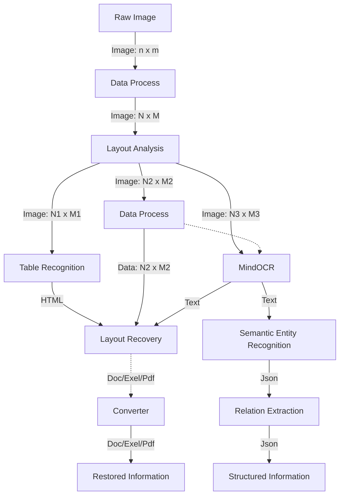
# 第二层设计描述
## DataProcess模块设计
#### 1.	总体结构

Data模块整体功能如图4所示，可对输入的图像进行预处理（旋转、缩放、格式转换）以及后处理（超分、锐化）。
#### 2.	模块分解描述
Preprocess：对图像数据的预处理，会提供一些常见的预处理方法，可根据图像类型自定义预处理方法
Postprocess：对图像数据的后处理，会提供一些常见的后处理方法，可根据图像类型自定义后处理方法，同时增加超分和锐化的方法
#### 3.	数据实体描述
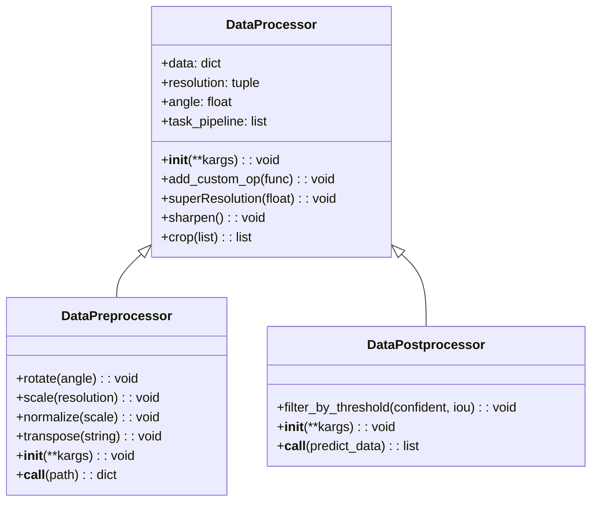
DataProcessor类有如下公共变量及接口：
+ `data`：存储图像数据的变量
+ `resolution`：存储图像的分辨率，（宽，长）
+ `angle`：图形的旋转角度
+ `task_pipeline`：Data的前后处理流水线，包含各处理的函数
+ `parallel`：并行处理的开关
+ `__init__(**kargs)`：初始化处理流水线涉及到的处理函数
+ `add_custom_op(func)`：用户可自定义处理函数并增加到task_pipeline中，调用__call__函数时会从task_pipline中取出该函数
+ `superResolution(float)`：超分模块，输入float为超分的倍数，当前采取双三次插值法
+ `sharpen()`：文字图像的锐化，通过高斯模糊区分出图像的低频和高频区，将高频信号与原始图像叠加达到图像增强的效果。
+ `crop(list)`：输入裁剪的顶点坐标做图像分割

DataPreprocessor类有如下公共变量及接口：
+ `rotate(angle)`：旋转图像，输入为旋转角度
+ `scale(resolution)`：缩放图像到指定大小，resolution为输入的tuple(wide, height)
+ `normalize(scale)`：图像归一化
+ `transpose(string)`：转换图像格式，bgr和rgb之间的转换和hwc和chw之间的转换
+ `__call__(path)`：输入图像路径，开始处理，返回包含图像数据的dictionary

DataPostprocessor类有如下公共变量及接口：
+ `confident_thres`：置信阈值
+ `iou_thres`：iou阈值
+ `filter_by_threshold(confident, iou)`：通过设置confident和iou的阈值来过滤数据
+ `__call__(predict_data))`：输入推测后的结果做后处理，返回list
#### 4.	依赖性描述
外部第三方依赖库：opencv、numpy
#### 5.	接口使用描述
```python
from mindocr import mindviewer
from mindviewer import DataPreprocessor, DataPostprocessor

image_path = "/path/to/Data"
preprocessor = DataPreprocessor(scale=(255.0), resolution=(800, 800), format=("rgb", "hwc"))
data = preprocessor(image_path)
...
output = net(data) # build your own network
...
postprocessor = DataPostprocessor(conf_thres=0.7, iou_thres=0.1)
out = postprocessor(output)
```
## AIModule模块设计
#### 1. 总体结构
为了方便开发者可以随时替换各个模块下的默认模型自行训练和推理，增加抽象AIModule模块以达成训推一体的效果。
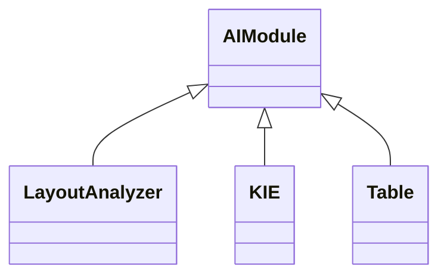
#### 2. 数据实体描述
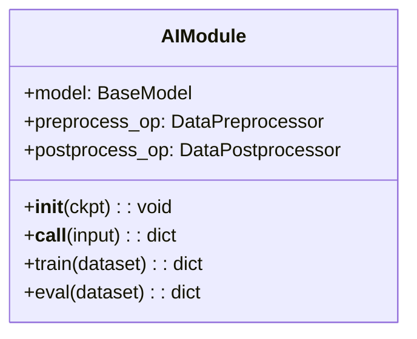
AIModule类有如下公共变量及接口：
+ `model`：输入的模型，类型为BaseModel
+ `preprocess_op`：DataPreprocessor类，用于数据前处理
+ `postprocess_op`：DataPostprocessor类，用于推理结果的处理
+ `__init__(ckpt_path)`：传入ckpt的路径并加载模型
+ `__call__(input)`：类的函数式调用方法，输入为网络的输入数据
+ `train(dataset)`：通过输入训练的dataset训练模型
+ `eval(dataset)`：通过输入评估的dataset评估模型

#### 3.	接口使用描述
```python
from mindocr import mindviewer
from mindviewer import AIModule
from mindocr.data import build_dataset

class CustomNet(AIModule):
    self.custom_param = 0

    def custom_func(param):
        pass

ckpt_path = '/path/to/your/ckpt'
custom_net = CustomNet(ckpt_path)
dataset = build_dataset('data_path')
custom_net.train(dataset)
```

## Layout模块设计
#### 1.	总体结构
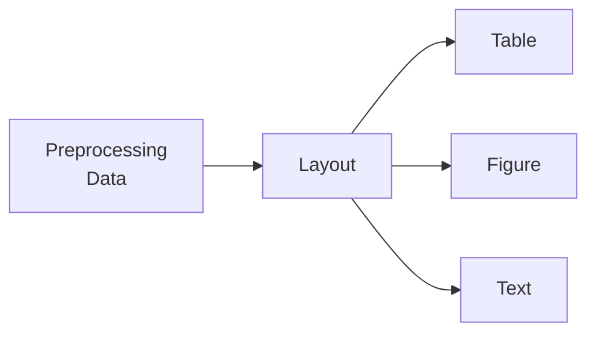
Layout模块整体功能如图5所示，预处理后的图像经过Layout模块做版面分析后切割成Table、Figure、Text区域。
#### 2.	模块分解描述
Layout模块无需分解额外子模块，所有功能包括数据前后处理、模型加载以及推理均在模块内处理完成。
#### 3.	数据实体描述
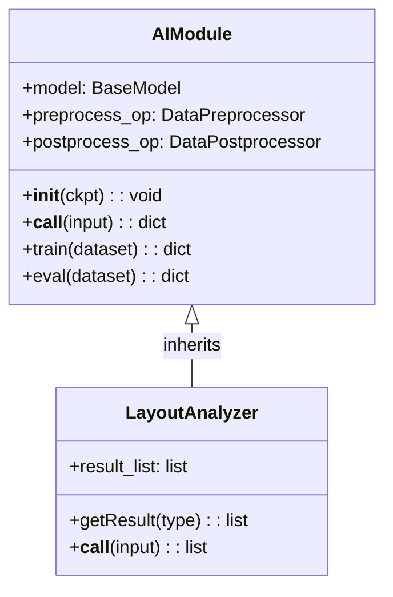
Layout模块下新建LayoutAnalyzer类，该类有如下几个初始化变量：
+ `result_list`：将推理结果储存方便后续操作
+ `getResult(type)`：用于返回特定的推理结果，分图像、文本和表格三类结果
+ `__call__(input)`：用于将结果存储在result_list
#### 4.	接口描述
```python
from mindocr import mindviewer
from mindviewer import LayoutAnalyzer, DataPreprocessor, DataPostprocessor
from mindocr.data import build_dataset

image_path = "/path/to/Data"
ckpt_path = "/path/to/your/ckpt"
preprocessor = DataPreprocessor(scale=(255.0), resolution=(800, 800), format=("rgb", "hwc"))
data = preprocessor(image_path)
net = LayoutAnalyzer(ckpt_path)
output = net(data) # build your own network
postprocessor = DataPostprocessor(conf_thres=0.7, iou_thres=0.1)
out = postprocessor(output)
table_output = output.getResult("table")
```
## Converter模块设计
#### 1.	总体结构
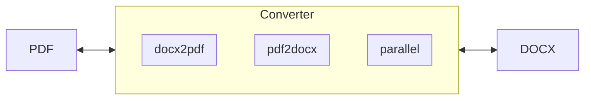
如上图所示，Converter模块可以将pdf格式或docx格式的文件转化成docx或pdf格式的文件。
#### 2.	模块分解描述
+ Parallel：多进程模块，该模块加速处理文件格式的转换
+ pdf2docx：pdf转docx模块
+ docx2pdf：docx转pdf模块
#### 3.	数据实体描述
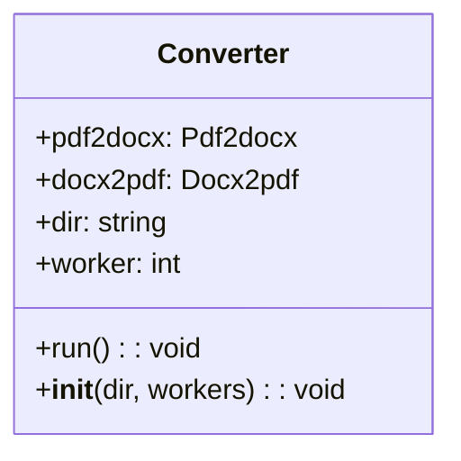
创建Converter类，该类初始化两个变量：
+ `pdf2docx`：为pdf2docx的api
+ `docx2pdf`：为docx2pdf的api
+ `dir`：文件夹路径，将文件夹下的所有文件做转换
+ `worker`：进程数量，默认为1（1的时候不开启多进程）
+ `run()`：Parallel模块的外部接口，同时作为Converter模块的主要调用接口，会开启多进程任务，加载文件并做格式转换。
+ `__init__(dir, workers=8)`：通过dir加载需要转换的文件，workers是进程数量，默认为8
#### 4.	依赖性描述
依赖第三方库pdf2docx、docx2pdf
#### 5.	接口描述
```python
from mindocr import mindviewer
from mindviewer import Converter

converter = Converer('/path/to/file', 64)
converter.run()
```
## Recovery模块设计
#### 1.	总体结构

Recovery(版面恢复)模块整体功能如图所示，将输入的图片、pdf内容经过版面分析、表格识别等技术，将处理后的结果，依照原文档位置信息重建到 word 文档中。

#### 2.	模块分解描述
Recovery模块无需分解额外子模块。
#### 3.	数据实体描述
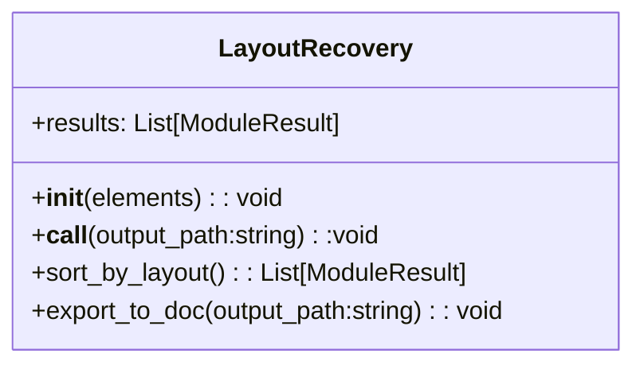
LayoutRecovery类有如下公共变量及接口: 
* `results`：其他模块输出的结果列表。
+ `__init__(results)`:初始化变量。
+ `__call__(results)`:构造函数，调用sort_by_layout和export_to_doc 进行版面恢复。
+ `sort_by_layout()`:依据page_id、box信息将 results进行排序。
+ `export_to_doc(output_path)`:将排序后的结果按顺序恢复，并输出到doc 文件。
#### 4.	依赖性描述
外部第三方依赖库：docx、bs4、html
不独立调用，需要结合版面分析模块(`Layout`)、表格分析模块（`Table`）等一起使用。
#### 5.	接口使用描述
```python
from mindocr import mindviewer
from mindviewer import LayoutAnalyzer, TableAnalyzer, LayoutRecovery
from mindocr.data import build_dataset 
from mindviewer import TableAnalyzer
image_path = "path/to/image"
layout_ckpt_path = "path/to/layout/ckpt" 
table_ckpt_path = "path/to/layout/ckpt"

layout_net = LayoutAnalyzer(layout_ckpt_path) 
output = layout_net(image_path) # build your own network 

table_net = TableAnalyzer(table_ckpt_path)
table_result = table_net.infer(output.getResult("table"))

results = [table_result, output.getResult("image"), output.getResult("text")]
recovery = LayoutRecovery(result)

recovery(output_path="path/to/recovery/")
```
## KIE模块设计
#### 1.	总体结构
KIE(Key Information Extraction,关键信息抽取) 模块整体功能如图所示，指在图像中，抽取出关键信息。
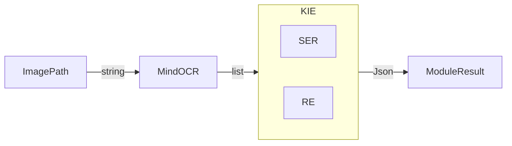
#### 2.	模块分解描述
KIE包含关系抽取(Relation Extraction, RE)和结构化实体识别(Structured Entity Recognition, SER)两个子模块：
+ 关系抽取(RE): 识别文本中的实体，并推断这些实体之间的关系。
+ 结构化实体识别(SER): 从非结构化文本中识别并提取结构化的实体(如人名、地名、组织名等)。
#### 3.	数据实体描述
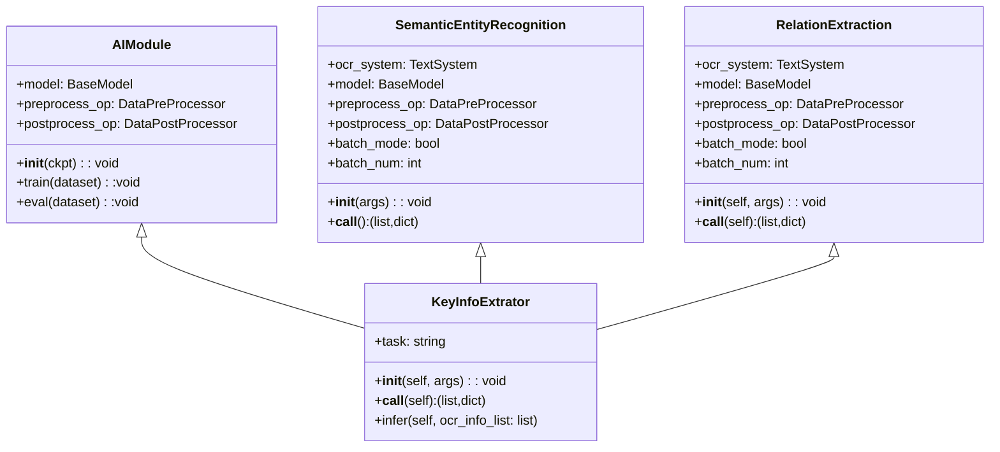
SemanticEntityRecognition类有如下公共变量及接口：
* `ocr_system`: 检测和识别图像中的文本系统
* `model`: 结构化实体识别的模型
* `preprocess_op`:DataPreprocessor类，用于对输入模型的数据进行前处理
* `postprocess_op`: DataPostprocessor类，用于对推理结果的处理
* `batch_mode`:是否开启batch模式
* `batch_num`: 定义开启batch模式中batch的数目
* ` __init__(self, args)`: 用于初始化模型，流水线及涉及到的处理函数
* `__call__(self, args)`: 用于直接对图片或者处理后的ocr结果进行结构化实体识别，返回识别后的结果以及时间报告

RelationExtraction类有如下公共变量及接口：
* `ocr_system`: 检测和识别图像中的文本系统
* `model`: 关系抽取的模型
* `preprocess_op`:DataPreprocessor类，用于对输入模型的数据进行前处理
* `postprocess_op`: DataPostprocessor类，用于对推理结果的处理
* `batch_mode`:是否开启batch模式
* `batch_num`: 定义开启batch模式中batch的数目
* ` __init__(self, args)`: 用于初始化模型，流水线及涉及到的处理函数
* `__call__(self, args)`: 用于直接对图片或者处理后的ocr结果进行关系抽取，返回识别后的结果以及时间报告

KeyInfoExtrator类有如下公共变量及接口：
* `task`: 任务选择，ser 或者 re
* ` __init__(self, args)`: 根据具体任务，初始化对应的模型，流水线及涉及到的处理函数
* `__call__(self, args)`: 根据具体任务，用于直接对图片或者处理后的ocr结果进行推理，返回识别后的结果以及时间报告
* `infer(self, ocr_info_list:list)`: 接受其他模块ocr处理后的结果，根据具体任务，进行推理

#### 4. 依赖性描述
SER模块依赖cv2、mindocr中infer/text下的predict_ser模块 RE模块在mindocr 中暂无推理工具，需要对infer/text下的工具进行补全，新增RelationExtraction象。

#### 5. 接口使用描述
```python
from mindocr import mindviewer
from mindviewer import KeyInfoExtrator
from collections import namedtuple 

# 直接调用KIE模块，对图片进行结构体实体识别
params = ["task", "image_dir", "ser_algorithm", "ser_model_dir"]
Args = namedtuple('Args', params)
args = Args(task="ser", image_dir="path/to/images", ser_algorithm="CRNN_CH", ser_model_dir="path/to/ckpt")
kie = KeyInfoExtrator(args, ser_res_all, time_report = kie(args.image_dir))
```
## Table模块设计
#### 1.	总体结构
Table模块整体功能如图所示，通过Table模块解析出单元格内的文字块位置和表格结构：
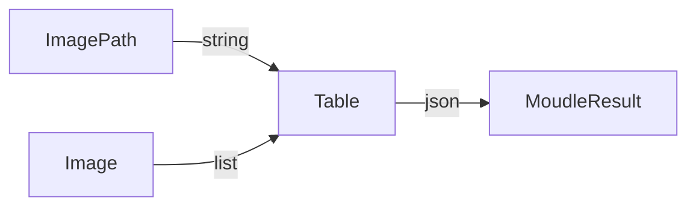
#### 2.	模块分解描述
Table模块没有子模块
#### 3.	数据实体描述
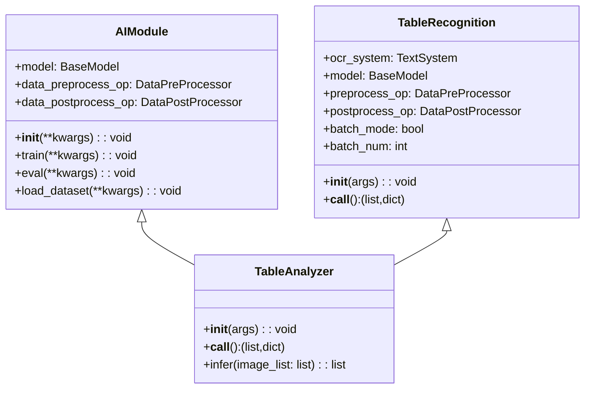
TableRecognition类有如下公共变量及接口：
* `ocr_system`: 检测和识别图像中的文本系统
* `model`: 关系抽取的模型
* `preprocess_op`:Preprocessor类，用于对输入模型的数据进行前处理
* `postprocess_op`: Postprocessor类，用于对推理结果的处理
* `batch_mode`:是否开启batch模式
* `batch_num`: 定义开启batch模式中batch的数目
* ` __init__(args)`: 用于初始化模型，流水线及涉及到的处理函数
* `__call__(args)`: 用于直接对图片表格识别。

TableAnalyer类有如下公共变量及接口：
* ` __init__(args)`: 初始化对应的模型，流水线及涉及到的处理函数
* `__call__(args)`: 调用TableRecognition进行表格识别
* `infer(ocr_info_list:list)`: 接受image_list数据进行表格识别
#### 4.	依赖性描述
Table依赖AIModule、TableRecognition。
#### 5.	接口使用描述
```python
from mindocr import mindviewer
from mindviewer import TableAnalyzer
from collections import namedtuple 

# 直接调用Table模块，对图片进行表格分析
params = ["image_dir", "table_model_dir"]
Args = namedtuple('Args', params)
args = Args(image_dir="path/to/images" table_model_dir="path/to/ckpt")
table_analyer = TableAnalyzer(args)
results = table_analyer(args.image_dir)
```
# 配置和控制
## 启动
可通过python代码启动流水线
```python
from mindocr import mindviewer

predict_layout = mindviewer(layout=True, table=True, recovery=True)
predict_kie = mindviewer(layout=False, kie=True)
```
如果对于某一个模块使用的模型不满意，开发者可以替换对应模块的模型，但需继承原模型的类别，并且输入和输出与原模块所使用的模型一至，举个例子：
```python
from mindocr import mindviewer, build_model
from mindviewer import LayoutAnalyzer

class CustomLayoutAnalyzer(LayoutAnalyzer):
    def __init__(self, ckpt):
        super().__init__(ckpt)
        self.model = build_model(ckpt)

layoutAnalyzer = CustomLayoutAnalyzer("/path/to/ckpt")
predict_layout = mindviewer(layout=layoutAnalyzer, table=True, recovery=True)
```
## 输出
+ 版面分析任务的输出默认在result_predict_dir目录下，也可通过--result_dir来配置
+ 关键信息提取任务的输出默认在result_kie_dir目录下，也可通过--result_dir来配置
## 日志
使用python自带的模块`logging`记录日志，并且日志输出到`log`目录下，可通过设置`MINDVIEWER_LOG_LEVEL`控制日志输出的等级。
+ `0: DEBUG`
+ `1: INFO`
+ `2: WARNING`
+ `3: ERROR`
# 技术方向演进
当前版本的MindSpore Viewer不会实现如下功能，但是可作为未来演进方向的一些参考，通过对比友商的OCR套件，我们得出如下几种优秀的OCR套件特性：
+ 可视化交互OCR：通过拖拽方式导入数据，并进行在线的文本、图像编辑
+ 操作系统层面OCR：如Windows 11推出的OCR可以识别Android/IOS投屏图像中的内容
+ 多语言OCR：当前只支持中文和英文，后续可增加其他语言的OCR模型，并实现语种之间的翻译
+ 与大模型结合OCR：如PP-ChatOCR可给予LLMs提取图像中的关键信息
