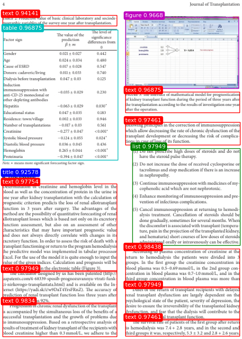
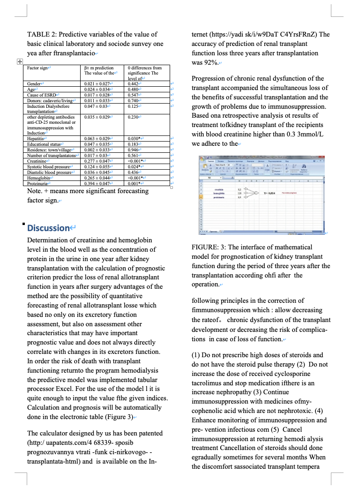

# MindOCR Online Inference

**About Online Inference:** Online inference is to infer based on the native MindSpore framework by loading the model checkpoint file then running prediction with MindSpore APIs.

Compared to offline inference (which is implemented in `deploy/py_infer` in MindOCR), online inferece does not require model conversion for target platforms and can run directly on the training devices (e.g. Ascend 910). But it requires installing the heavy AI framework and the model is not optimized for deployment.

Thus, online inference is more suitable for demonstration and to visually evaluate model generalization ability on unseen data.

## Dependency and Installation

To be consistent with training environment.

## Text Detection

To run text detection on an input image or a directory containing multiple images, please execute

```shell
python tools/infer/text/predict_det.py  --image_dir {path_to_img or dir_to_imgs} --det_algorithm DB++
```

After running, the inference results will be saved in `{args.draw_img_save_dir}/det_results.txt`, where `--draw_img_save_dir` is the directory for saving  results and is set to `./inference_results` by default Here are some results for examples.

Example 1:
<p align="center">
  
</p>
<p align="center">
  <em> Visualization of text detection result on img_108.jpg</em>
</p>

, where the saved txt file is as follows
```
img_108.jpg	[[[228, 440], [403, 413], [406, 433], [231, 459]], [[282, 280], [493, 252], [499, 293], [288, 321]], [[500, 253], [636, 232], [641, 269], [505, 289]], ...]
```

Example 2:

<p align="center">
  
</p>
<p align="center">
  <em>Visualization of text detection result on paper_sam.png</em>
</p>

, where the saved txt file is as follows
```
paper_sam.png	[[[1161, 340], [1277, 340], [1277, 378], [1161, 378]], [[895, 335], [1152, 340], [1152, 382], [894, 378]], ...]
```

**Notes:**
- For input images with high resolution, please set `--det_limit_side_len` larger, e.g., 1280. `--det_limit_type` can be set as "min" or "max", where "min " means limiting the image size to be at least  `--det_limit_side_len`, "max" means limiting the image size to be at most `--det_limit_side_len`.

- For more argument illustrations and usage, please run `python tools/infer/text/predict_det.py -h` or view `tools/infer/text/config.py`

- Currently, this script runs serially to avoid dynamic shape issue and achieve better performance.


### Supported Detection Algorithms and Networks

<center>

  | **Algorithm Name** | **Network Name** | **Language** |
  | :------: | :------: | :------: |
  | DB  | dbnet_resnet50 | English |
  | DB++ | dbnetpp_resnet50 | English |
  | DB_MV3 | dbnet_mobilenetv3 | English |
  | PSE | psenet_resnet152 | English |

</center>

The algorithm-network mapping is defined in `tools/infer/text/predict_det.py`.

## Text Recognition

To run text recognition on an input image or a directory containing multiple images, please execute

```shell
python tools/infer/text/predict_rec.py  --image_dir {path_to_img or dir_to_imgs} --rec_algorithm CRNN
```
After running, the inference results will be saved in `{args.draw_img_save_dir}/rec_results.txt`, where `--draw_img_save_dir` is the directory for saving  results and is set to `./inference_results` by default. Here are some results for examples.

- English text recognition

<p align="center">
  
</p>
<p align="center">
  <em> word_1216.png </em>
</p>

<p align="center">
  
</p>
<p align="center">
  <em> word_1217.png </em>
</p>

Recognition results:
```text
word_1216.png   coffee
word_1217.png   club
```

- Chinese text recognition:

<p align="center">
  
</p>
<p align="center">
  <em> cert_id.png </em>
</p>

<p align="center">
  
</p>
<p align="center">
  <em> doc_cn3.png </em>
</p>

Recognition results:
```text
cert_id.png 公民身份号码44052419
doc_cn3.png 马拉松选手不会为短暂的领先感到满意，而是永远在奔跑。
```

**Notes:**
- For more argument illustrations and usage, please run `python tools/infer/text/predict_rec.py -h` or view `tools/infer/text/config.py`
- Both batch-wise and single-mode inference are supported. Batch mode is enabled by default for better speed. You can set the batch size via `--rec_batch_size`. You can also run in single-mode by set `--det_batch_mode` False, which may improve accuracy if the text length varies a lot.

### Supported Recognition Algorithms and Networks

<center>

  | **Algorithm Name** | **Network Name** | **Language** |
  | :------: | :------: | :------: |
  | CRNN | crnn_resnet34 | English |
  | RARE | rare_resnet34 | English |
  | SVTR | svtr_tiny | English|
  | CRNN_CH | crnn_resnet34_ch | Chinese |
  | RARE_CH | rare_resnet34_ch | Chinese |

</center>

The algorithm-network mapping is defined in `tools/infer/text/predict_rec.py`

Currently, space char recognition is not supported for the listed models. We will support it soon.

## Text Detection and Recognition Concatenation

To run text spoting (i.e., detect all text regions then recognize each of them) on an input image or multiple images in a directory, please run:

```shell
python tools/infer/text/predict_system.py --image_dir {path_to_img or dir_to_imgs} \
                                          --det_algorithm DB++  \
                                          --rec_algorithm CRNN
```
> Note: set `--visualize_output True` if you want to visualize the detection and recognition results on the input image.

After running, the inference results will be saved in `{args.draw_img_save_dir}/system_results.txt`,  where `--draw_img_save_dir` is the directory for saving  results and is set to `./inference_results` by default. Here are some results for examples.

Example 1:

<p align="center">
  
</p>
<p align="center">
  <em> Visualization of text detection and recognition result on img_10.jpg </em>
</p>

, where the saved txt file is as follows
```text
img_10.jpg	[{"transcription": "residential", "points": [[43, 88], [149, 78], [151, 101], [44, 111]]}, {"transcription": "areas", "points": [[152, 83], [201, 81], [202, 98], [153, 100]]}, {"transcription": "when", "points": [[36, 56], [101, 56], [101, 78], [36, 78]]}, {"transcription": "you", "points": [[99, 54], [143, 52], [144, 78], [100, 80]]}, {"transcription": "pass", "points": [[140, 54], [186, 50], [188, 74], [142, 78]]}, {"transcription": "by", "points": [[182, 52], [208, 52], [208, 75], [182, 75]]}, {"transcription": "volume", "points": [[199, 30], [254, 30], [254, 46], [199, 46]]}, {"transcription": "your", "points": [[164, 28], [203, 28], [203, 46], [164, 46]]}, {"transcription": "lower", "points": [[109, 25], [162, 25], [162, 46], [109, 46]]}, {"transcription": "please", "points": [[31, 18], [109, 20], [108, 48], [30, 46]]}]
```

Example 2:

<p align="center">
  
</p>
<p align="center">
  <em> Visualization of text detection and recognition result on web_cvpr.png </em>
</p>

, where the saved txt file is as follows

```text
web_cvpr.png	[{"transcription": "canada", "points": [[430, 148], [540, 148], [540, 171], [430, 171]]}, {"transcription": "vancouver", "points": [[263, 148], [420, 148], [420, 171], [263, 171]]}, {"transcription": "cvpr", "points": [[32, 69], [251, 63], [254, 174], [35, 180]]}, {"transcription": "2023", "points": [[194, 44], [256, 45], [255, 72], [194, 70]]}, {"transcription": "june", "points": [[36, 45], [110, 44], [110, 70], [37, 71]]}, {"transcription": "1822", "points": [[114, 43], [190, 45], [190, 70], [113, 69]]}]
```


**Notes:**
1. For more argument illustrations and usage, please run `python tools/infer/text/predict_system.py -h` or view `tools/infer/text/config.py`

### Supported Detection Algorithms and Networks

<center>

  | **Algorithm Name** | **Network Name** | **Language** |
  | :------: | :------: | :------: |
  |YOLOv8 | yolov8 |English|

</center>

The algorithm-network mapping is defined in `tools/infer/text/predict_layout.py`.

### Evaluation of the Inference Results

To infer on the whole [ICDAR15](https://rrc.cvc.uab.es/?ch=4&com=downloads) test set, please run:
```
python tools/infer/text/predict_system.py --image_dir /path/to/icdar15/det/test_images  /
                                          --det_algorithm {DET_ALGO}    /
                                          --rec_algorithm {REC_ALGO}  /
                                          --det_limit_type min  /
                                          --det_limit_side_len 720
```
> Note: Here we set`det_limit_type` as `min` for better performance, due to the input image in ICDAR15 is of high resolution (720x1280).

After running, the results including image names, bounding boxes (`points`) and recognized texts (`transcription`) will be saved in `{args.draw_img_save_dir}/system_results.txt`. The format of prediction results is shown as follows.

```text
img_1.jpg	[{"transcription": "hello", "points": [600, 150, 715, 157, 714, 177, 599, 170]}, {"transcription": "world", "points": [622, 126, 695, 129, 694, 154, 621, 151]}, ...]
img_2.jpg	[{"transcription": "apple", "points": [553, 338, 706, 318, 709, 342, 556, 362]}, ...]
   ...
```

Prepare the **ground truth** file (in the same format as above), which can be obtained from the dataset conversion script in `tools/dataset_converters`, and run the following command to evaluate the prediction results.

```bash
python deploy/eval_utils/eval_pipeline.py --gt_path path/to/gt.txt --pred_path path/to/system_results.txt
```

Evaluation of the text spotting inference results on Ascend 910 with MindSpore 2.0rc1 are shown as follows.

<center>

| Det. Algorithm| Rec. Algorithm |  Dataset     | Accuracy(%) | FPS (imgs/s) |
|---------|----------|--------------|---------------|-------|
| DBNet   | CRNN    | ICDAR15 | 57.82 | 4.86 |
| PSENet  | CRNN    | ICDAR15 | 47.91 | 1.65|
| PSENet (det_limit_side_len=1472 )  | CRNN    | ICDAR15 | 55.51 | 0.44 |
| DBNet++   | RARE | ICDAR15 | 59.17  | 3.47 |
| DBNet++   | SVTR | ICDAR15 | 64.42  | 2.49 |

</center>

**Notes:**
1. Currently, online inference pipeline is not optimized for efficiency, thus FPS is only for comparison between models. If FPS is your highest priority, please refer to [Inference on Ascend 310](https://github.com/mindspore-lab/mindocr/blob/main/docs/en/inference/inference_tutorial.md), which is much faster.
2. Unless extra inidication, all experiments are run with `--det_limit_type`="min" and `--det_limit_side`=720.
3. SVTR is run in mixed precision mode (amp_level=O2) since it is optimized for O2.

### Text direction classification

If there are non-upright text characters in the image, they can be classified and corrected for orientation using a text direction classifier after the detection. If you run text direction classification and correction on an input image, please perform
```shell
python tools/infer/text/predict_system.py --image_dir {path_to_img or dir_to_imgs} \
                                          --det_algorithm DB++  \
                                          --rec_algorithm CRNN  \
                                          --cls_algorithm M3
```
The default parameter `--cls_alorithm` is None, which means that text direction classification is not performed. By setting `--cls_alorithm`, text direction classification is performed in the text detection and recognition flow. In the process of execution, the text direction classifier classifies the list of images detected by the text and corrects the direction of the non-upright images. Here are some examples of the results.

- Text direction classification

<p align="center">
  
</p>
<p align="center">
  <em> word_01.png </em>
</p>

<p align="center">
  
</p>
<p align="center">
  <em> word_02.png </em>
</p>

Classification Results:：
```text
word_01.png   0     1.0
word_02.png   180   1.0
```

The currently supported text direction classification network is `mobilnet_v3`, which can be set by configuring `--cls_algorithm` for `M3`. And through `--cls_amp_level` and `--cls_model_dir` to set the text direction classifier automatic mixing precision and weight file. At present, the default weight file has been configured, the default mixing precision of the network is `O0`, and the direction classification supports `0` and `180` degrees under the default configuration. We will support the classification of other directions in the future.

<center>

  |**Algorithm Name**|**Network Name**|**Language**|
  | :------: | :------: | :------: |
  | M3 | mobilenet_v3 | CH/EN|

</center>

In addition, by setting `--save_cls_result` to `True`, text orientation classification results can be saved to `{args.crop_res_save_dir}/cls_results.txt`, Where `--crop_res_save_dir` is the directory where the results are saved.

For more parameter descriptions and usage information, please refer to `tools/infer/text/config.py`.

## Table Structure Recognition

To run table structure recognition on an input image or multiple images in a directory, please run:

```shell
python tools/infer/text/predict_table_structure.py --image_dir {path_to_img or dir_to_imgs} --table_algorithm TABLE_MASTER
```

After running, the inference results will be saved in `{args.draw_img_save_dir}`, where `--draw_img_save_dir` is the directory for saving  results and is set to `./inference_results` by default. Here are some results for examples.

Example 1：

The sample image is `configs/table/example.png`. The inference result is as follows:

<p align="center">
  
</p>
<p align="center">
  <em> example_structure.png </em>
</p>

**Notes:**
1. For more argument illustrations and usage, please run `python tools/infer/text/predict_table_structure.py -h` or view `tools/infer/text/config.py`

### Supported Table Structure Recognition Algorithms and Networks

<center>

  | **Model Name** |    **Backbone**    | **Language** |
  |:--------------:|:------------------:|:------------:|
  |  table_master  | table_resnet_extra |  universal   |

</center>

The algorithm-network mapping is defined in `tools/infer/text/predict_table_structure.py`.

## Table Structure Recognition and Text Detection Recognition Concatenation

To run table recognition on an input image or multiple images in a directory (i.e., recognize the table structure first, then combine the results of text detection and recognition to recognize the complete table content), and recovery to CSV files, please run:
```shell
python tools/infer/text/predict_table_recognition.py --image_dir {path_to_img or dir_to_imgs} \
                                          --det_algorithm DB_PPOCRv3  \
                                          --rec_algorithm SVTR_PPOCRv3_CH \
                                          --table_algorithm TABLE_MASTER
```

After running, the inference results will be saved in `{args.draw_img_save_dir}`, where `--draw_img_save_dir` is the directory for saving  results and is set to `./inference_results` by default. Here are some results for examples.

Example 1：

The sample image is `configs/table/example.png`. After online inference, the content of the CSV file is as follows:

```txt
Parameter,Non-smokers Mean± SD or N (3),Smokers Mean ± SD or N (C)
N,24,
Age (y),69.1 ± 7.0,61.5 ± 9.3 +
Males/Females,24/0,11/0
Race White/Black,19/5,9/2
Weight (kg),97.8 ± 16.8,102.5 ± 23.4
BMII (kg/m*),32.6 ± 4.9,32.6 ± 6.6
Serum albumin (g/dL),3.8 ± 0.33,3.63 ± 0.30
Serum Creatinine (mg/dL),2.75 ± 1.21,1.80 ± 0.74 *
BUN (mg/dL),46.5 ± 25.6,38.3 ± 21.8
Hemoglobin (g/dL),13.3 ± 1.6,13.5 ± 2.4
24 hour urine protein (g/d),3393 ± 2522,4423 ± 4385
lathae)mm,28.9 ± 13.8,47.2 ± 34.8 *
Duration of diabetes (yr),15.7 ± 9.1,13.3 ± 9.0
Insulin use,15 (63%),6 (55%)
"Hemoglobin A, C (%)",7.57 ± 2.02,8.98 ± 2.93
Waist/Hip Ratio,1.00 ± 0.07,1.04 ± 0.07
Antihypertensive medications,4.3 ± 1.6,3.9 ± 1.9
A,21 (88%),8 (73%)
Total Cholesterol (mg/dL),184 ± 51,223 ± 87
LDL Cholesterol (mg/dL),100 ± 44,116 ± 24
HDL Cholesterol (mg/dL),42 ± 11.1,46 ± 11.4
,17 (71%),7 (64%)

```

**Notes:**
1. For more argument illustrations and usage, please run `python tools/infer/text/predict_table_recognition.py -h` or view `tools/infer/text/config.py`

## Layout Analysis

To run layout analysis on an input image or a directory containing multiple images, please execute
```shell
python tools/infer/text/predict_layout.py  --image_dir {path_to_img or dir_to_imgs} --layout_algorithm YOLOv8 --visualize_output True
```
After running, the inference results will be saved in `{args.draw_img_save_dir}/det_results.txt`, where `--draw_img_save_dir` is the directory for saving  results and is set to `./inference_results` by default Here are some results for examples.

Example 1:
<p align="center">
  
</p>
<p align="center">
  <em> Visualization of layout analysis result on PMC4958442_00003.jpg</em>
</p>

, where the saved layout_result.txt file is as follows
```
{"image_id": 0, "category_id": 1, "bbox": [308.649, 559.189, 240.211, 81.412], "score": 0.98431}
{"image_id": 0, "category_id": 1, "bbox": [50.435, 673.018, 240.232, 70.262], "score": 0.98414}
{"image_id": 0, "category_id": 3, "bbox": [322.805, 348.831, 225.949, 203.302], "score": 0.98019}
{"image_id": 0, "category_id": 1, "bbox": [308.658, 638.657, 240.31, 70.583], "score": 0.97986}
{"image_id": 0, "category_id": 1, "bbox": [50.616, 604.736, 240.044, 70.086], "score": 0.9797}
{"image_id": 0, "category_id": 1, "bbox": [50.409, 423.237, 240.132, 183.652], "score": 0.97805}
{"image_id": 0, "category_id": 1, "bbox": [308.66, 293.918, 240.181, 47.497], "score": 0.97471}
{"image_id": 0, "category_id": 1, "bbox": [308.64, 707.13, 240.271, 36.028], "score": 0.97427}
{"image_id": 0, "category_id": 1, "bbox": [308.697, 230.568, 240.062, 43.545], "score": 0.96921}
{"image_id": 0, "category_id": 4, "bbox": [51.787, 100.444, 240.267, 273.653], "score": 0.96839}
{"image_id": 0, "category_id": 5, "bbox": [308.637, 74.439, 237.878, 149.174], "score": 0.96707}
{"image_id": 0, "category_id": 1, "bbox": [50.615, 70.667, 240.068, 22.0], "score": 0.94156}
{"image_id": 0, "category_id": 2, "bbox": [50.549, 403.5, 67.392, 12.85], "score": 0.92577}
{"image_id": 0, "category_id": 1, "bbox": [51.384, 374.84, 171.939, 10.736], "score": 0.76692}
```
In this file, `image_id` is the image ID, `bbox` is the detected bounding box `[x-coordinate of the top-left corner, y-coordinate of the bottom-right corner, width, height]`, `score` is the detection confidence, and `category_id` has the following meanings:
- `1: text`
- `2: title`
- `3: list`
- `4: table`
- `5: figure`

**Notes:**
- For more argument illustrations and usage, please run `python tools/infer/text/predict_layout.py -h` or view `tools/infer/text/config.py`

## End-to-end Document Analysis and Recovery

To run end-to-end document analysis and recovery on an input image or multiple images in a directory (detecting all the text, table, and figure regions, recognizing words in these regions, and putting everything into docx files according to the original layout), please run:

```shell
python tools/infer/text/predict_table_e2e.py --image_dir {path_to_img or dir_to_imgs} \
                                             --det_algorithm {DET_ALGO} \
                                             --rec_algorithm {REC_ALGO}
```
>Note: To visualize the outputs of layout, table and ocr, please set `--visualize_output True`.

After running, the inference results will be saved in `{args.draw_img_save_dir}/{img_name}_e2e_result.txt`, where `--draw_img_save_dir` is the directory for saving  results and is set to `./inference_results` by default. Here are some results for examples.

Example 1:

<p align="center">
  
</p>
<p align="center">
  <em> PMC4958442_00003.jpg Converting into docx </em>
</p>

, where the saved txt file is as follows
```text
{"type": "text", "bbox": [50.615, 70.667, 290.683, 92.667], "res": "tabley predictive value ofbasic clinical laboratory and suciode variables surney anc yea after tramphenins", "layout": "double"}
{"type": "table", "bbox": [51.787, 100.444, 292.054, 374.09700000000004], "res": "<html><body><table><thead><tr><td><b>sign factor</b></td><td><b>prediction valucofthe the</b></td><td><b>from difereness significance levelaf the</b></td></tr></thead><tbody><tr><td>gender</td><td>0027 0021</td><td>o442</td></tr><tr><td></td><td>00z44</td><td>0480</td></tr><tr><td>cause</td><td>tooza 0017</td><td>o547</td></tr><tr><td>cadaverieilizing donorst</td><td>0013 aont</td><td>0740</td></tr><tr><td>induction transplantation before dialysis</td><td>doattoos</td><td>0125</td></tr><tr><td>depleting antibodies monoclomalor cn immunosuppression with</td><td>doista09</td><td>0230</td></tr><tr><td>ititis</td><td>0029</td><td>aaso</td></tr><tr><td>status itional</td><td>0047 toots</td><td></td></tr><tr><td>townfrillage</td><td>non</td><td></td></tr><tr><td>transplantations number</td><td>toos 0017</td><td>o5s1</td></tr><tr><td>creatinine</td><td>02400g</td><td>caoor</td></tr><tr><td>pressure bload systolic</td><td>aidaloloss</td><td>aoz</td></tr><tr><td>pressure diastolic blood</td><td>dobetods</td><td>ass</td></tr><tr><td>hemoglobin</td><td>0044 0255t</td><td>caoor</td></tr><tr><td></td><td>004</td><td>caoor</td></tr></tbody></table></body></html>", "layout": "double"}
{"type": "text", "bbox": [51.384, 374.84, 223.32299999999998, 385.57599999999996], "res": "nanc rmeans more significant forecasting factor sign", "layout": "double"}
{"type": "title", "bbox": [50.549, 403.5, 117.941, 416.35], "res": "discussion", "layout": "double"}
{"type": "text", "bbox": [50.409, 423.237, 290.541, 606.889], "res": "determination of creatinine and hemoglobin level in the blood well aetho concentration of protein in the urine in one year atter kidney transplantation with the calculation of prognostic criterion predics the loss of renal allotransplant function in years fafter surgery advantages ff the method are the possibility oof quantitative forecasting of renal allotransplant losser which based not only its excretory function assessment but also on assessment other characteristics that may have important prognostic value and does not always directly correlate with changes in its excretors function in order the riskof death with transplant sfunctioning returntothe program hemodialysis the predictive model was implemented cabular processor excel forthe useofthe model litisquite enough the value ethel given indices calculation and prognosis will be automatically done in the electronic table figure 31", "layout": "double"}
{"type": "text", "bbox": [50.616, 604.736, 290.66, 674.822], "res": "the calculator designed by us has been patented chttpell napatentscomy 68339 sposib prognozuvannys vtrati funk caniskovogo transplanatchti and disnvailable on the in ternet chitpsolivad skillwond the accuract ot prediction of renal transplant function loss three years after transplantation was 92x", "layout": "double"}
{"type": "text", "bbox": [50.435, 673.018, 290.66700000000003, 743.28], "res": "progression of chronic renal dysfunctional the transplant accompanied the simultaneous losa the benefits of successful transplantation and the growth of problems due to immunosuppresson bosed on retrospective analysis nt resultsof treatment tofkidney transplantof the recipients with blood creatinine higher than d3 immold we adhere to the", "layout": "double"}
{"type": "figure", "bbox": [308.637, 74.439, 546.515, 223.613], "res": "./inference_results/example_figure_10.png", "layout": "double"}
{"type": "text", "bbox": [308.697, 230.568, 548.759, 274.113], "res": "figures the cnerhecadfmuthrnatical modeltor prognostication ofkidaey transplant function during the periodal three years after thetransplantation according oletectercipiolgaps after theoperation", "layout": "double"}
{"type": "text", "bbox": [308.66, 293.918, 548.841, 341.415], "res": "following principles in thecorrectionod immunisuppresion which allow decreasing the rateofs chronic dysfunctionof the transplant development or edecreasing the risk fof compliea tions incaeoflasof function", "layout": "double"}
{"type": "list", "bbox": [322.805, 348.831, 548.754, 552.133], "res": "wdo not prescribe hish doses steroids and do have the steroid pulse therapy cy do not increase the dose of received cyclosporine tacrolimus and stop medication ifthere isan increase in nephropathy tj continue immunosuppression with medicines ofmy cophenolic acid which are not nephrotoxic k4 enhance amonitoring of immunosuppression andpe vention infectious com cancel immunosuppression atreturning hemodi alysis treatment cancellation of steroids should done egradually sometimes for several months when thediscomfort eassociated transplant tempera ture main in the projection the transplanted kidney and hematurial short course of low doses of steroids administered orally of intravenously can be effective", "layout": "double"}
{"type": "text", "bbox": [308.649, 559.189, 548.86, 640.601], "res": "according to plasma concentration of creatinine the return hemodialvsis the patients were divided into groups ln the first group the creatinine concentration in blood plasma waso mmoly in the 2nd groun con centration in blood plasma was azlommaty and in the third group concentration in blood plasma was more than commolt", "layout": "double"}
{"type": "text", "bbox": [308.658, 638.657, 548.9680000000001, 709.24], "res": "dates or the return of transplant recipients with delaved rena transplant disfunction are largely dependent ion the psychological state ofthe patient severity of depression the desire to ensure the irreversibility the transplanted kidney dysfunction and fear that the dialysis will contribute to the deterioration of renal transplant function", "layout": "double"}
{"type": "text", "bbox": [308.64, 707.13, 548.911, 743.158], "res": "the survival rateof patients ofthe first group after return in hemodialysis was years and in the second and third groups respectively 53132 and28426 years", "layout": "double"}

```
In this file, `type` is the classification of the detected region, `bbox` is the detected bounding box `[x-coordinate of the top-left corner, y-coordinate of the bottom-right corner, width, height]`, and `res` is the detected result.

**Notes:**
1. For more argument illustrations and usage, please run `python tools/infer/text/predict_table_e2e.py -h` or view `tools/infer/text/config.py`
2. Besides the parameters in the config.py, predict_table_e2e.py also accepts the following parameters:
<center>

  |   **Parameter**   |**Description**| **Default** |
  |:------------:| :------: |:------:|
  | layout | Layout Analysis |   True    |
  | ocr | Text Recognition |   True    |
  | table | Table Analysis |   True    |
  | recovery | Docx Convertion |   True    |

</center>

## Argument List

All CLI argument definition can be viewed via `python tools/infer/text/predict_system.py -h` or reading `tools/infer/text/config.py`.


## Developer Guide - How to Add a New Model for Inference

### Preprocessing

The optimal preprocessing strategy can vary from model to model, especially for the resize setting (keep_ratio, padding, etc). We define the preprocessing pipeline for each model in `tools/infer/text/preprocess.py` for different tasks.

If you find the default preprocessing pipeline or hyper-params does not meet the network requirement, please extend by changing the if-else conditions or adding a new key-value pair to the `optimal_hparam` dict in `tools/infer/text/preprocess.py`, where key is the algorithm name and the value is the suitable hyper-param setting for the target network inference.

### Network Inference

Supported alogirhtms and their corresponding network names (which can be checked by using the `list_model()` API) are defined in the `algo_to_model_name` dict in `predict_det.py` and `predict_rec.py`.

To add a new detection model for inference, please add a new key-value pair to `algo_to_model_name` dict, where the key is an algorithm name and the value is the corresponding network name registered in `mindocr/models/{your_model}.py`.

By default, model weights will be loaded from the pro-defined URL in `mindocr/models/{your_model}.py`. If you want to load a local checkpoint instead, please set `--det_model_dir` or `--rec_model_dir` to the path of your local checkpoint or the directory containing a model checkpoint.

### Postproprocess

Similar to preprocessing, the postprocessing method for each algorithm can vary. The postprocessing method for each algorithm is defined in `tools/infer/text/postprocess.py`.

If you find the default postprocessing method or hyper-params does not meet the model need, please extend the if-else conditions or add a new key-value pair  to the `optimal_hparam` dict in `tools/infer/text/postprocess.py`, where the key is an algorithm name and the value is the hyper-param setting.
